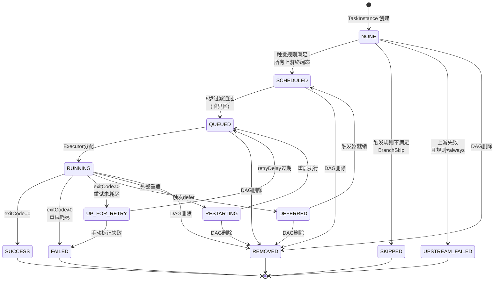
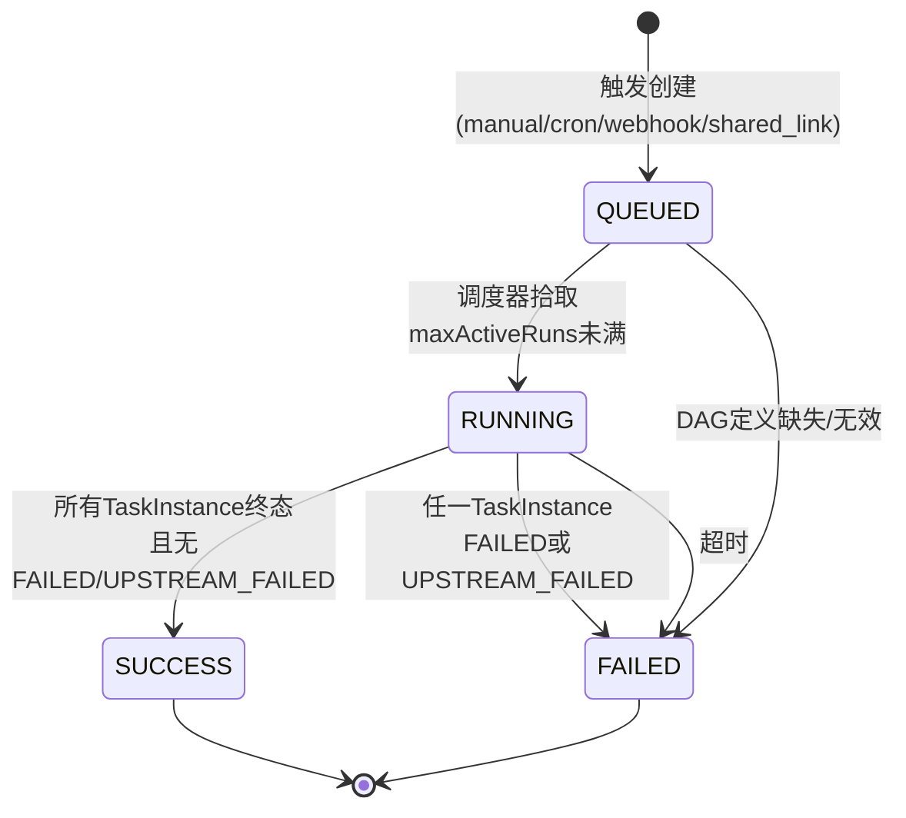
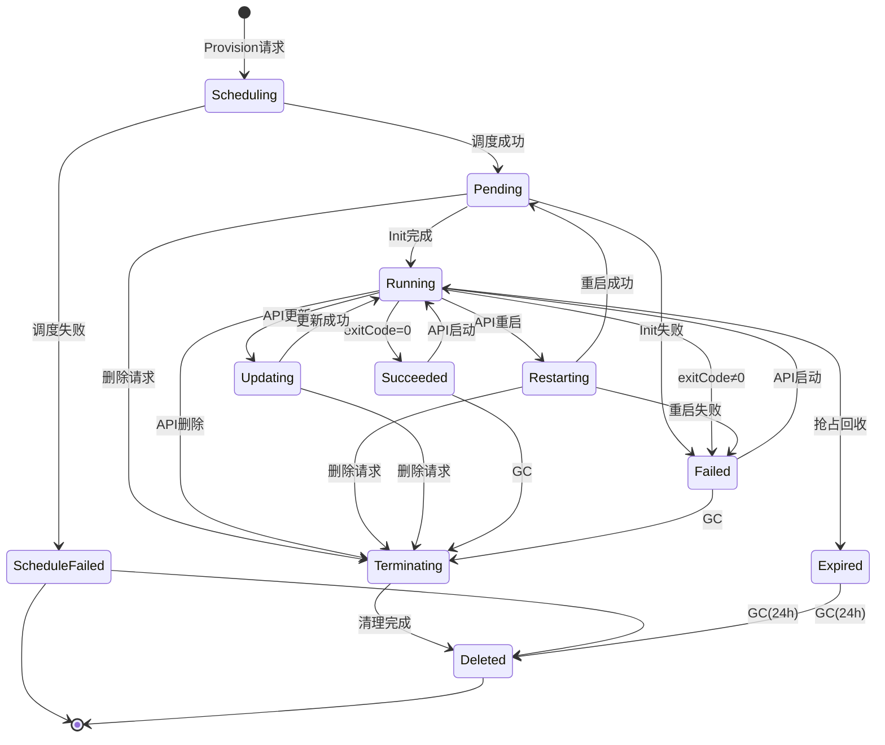
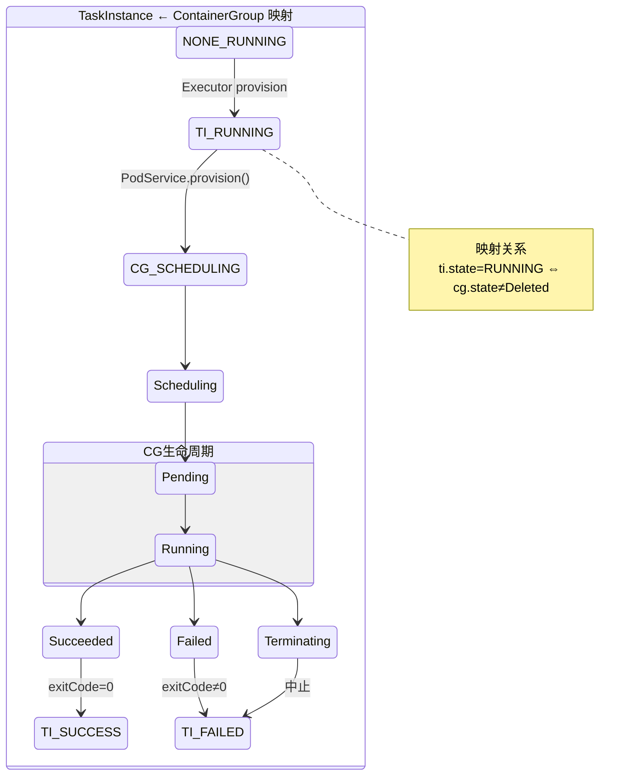
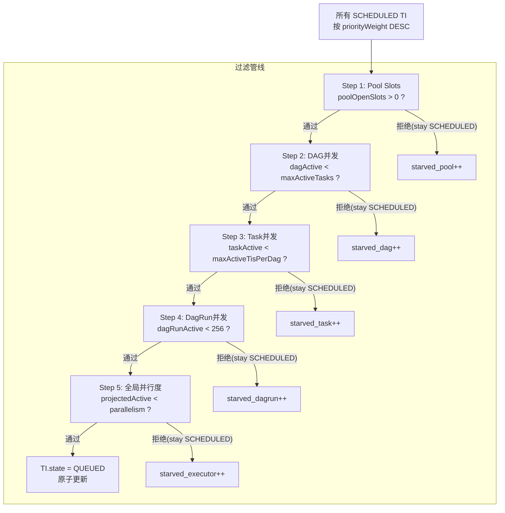
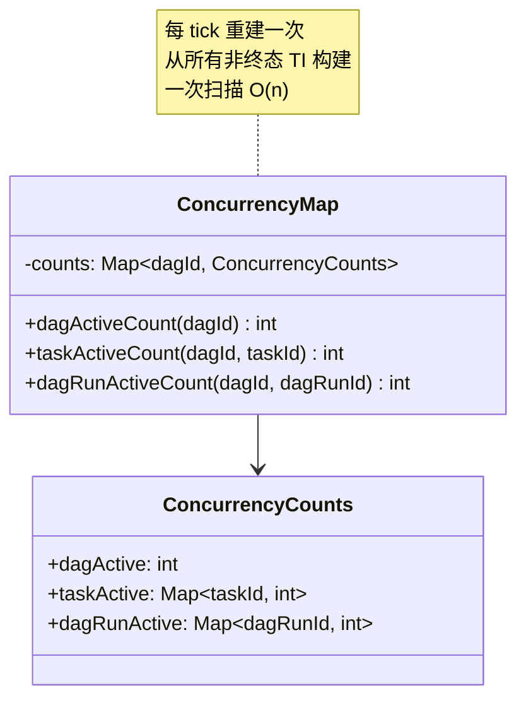
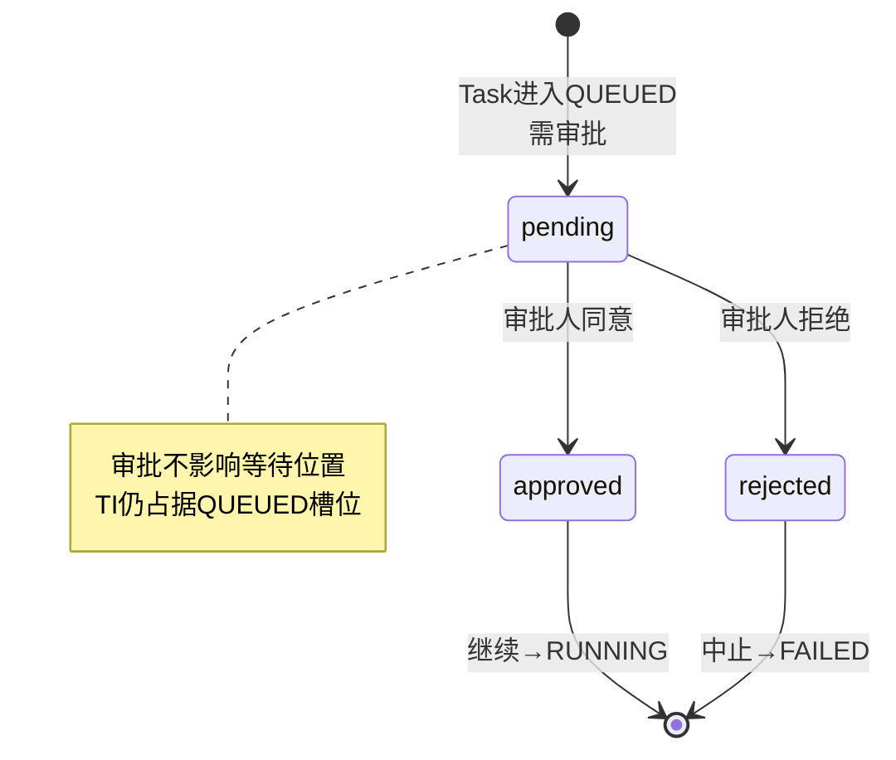
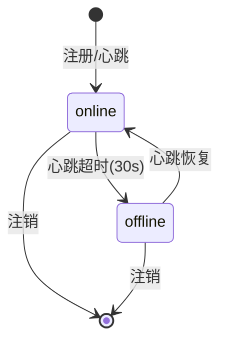
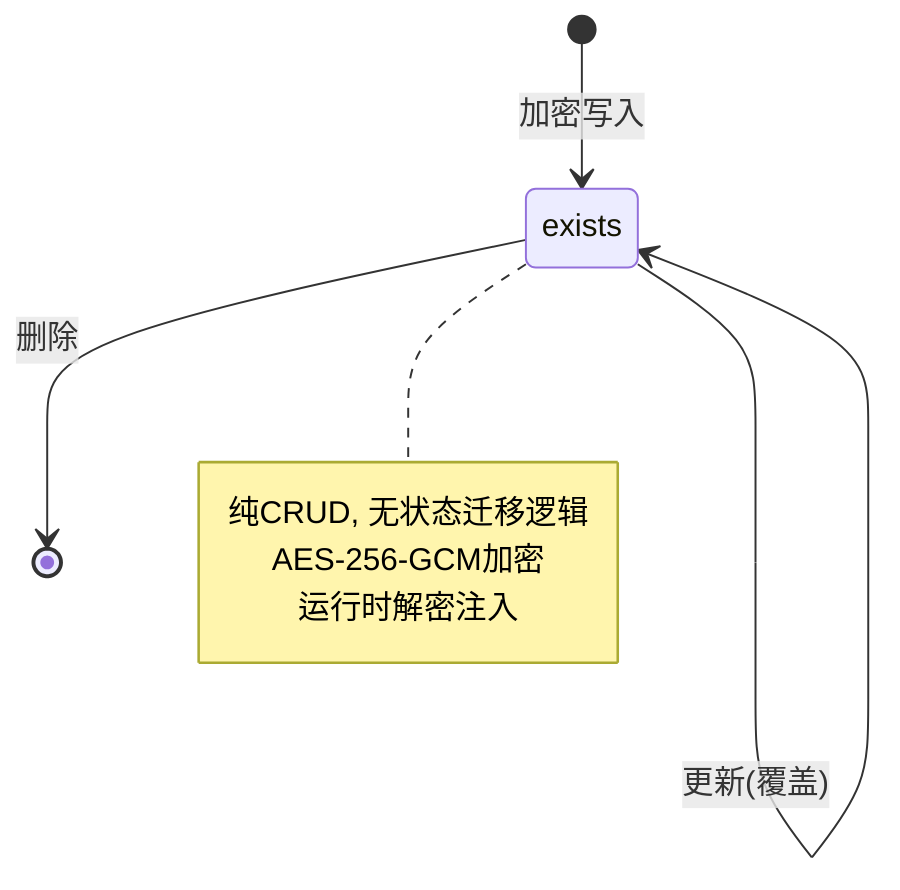
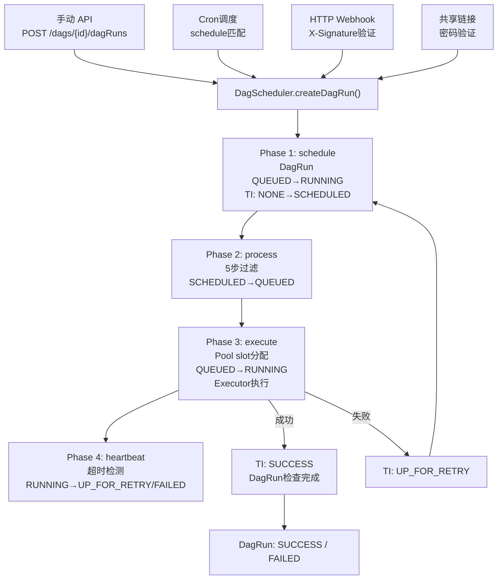

# Action 系统统一状态机 — 形式化规约

> 所有状态迁移规则，用于 TLA+/Z3 形式化验证。DAG→TaskInstance→ContainerGroup 三层嵌套生命周期。

---

## 1. 实体层次

```
DagDef (DAG 定义，编译后不可变)
  └─ DagRun (一次执行实例，4 态)
       └─ TaskInstance (单个 Task 执行，12 态)
            └─ ContainerGroup (Pod/沙箱，11 态)
```

- **DagDef** 是静态模板，不参与状态机。
- **DagRun** 聚合其下所有 TaskInstance 状态。
- **TaskInstance** 在运行时绑定一个 ContainerGroup 作为执行载体。

---

## 2. TaskInstance — 12 态状态机

与 Airflow 的 13 态对齐，去掉 `UP_FOR_RESCHEDULE`，保留其余 12 态。

### 2.1 状态集合

$$\mathbb{S}_{TI} = \{ \text{NONE}, \text{SCHEDULED}, \text{QUEUED}, \text{RUNNING}, \text{SUCCESS}, \text{FAILED}, \text{SKIPPED}, \text{UP\_FOR\_RETRY}, \text{UPSTREAM\_FAILED}, \text{DEFERRED}, \text{RESTARTING}, \text{REMOVED} \}$$

**终态:** $$\mathbb{S}_{TI}^{term} = \{ \text{SUCCESS}, \text{FAILED}, \text{SKIPPED}, \text{UPSTREAM\_FAILED}, \text{REMOVED} \}$$

**调度器关注态:** $$\mathbb{S}_{TI}^{sched} = \{ \text{NONE}, \text{SCHEDULED}, \text{QUEUED}, \text{UP\_FOR\_RETRY} \}$$

### 2.2 状态图



### 2.3 完整迁移表

| from | valid to |
|------|----------|
| NONE | SCHEDULED, SKIPPED, UPSTREAM_FAILED, REMOVED |
| SCHEDULED | QUEUED, REMOVED |
| QUEUED | RUNNING, REMOVED |
| RUNNING | SUCCESS, FAILED, UP_FOR_RETRY, DEFERRED, RESTARTING, REMOVED |
| UP_FOR_RETRY | QUEUED, FAILED |
| DEFERRED | SCHEDULED, REMOVED |
| RESTARTING | QUEUED, REMOVED |
| SUCCESS | (none) |
| FAILED | (none) |
| SKIPPED | (none) |
| UPSTREAM_FAILED | (none) |
| REMOVED | (none) |

### 2.4 安全不变量

**P1 — 终态不可逆:**
$$\forall ti \in \mathbb{S}_{TI}^{term}: next(ti) = ti$$

**P2 — 依赖尊重:**
$$\forall ti: ti.state = \text{SCHEDULED} \implies \forall u \in upstream(ti): u.state \in \mathbb{S}_{TI}^{term}$$

**P3 — 重试边界:**
$$\forall ti: ti.state = \text{UP\_FOR\_RETRY} \iff ti.state_{prev} = \text{RUNNING} \land ti.tryNumber < task.retries$$

**P4 — 并发上限:**
$$|\{ti : ti.state \in \{\text{QUEUED}, \text{RUNNING}\}\}| \leq parallelism$$

**P5 — Pool slot 一致性:**
$$\forall p \in Pools: pool.occupiedSlots[p] = |\{ti : ti.state \in \{\text{QUEUED}, \text{RUNNING}\} \land ti.pool = p\}|$$

### 2.5 活性属性

**L1 — SCHEDULED→QUEUED 进展:**
$$\forall ti: ti.state = \text{SCHEDULED} \leadsto ti.state \in \{\text{QUEUED}, \text{SKIPPED}, \text{UPSTREAM\_FAILED}\}$$

**L2 — RUNNING→终态收敛:**
$$\forall ti: ti.state = \text{RUNNING} \leadsto ti.state \in \mathbb{S}_{TI}^{term} \cup \{\text{UP\_FOR\_RETRY}\}$$

**L3 — RETRY→解决:**
$$\forall ti: ti.state = \text{UP\_FOR\_RETRY} \leadsto ti.state \in \{\text{QUEUED}, \text{FAILED}\}$$

---

## 3. DagRun — 4 态状态机

### 3.1 状态集合

$$\mathbb{S}_{DR} = \{ \text{QUEUED}, \text{RUNNING}, \text{SUCCESS}, \text{FAILED} \}$$

### 3.2 状态图



### 3.3 聚合规则

DagRun 状态由其 TaskInstance 集合推导：

$$DR\_status(dr) = \begin{cases}
\text{QUEUED} & \text{if } \forall ti \in dr: ti.state = \text{NONE} \\
\text{RUNNING} & \text{if } \exists ti \in dr: ti.state \notin \mathbb{S}_{TI}^{term} \\
\text{SUCCESS} & \text{if } \forall ti \in dr: ti.state \in \{\text{SUCCESS}, \text{SKIPPED}, \text{REMOVED}\} \\
\text{FAILED} & \text{if } \exists ti \in dr: ti.state \in \{\text{FAILED}, \text{UPSTREAM\_FAILED}\}
\end{cases}$$

> **勘误 (2026-07-15) — REMOVED 态聚合缺漏。** 原 SUCCESS 条件仅包含 `{SUCCESS, SKIPPED}`，遗漏了同为终态（§2.1）的 REMOVED。当所有 TI 均为 REMOVED 时，四个分支全部不命中，聚合函数无匹配，DR 被错误赋值为 RUNNING。根据 §3.2 状态图语义——全部 TI 终态且无 FAILED/UPSTREAM_FAILED → SUCCESS——正确结果应为 SUCCESS。此缺陷由 TLA+ 模型穷举（TLC 4M states）与 NRI 穷举（2^12 = 4096 TI 子集）两组独立方法交叉发现，已将 SUCCESS 条件修正为 `{SUCCESS, SKIPPED, REMOVED}`。
>
> **参考文献**
>
> [1] HBI-AAD Oracle Test. CrossConsistency.tla: TLA+ cross-entity consistency model[CP]. `.oracle/tla/models/CrossConsistency.tla`, 2026-07-15.
>
> [2] HBI-AAD Oracle Test. nri_dag_run.py: Naive reference implementation of DagRun 4-state aggregation[CP]. `.oracle/tests/nri_dag_run.py`, 2026-07-15.
>
> [3] HBI-AAD Oracle Test. test_dag_run.py: PBT exhaustive enumeration of 4096 TI subsets[CP]. `.oracle/tests/test_dag_run.py`, 2026-07-15.

### 3.4 安全不变量

**P6 — 聚合一致性:**
$$\forall dr: dr.status = \text{SUCCESS} \iff \forall ti \in dr: ti.state \in \{\text{SUCCESS}, \text{SKIPPED}, \text{REMOVED}\}$$

**P7 — 最大并发运行数:**
$$\forall dag: |\{dr : dr.dagId = dag.id \land dr.status = \text{RUNNING}\}| \leq dag.maxActiveRuns$$

**P8 — 最大活跃 Task:**
$$\forall dag, dr: dr.status = \text{RUNNING} \implies |\{ti \in dr : ti.state \notin \mathbb{S}_{TI}^{term}\}| \leq dag.maxActiveTasks$$

---

## 4. ContainerGroup — 11 态容器生命周期

TaskInstance 进入 RUNNING 时，Executor 分配一个 ContainerGroup 承载执行。

### 4.1 状态集合

$$\mathbb{S}_{CG} = \{ \text{Scheduling}, \text{ScheduleFailed}, \text{Pending}, \text{Running}, \text{Succeeded}, \text{Failed}, \text{Restarting}, \text{Updating}, \text{Terminating}, \text{Expired}, \text{Deleted} \}$$

**硬终态:** $$\mathbb{S}_{CG}^{hard} = \{ \text{ScheduleFailed}, \text{Expired}, \text{Deleted} \}$$

**软终态 (可重启):** $$\mathbb{S}_{CG}^{soft} = \{ \text{Succeeded}, \text{Failed} \}$$

### 4.2 状态图



### 4.3 完整迁移表

| from | valid to |
|------|----------|
| Scheduling | Pending, ScheduleFailed |
| ScheduleFailed | Deleted |
| Pending | Running, Failed, Terminating |
| Running | Succeeded, Failed, Restarting, Updating, Terminating, Expired |
| Succeeded | Running, Terminating |
| Failed | Running, Terminating |
| Restarting | Pending, Failed, Terminating |
| Updating | Running, Terminating |
| Terminating | Deleted |
| Expired | Deleted |
| Deleted | (none) |

### 4.4 GC 触发器

| 触发器 | 条件 | 源状态 | 目标状态 |
|--------|------|--------|----------|
| provider-gone | getStatus()=null | Running | Terminating |
| stopped-gc | Succeeded + 60s | Succeeded | Terminating |
| failed-gc | Failed + 24h | Failed | Terminating |
| terminating-gc | Terminating + 60s | Terminating | Deleted (强制) |
| stuck-gc | Scheduling/Pending/Restarting/Updating + 10min | transient | Terminating |
| expired-gc | ScheduleFailed/Expired + 24h | hard-terminal | Deleted |

### 4.5 安全不变量

**P9 — 硬终态不可逆:**
$$\forall cg: cg.state \in \{\text{ScheduleFailed}, \text{Deleted}\} \implies next(cg) = cg \lor next(cg) = \text{Deleted}$$

**P10 — 删除必须经过 Terminating (除非已是硬终态):**
$$\forall cg: cg.state \notin \mathbb{S}_{CG}^{hard} \land delete(cg) \implies cg.state' = \text{Terminating}$$

**P11 — 重启仅从 Running:**
$$\forall cg: restart(cg) \implies cg.state = \text{Running}$$

**P12 — 更新仅从 Running:**
$$\forall cg: update(cg) \implies cg.state = \text{Running}$$

**P13 — Container Running 蕴含 CG Running:**
$$\forall cg: \exists c \in cg.containers: c.state = \text{Running} \implies cg.state = \text{Running}$$

### 4.6 TaskInstance ↔ ContainerGroup 绑定



一致性约束：

$$ti.state = \text{RUNNING} \implies cg.state \in \{\text{Scheduling}, \text{Pending}, \text{Running}, \text{Restarting}, \text{Updating}\}$$

$$ti.state \in \{\text{SUCCESS}, \text{FAILED}, \text{UP\_FOR\_RETRY}\} \implies cg.state \in \{\text{Succeeded}, \text{Failed}, \text{Terminating}, \text{Deleted}\}$$

---

## 5. 触发规则 — 9 规则引擎

TriggerRule 决定上游全部进入终态后，下游 NONE 态 TaskInstance 是否进入 SCHEDULED。

### 5.1 规则定义

$$\text{TriggerRule} \in \left\{ \begin{array}{ll}
\text{all\_success}      & \text{所有上游 SUCCESS} \\
\text{all\_failed}       & \text{所有上游 FAILED 或 UPSTREAM\_FAILED} \\
\text{all\_done}         & \text{所有上游均为终态 (任意终态)} \\
\text{one\_success}      & \text{至少一个上游 SUCCESS} \\
\text{one\_failed}       & \text{至少一个上游 FAILED 或 UPSTREAM\_FAILED} \\
\text{none\_failed}      & \text{没有上游 FAILED 或 UPSTREAM\_FAILED} \\
\text{none\_skipped}     & \text{没有上游 SKIPPED} \\
\text{none\_failed\_min\_one\_success} & \text{无 FAILED 且至少一个 SUCCESS} \\
\text{always}            & \text{无条件}
\end{array} \right\}$$

### 5.2 评估函数

```
evaluate(rule, upstream_states):
  if upstream_states is empty → true
  switch rule:
    all_success                 → ∀s: s = SUCCESS
    all_failed                  → ∀s: s ∈ {FAILED, UPSTREAM_FAILED}
    all_done                    → ∀s: isTerminal(s)
    one_success                 → ∃s: s = SUCCESS
    one_failed                  → ∃s: s ∈ {FAILED, UPSTREAM_FAILED}
    none_failed                 → ¬∃s: s ∈ {FAILED, UPSTREAM_FAILED}
    none_skipped                → ¬∃s: s = SKIPPED
    none_failed_min_one_success → none_failed ∧ one_success
    always                      → true
```

### 5.3 NONE→SCHEDULED 条件

```
canSchedule(ti):
  if ti.state ≠ NONE → false
  if not all(ti.dependsOn).isTerminal() → false
  if not evaluateTriggerRule(ti.triggerRule, upstreamStates) → false
  return true → ti.state' = SCHEDULED
```

### 5.4 NONE→SKIPPED 条件 (BranchSkip)

当触发规则不满足且所有上游都已终态：

```
shouldSkip(ti):
  if ti.state ≠ NONE → false
  if not all(ti.dependsOn).isTerminal() → false
  if evaluateTriggerRule(ti.triggerRule, upstreamStates) → false
  return true → ti.state' = SKIPPED
```

### 5.5 NONE→UPSTREAM_FAILED 条件

当一个上游是 FAILED/UPSTREAM_FAILED，且触发规则 ≠ always：

```
shouldMarkUpstreamFailed(ti):
  if ti.state ≠ NONE → false
  if any upstream is FAILED or UPSTREAM_FAILED
     and ti.triggerRule ≠ always → true
  return true → ti.state' = UPSTREAM_FAILED
```

---

## 6. 调度器主循环 (DagScheduler Tick)

```
每 5 秒:

Phase 1 — schedule:
  for each active DagRun:
    if DagRun.status = QUEUED → transition to RUNNING
    for each TaskDef in DagDef:
      if TI not yet exists → create TI(NONE)
      if TI.state = NONE:
        evaluate canSchedule → SCHEDULED
        evaluate shouldSkip → SKIPPED
        evaluate shouldMarkUpstreamFailed → UPSTREAM_FAILED
      if TI.state = UP_FOR_RETRY and retryDelay elapsed:
        → QUEUED (tryNumber++)
    if all TI terminal:
      DagRun.status = any FAILED/UPSTREAM_FAILED ? FAILED : SUCCESS

Phase 2 — process (5步过滤):
  for each DagRun (status=RUNNING):
    for each TI (state=SCHEDULED):
      Step 1: poolSlots > 0 ?
      Step 2: dagActiveCount < dag.maxActiveTasks ?
      Step 3: taskActiveCount < task.maxActiveTisPerDag ?
      Step 4: dagRunActiveCount < 256 ?
      Step 5: projectedActive < parallelism ?
      if all pass → TI.state' = QUEUED

Phase 3 — execute:
  for each DagRun (status=RUNNING):
    for each TI (state=QUEUED):
      claimPoolSlot(poolName)
      resolveExecutor(task.executorKey)
      TI.state' = RUNNING
      executor.execute(task, ti)
        → SUCCESS or FAILED or UP_FOR_RETRY

Phase 4 — heartbeat:
  for each DagRun (status=RUNNING):
    for each TI (state=RUNNING):
      if elapsed > task.timeoutMs:
        → UP_FOR_RETRY (retries remaining)
        → FAILED (retries exhausted)
        releasePoolSlot
```

### 6.1 5 步过滤管线



被拒绝的 TI 停留在 SCHEDULED，下一 tick 重新评估，无饥饿丢弃。

### 6.2 ConcurrencyMap — O(1) 查询



---

## 7. Pool — 全局信号量

```
Pool {
  name: string
  slots: int          // 总slot数
  occupiedSlots: int  // 当前占用
}

openSlots(pool) = max(0, pool.slots - pool.occupiedSlots)
```

**默认池:** `default_pool` slots=128，当 Task 未指定 pool 时使用。

**多调度器环境下的 slot 一致性:** 单 DO 实例天然串行，无竞争。若扩展到多调度器，需要 advisory lock 保护 slot 分配。

---

## 8. 辅助状态机

### 8.1 ApprovalSensor (审批门)



### 8.2 Runner 状态



### 8.3 Secret 生命周期



---

## 9. 交叉一致性约束

### 9.1 DagRun ↔ TaskInstance

```
C1: dr.status = RUNNING ⇔ ∃ ti ∈ dr: ti.state ∉ ℕ_TI_term
C2: dr.status = SUCCESS ⇔ ∀ ti ∈ dr: ti.state ∈ {SUCCESS, SKIPPED}
C3: dr.status = FAILED  ⇔ ∃ ti ∈ dr: ti.state ∈ {FAILED, UPSTREAM_FAILED}
```

### 9.2 TaskInstance ↔ ContainerGroup

```
C4: ti.state = RUNNING  ⇒ cg.state ∈ {Scheduling, Pending, Running, Restarting, Updating}
C5: ti.state ∈ {SUCCESS, FAILED} ⇒ cg.state ∈ {Succeeded, Failed, Terminating, Deleted}
C6: cg.state = Deleted ⇒ ti.state ∈ ℕ_TI_term  (CG已清理则TI必须有结论)
```

### 9.3 TaskInstance ↔ Pool

```
C7: ti.state ∈ {QUEUED, RUNNING} ⇒ pool.occupiedSlots includes ti
C8: ti.state ∉ {QUEUED, RUNNING} ⇒ pool.occupiedSlots does NOT include ti
```

### 9.4 TriggerRule ↔ 上游状态

```
C9: ti.state = UPSTREAM_FAILED ⇒ ∃ u ∈ upstream(ti): u.state ∈ {FAILED, UPSTREAM_FAILED}
C10: ti.state = SKIPPED ⇒ ti.triggerRule ≠ always
```

---

## 10. 统一触发路径 (单一入口)

所有触发源 converge 到同一个入口：



**关键约束:** runner.ts 的直接执行路径在此规约下不存在。所有 TI 执行必须经过 4 阶段调度器。Executor 是调度器内部的可插拔组件，不是独立入口。

---

## 11. DagDef 不可变性

DagDef 是编译后的不可变对象。修改工作流定义 = 创建新 DagDef，旧 DagRun 不受影响。

```
DagDef {
  id: DagId          // 不可变标识
  tasks: Task[]      // 不可变列表
  maxActiveTasks     // 运行时可调
  maxActiveRuns      // 运行时可调
  version: VersionId // OCC 乐观锁
}
```

---

## 12. YAML DSL → DagDef 编译

YAML 是语法糖，dag-builder.ts 是编译器：

```
YAML/JSON DSL
  ├─ jobs: {name: JobDef}         → 展开为 Task[]
  ├─ strategy.matrix               → 展开为多个并行 Task
  ├─ needs: [otherJob]             → Task.dependsOn
  ├─ container/containers          → Task.config (传给 Executor)
  ├─ steps: [{run:, uses:, dns:}] → Task.config.steps (Executor解析)
  └─ approval.approvers            → 插入 ApprovalSensor Task
```

编译产出是 `DagDef`，此后所有调度逻辑只认识 DagDef/DagRun/TaskInstance，不感知 YAML 语法。

---

## 13. API 路由映射

| 方法 | 路径 | 含义 |
|------|------|------|
| POST | `/dags` | 创建/更新 DagDef |
| GET | `/dags` | 列表 DagDef |
| GET | `/dags/{dagId}` | 获取 DagDef |
| DELETE | `/dags/{dagId}` | 删除 DagDef |
| POST | `/dags/{dagId}/dagRuns` | 触发 DagRun (手动/API) |
| GET | `/dags/{dagId}/dagRuns` | DagRun 列表 |
| GET | `/dags/{dagId}/dagRuns/{dagRunId}` | DagRun 详情 |
| GET | `/dags/{dagId}/dagRuns/{dagRunId}/taskInstances` | TI 列表 |
| GET | `/dags/{dagId}/dagRuns/{dagRunId}/taskInstances/{tiId}` | TI 详情 |
| GET | `/dags/{dagId}/dagRuns/{dagRunId}/taskInstances/{tiId}/logs` | 日志 |
| POST | `/dags/from-yaml` | YAML→DagDef 编译 (便捷端点) |
| GET | `/pools` | Pool 列表 |
| GET | `/health` | 调度器状态 |

与 Airflow REST API 的差异：去掉了 Airflow 中的 `variables`、`connections`、`xcoms`、`sla_miss`、`event_logs`、`import_errors`——这些属于 Airflow 平台功能，不在核心调度范围内。

---

## 14. 形式化验证检查清单

| # | 类别 | 属性 | TLA+ / Z3 |
|---|------|------|-----------|
| 1 | TI | 终态不可逆 | `∀ti ∈ term: ti' = ti` |
| 2 | TI | 依赖尊重 | SCHEDULED ⇒ upstream 全部终态 |
| 3 | TI | 重试次数边界 | tryNumber <= task.retries |
| 4 | TI | Pool slot 一致性 | occupiedSlots = Σ(active TI) |
| 5 | DR | 聚合一致性 | DR.status 由 TI 集合决定 |
| 6 | DR | 最大并发 Run | activeRuns <= maxActiveRuns |
| 7 | CG | 终态不可逆 | Deleted 不能再变 |
| 8 | CG | 删除路径 | 非硬终态删除须经过 Terminating |
| 9 | CG | 重启/更新仅 Running | Restarting/Updating 入边只从 Running |
| 10 | TriggerRule | 9 规则完备 | 所有 TI 进入终态后有明确下游 |
| 11 | 5-step | 过滤确定性 | 相同输入相同输出 |
| 12 | 交叉 | TI-CG 一致性 | RUNNING ⇔ CG 活跃态 |
| 13 | 交叉 | 单一路径 | 所有执行经过 DagScheduler |
| 14 | 整体 | 无环 DAG | Kahn 排序通过 |
| 15 | 整体 | 活性 | 所有 transient 状态最终收敛 |
