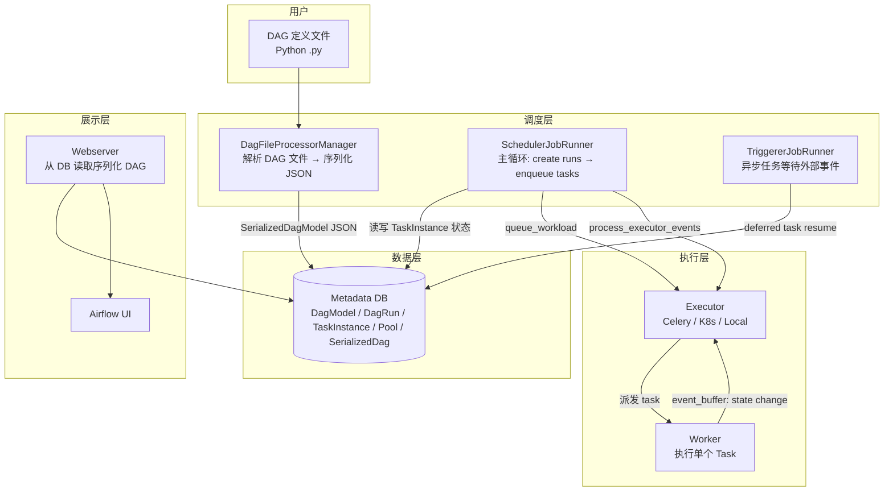
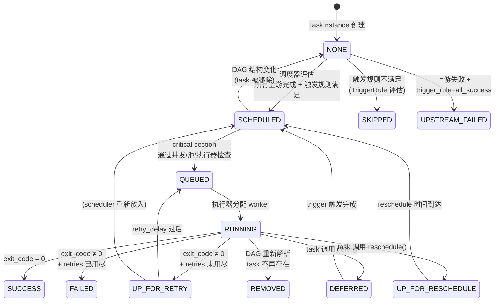
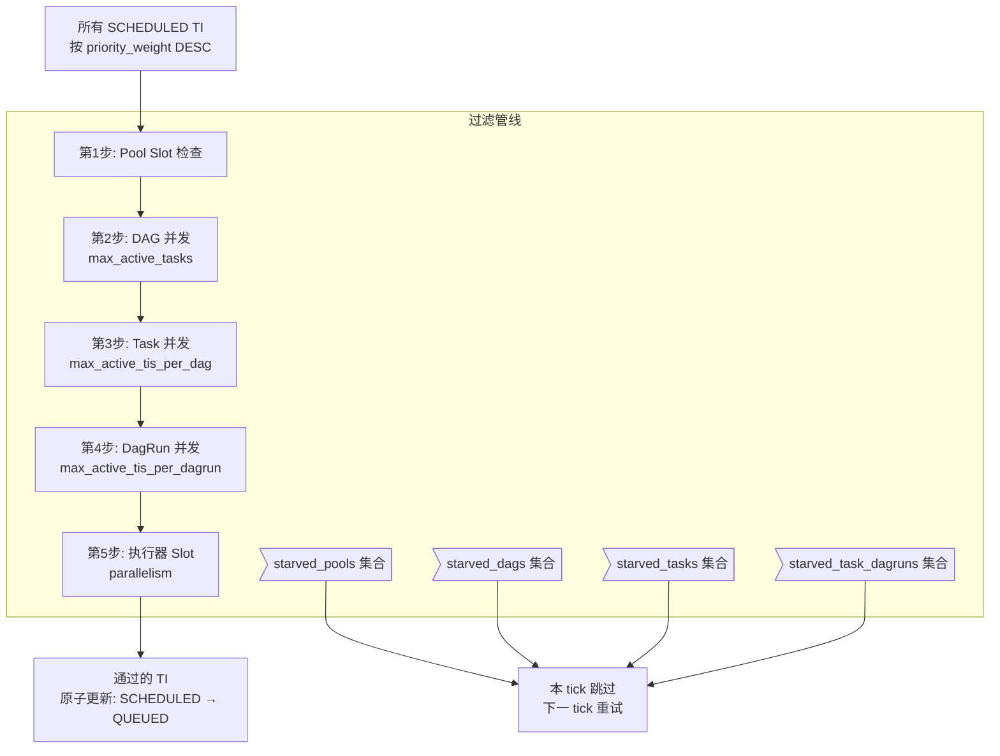
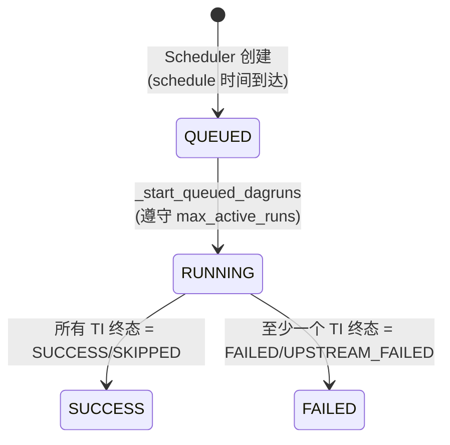

# Apache Airflow 架构 —— 完整模型

> **源码仓库**: `https://github.com/apache/airflow`
> **关键文件**: `airflow-core/src/airflow/jobs/scheduler_job_runner.py`, `airflow-core/src/airflow/models/`
> **版本**: 2.x → 3.x 过渡期

---

## 0. 整体架构



关键设计: **调度器不再直接解析 DAG 文件** (自 2.0 起)。DAG 文件由独立子进程 (`DagFileProcessorProcess`) 解析并序列化为 JSON 存入数据库。调度器只读序列化后的 DAG。

---

## 1. 核心数据模型

### 1.1 六张核心表

| Model | 文件 | 含义 |
|---|---|---|
| `DagModel` | `models/dag.py` | DAG 的元数据 (schedule_interval, is_paused, next_dagrun) |
| `SerializedDagModel` | `models/serialized_dag.py` | DAG 的完整结构 JSON (tasks, dependencies, params) |
| `DagRun` | `models/dagrun.py` | DAG 的一次执行实例 |
| `TaskInstance` | `models/taskinstance.py` | 单个 Task 在一次 DagRun 中的执行实例 |
| `Pool` | `models/pool.py` | 全局信号量 (限制并发 task 数量) |
| `BaseJob` | `jobs/base_job.py` | 调度器/Triggerer 等长期运行的 job |

### 1.2 关系

```
DagModel (1) ──→ (*) DagRun ──→ (*) TaskInstance
                     │                  │
                     │                  ├── pool (FK → Pool)
                     │                  └── state: NONE → SCHEDULED → QUEUED → RUNNING → ...
                     │
                     ├── state: QUEUED → RUNNING → SUCCESS/FAILED
                     └── execution_date (逻辑时间)
```

### 1.3 DAG 定义 (Python DSL)

```python
from airflow import DAG
from airflow.operators.bash import BashOperator
from datetime import datetime

with DAG(
    dag_id="my_pipeline",
    schedule="0 2 * * *",
    start_date=datetime(2024, 1, 1),
    max_active_runs=1,
    max_active_tasks=16,
    catchup=False,
) as dag:

    task_a = BashOperator(task_id="extract", bash_command="extract.sh")
    task_b = BashOperator(task_id="transform", bash_command="transform.sh")
    task_c = BashOperator(task_id="load", bash_command="load.sh")

    task_a >> task_b >> task_c
    # >> 操作符创建有向边: task_a → task_b → task_c
```

`>>` 操作符等价于 `task_a.set_downstream(task_b)`，在内部构建邻接表。

---

## 2. 拓扑排序 (Kahn 算法)

### 2.1 源码位置

`airflow/models/dag.py` → `DAG.topological_sort()` → 委托给 `TaskGroup.topological_sort()`

### 2.2 算法

```python
def topological_sort(self, tasks: list[Operator]) -> tuple[Operator, ...]:
    """
    Kahn 算法: O(V + E)
    1. 构建入度表 (已排序节点的入度 = 0)
    2. 反复扫描: 找到"所有上游都在已排序集合"中的节点
    3. 移到已排序列表末尾
    4. 若一轮无进展 → 检测到环 → 抛异常
    """
    graph_unsorted = OrderedDict((t.task_id, t) for t in tasks)
    graph_sorted = []

    while graph_unsorted:
        acyclic = False
        for node in list(graph_unsorted.values()):
            for edge in node.upstream_list:
                if edge.node_id in graph_unsorted:
                    break  # 还有上游未排序
            else:
                # 所有上游已排序 → 此节点就绪
                acyclic = True
                del graph_unsorted[node.task_id]
                graph_sorted.append(node)

        if not acyclic:
            raise AirflowException("A cyclic dependency occurred in dag")

    return tuple(graph_sorted)
```

### 2.3 形式化

$$\text{Kahn}(G) \triangleq \begin{cases}
\text{sort}(V) & \text{if } G \text{ is acyclic} \\
\text{CycleDetected} & \text{otherwise}
\end{cases}$$

$$\text{CycleFree}(G) \iff |\text{Kahn}(G)| = |V|$$

### 2.4 使用场景

拓扑排序在 Airflow 中被多处调用:

| 场景 | 调用者 |
|---|---|
| Grid View 渲染 (UI 按拓扑序展示 task) | `views.py` |
| 调度器遍历 task 检查就绪态 | `scheduler_job_runner.py` |
| Backfill 按依赖顺序执行 | `backfill_job.py` |
| DAG 序列化前验证 | `serialized_dag.py` |

---

## 3. TaskInstance 状态机

### 3.1 13 个状态

$$\mathbb{S}_{\text{TI}} = \{ \text{NONE}, \text{SCHEDULED}, \text{QUEUED}, \text{RUNNING}, \text{SUCCESS}, \text{FAILED}, \text{SKIPPED}, \text{UP\\\_FOR\\\_RETRY}, \text{UPSTREAM\\\_FAILED}, \text{REMOVED}, \text{DEFERRED}, \text{RESTARTING}, \text{UP\\\_FOR\\\_RESCHEDULE} \}$$



### 3.2 调度器关注的状态

调度器**只检查和修改**这些状态的 TI:

$$\mathbb{S}_{\text{scheduler-active}} = \{ \text{NONE}, \text{SCHEDULED}, \text{QUEUED}, \text{UP\\\_FOR\\\_RETRY}, \text{UP\\\_FOR\\\_RESCHEDULE} \}$$

`RUNNING` 的任务由执行器管理；终态不再触碰。

### 3.3 触发规则 (TriggerRule)

决定上游终止后下游是否执行:

$$\text{TriggerRule} \in \left\{ \begin{array}{ll}
\text{all\_success}      & \text{所有上游成功} \\
\text{all\_failed}       & \text{所有上游失败} \\
\text{all\_done}         & \text{所有上游终止 (无论成败)} \\
\text{one\_success}      & \text{至少一个上游成功} \\
\text{one\_failed}       & \text{至少一个上游失败} \\
\text{none\_failed}      & \text{没有上游失败} \\
\text{none\_skipped}     & \text{没有上游跳过} \\
\text{none\_failed\_min\_one\_success} & \text{无失败且至少一个成功} \\
\text{always}            & \text{无论上游什么状态都执行} \\
\end{array} \right\}$$

---

## 4. 调度器主循环 (SchedulerJobRunner)

### 4.1 完整循环

`airflow-core/src/airflow/jobs/scheduler_job_runner.py` → `_execute()`

```mermaid
flowchart TD
    START([开始循环]) --> HB[执行 heartbeat<br/>更新 job 心跳时间戳]

    HB --> ADOPT[adopt_or_reset_orphaned_tasks<br/>接管僵尸 task]

    ADOPT --> DR_CREATE[_create_dag_runs_for_dags<br/>为到时间的 DAG 创建 DagRun]

    DR_CREATE --> DR_START[_start_queued_dagruns<br/>QUEUED → RUNNING<br/>遵守 max_active_runs]

    DR_START --> DR_FETCH[_get_next_dagruns_to_examine<br/>取 RUNNING 状态的 DagRun]

    DR_FETCH --> SCHED_LOOP{遍历每个 DagRun}

    SCHED_LOOP -->|per DagRun| SCHED_DR[_schedule_dag_run<br/>检查超时/结构变化<br/>计算哪些 TI 进入 SCHEDULED<br/>传递回调给 DFP]

    SCHED_DR --> SCHED_LOOP

    SCHED_LOOP -->|完成| CRITICAL[_critical_section_enqueue_task_instances<br/>━━━ 临界区 ━━━]

    CRITICAL --> LOCK[获取 advisory lock /<br/>SELECT FOR UPDATE SKIP LOCKED]

    LOCK --> BUILD[构建 ConcurrencyMap<br/>一次 SQL 查询所有活跃 TI 计数]

    BUILD --> FILTER[_executable_task_instances_to_queued<br/>5 步过滤管线]

    FILTER --> ENQUEUE[原子更新 TI: SCHEDULED → QUEUED<br/>executor.queue_workload()]

    ENQUEUE --> UNLOCK[释放锁]

    UNLOCK --> EVENTS[process_executor_events<br/>消费执行器事件 buffer<br/>更新 TI 和 DagRun 状态]

    EVENTS --> ORPHAN[detect_and_handle_orphaned_tasks]

    ORPHAN --> DEADLINE[process_deadline_alerts<br/>SLA miss 处理]

    DEADLINE --> COMPLETE[update_dag_run_state<br/>所有 TI 终态 → DagRun SUCCESS/FAILED]

    COMPLETE --> SLEEP[idle_sleep_time<br/>默认 5s]

    SLEEP --> START
```

### 4.2 五个阶段的职责

| 阶段 | 方法 | 职责 |
|---|---|---|
| 1. 创建 DagRun | `_create_dag_runs_for_dags` | 遍历所有 DAG，为到时的 DAG 创建 DagRun |
| 2. 启动 DagRun | `_start_queued_dagruns` | QUEUED → RUNNING (遵守 max_active_runs) |
| 3. 调度 TaskInstance | `_schedule_dag_run` | 评估每个 TI 是否可被调度 (SCHEDULED) |
| 4. 入队 TaskInstance | `_critical_section_enqueue_task_instances` | **临界区** — 加锁 + 过滤 + 入队 |
| 5. 同步执行器状态 | `process_executor_events` | 从执行器取回 task 完成/失败事件 |

### 4.3 调度频率

`scheduler_heartbeat_sec` = 默认 5s。主循环每次迭代称为一个 "tick"。

---

## 5. 临界区: 多步过滤管线

这是整个调度器最核心的方法: `_executable_task_instances_to_queued()`

### 5.1 输入

来自数据库查询: `state = SCHEDULED` 的所有 TaskInstance，按 `priority_weight DESC` 排序。

### 5.2 五步过滤



每一步被拒绝的 TI 不会被丢弃——它们停留在 `SCHEDULED` 状态，在下一 tick 重新评估。starvation 集合用于生成监控指标，帮助运维发现"为什么我的 task 一直排队"。

### 5.3 形式化

$$\text{Pass}(v) \triangleq \begin{cases}
\text{QUEUED} & \text{if } \text{pool\_ok}(v) \land \text{dag\_ok}(v) \land \text{task\_ok}(v) \land \text{dagrun\_ok}(v) \land \text{executor\_ok}(v) \\
\text{SCHEDULED} & \text{otherwise (retry next tick)}
\end{cases}$$

---

## 6. ConcurrencyMap: 内存并发索引

### 6.1 数据结构

```python
class ConcurrencyMap:
    """一次 SQL 查询，构建所有活跃 TI 的并发计数索引"""
    
    dag_run_active_tasks_map: dict[tuple[dag_id, run_id], int]
    # (dag_id, run_id) → 当前 RUNNING/QUEUED 的 task 数
    
    task_concurrency_map: dict[tuple[dag_id, task_id], int]
    # (dag_id, task_id) → 当前活跃的同名 task 数
    
    task_dagrun_concurrency_map: dict[tuple[dag_id, run_id, task_id], int]
    # (dag_id, run_id, task_id) → DagRun 内的同名 task 数
```

### 6.2 构建

```sql
-- 一次查询，按三组维度分组计数
SELECT 
    dag_id, run_id, task_id,
    COUNT(*) as count
FROM task_instance
WHERE state IN ('RUNNING', 'QUEUED')
GROUP BY dag_id, run_id, task_id;
```

### 6.3 查询 (O(1))

```python
def can_schedule(self, ti: TaskInstance) -> bool:
    dag_key = (ti.dag_id, ti.run_id)
    if self.dag_run_active_tasks_map.get(dag_key, 0) >= ti.dag_model.max_active_tasks:
        return False
    task_key = (ti.dag_id, ti.task_id)
    if self.task_concurrency_map.get(task_key, 0) >= ti.task.max_active_tis_per_dag:
        return False
    return True
```

---

## 7. Pool 信号量

### 7.1 模型

```python
class Pool(Base):
    __tablename__ = "slot_pool"
    
    pool: str          # 池名称 (主键)
    slots: int         # 总 slot 数
    description: str   # 描述

    @property
    def open_slots(self) -> int:
        """当前可用 slot 数 = 总 slot - 占用的 slot"""
        running_count = TaskInstance.query.filter(
            TaskInstance.pool == self.pool,
            TaskInstance.state.in_(['RUNNING', 'QUEUED'])
        ).count()
        return self.slots - running_count
```

### 7.2 使用

```python
# DAG 定义时指定 task 使用的池
task = BashOperator(
    task_id="api_call",
    pool="api_pool",     # 使用 api_pool (slots=5)
    pool_slots=2,         # 此 task 占用 2 个 slot
    bash_command="call_api.sh"
)
```

### 7.3 高可用锁

多调度器场景下，池的 slot 分配需要加锁:

| 数据库 | 锁机制 |
|---|---|
| PostgreSQL | `pg_try_advisory_xact_lock(lock_id)` — 事务级，自动释放 |
| MySQL/SQLite | `SELECT ... FOR UPDATE SKIP LOCKED` — 行级锁 |
| 获取失败 | 跳过本次临界区，下个 tick 重试 |

---

## 8. DagRun 生命周期

### 8.1 DagRun 状态

$$\mathbb{S}_{\text{DR}} = \{ \text{QUEUED}, \text{RUNNING}, \text{SUCCESS}, \text{FAILED} \}$$



### 8.2 调度条件

创建 DagRun 的条件:

$$\text{ShouldCreate}(d) \triangleq \text{next\_dagrun}(d) \leq \text{now} \land \neg \text{is\_paused}(d) \land \text{active\_runs}(d) < \text{max\_active\_runs}(d)$$

### 8.3 唯一性

DagRun 由 `(dag_id, logical_date)` 唯一标识。同一个 DAG 的同一个逻辑时间不可能有两个 DagRun。

---

## 9. Executor 接口

```python
class BaseExecutor(LoggingMixin):
    """所有执行器的抽象基类"""
    
    parallelism: int                              # 最大并行 task 数
    queued_tasks: dict[key, tuple[command, ...]]  # 排队中的 task
    running: dict[key, TaskInstance]              # 运行中的 task
    event_buffer: dict[key, tuple[state, info]]   # 事件缓冲区
    
    def queue_workload(self, workload: SchedulerWorkload) -> None:
        """调度器入队 task"""
        raise NotImplementedError
    
    def get_event_buffer(self) -> dict:
        """返回事件缓冲并清空"""
        events = self.event_buffer.copy()
        self.event_buffer.clear()
        return events
    
    def heartbeat(self) -> None:
        """同步 worker 状态"""
        pass
```

### 9.1 四种执行器对比

| Executor | 并行度 | 故障恢复 | 适用场景 |
|---|---|---|---|
| `SequentialExecutor` | 1 | 无 | 开发/测试 |
| `LocalExecutor` | N (同机进程) | 无 | 单机生产 |
| `CeleryExecutor` | N (跨机) | Worker 级 | 分布式生产 |
| `KubernetesExecutor` | N (跨 Pod) | Pod 自动重启 | K8s 原生 |

---

## 10. Airflow 3.x 变化 (2024-2025)

| 变化 | 说明 |
|---|---|
| **Bundle-based DAG discovery** | DAG 组织为版本化 bundle，不再只是目录扫描 |
| **Task Execution API** | 调度器与执行器通过 REST API 解耦 |
| **Schema contracts** | `dag-serialization/v2.json`，版本化 schema |
| **`client_defaults`** | SDK 在序列化 JSON 中附带默认值 |
| **Independent upgrades** | Server (scheduler + webserver) 和 Client (SDK + processor) 可独立升级 |
| **Task SDK (Rust/Python 双语言)** | SDK 从 core 中独立，任何语言可实现 |

---

## 11. 形式化规约 (TLA⁺)

```tla
---- MODULE Airflow_Scheduler ----

CONSTANTS
  Tasks, Dags, Pools, MaxConcurrency

VARIABLES
  ti_state         \* [TaskInstance -> TIState]
  dagrun_state     \* [DagRun -> DRState]
  pool_occupied    \* [Pool -> Int]
  executor_queue   \* Sequence of TaskInstance

----
TIState ≜ {
  "none", "scheduled", "queued", "running",
  "success", "failed", "skipped", "up_for_retry",
  "upstream_failed", "removed", "deferred"
}

DRState ≜ { "queued", "running", "success", "failed" }

----
TypeOK ≜
  ∧ ti_state ∈ [TaskInstance -> TIState]
  ∧ dagrun_state ∈ [DagRun -> DRState]
  ∧ ∀ p ∈ Pools: pool_occupied[p] ≤ PoolSlots[p]

----
\* Kahn 拓扑排序: 按依赖顺序输出 tasks
Kahn(G) ≜
  LET indegree = [t ∈ G.nodes ↦ |G.incoming(t)|]
      Q = {t ∈ G.nodes : indegree[t] = 0}
      sorted = ⟨⟩
  IN
  WHILE Q ≠ {}
    LET t = CHOOSE any ∈ Q
    IN
    Q = Q \ {t}
    sorted = sorted ∘ ⟨t⟩
    FOR EACH (t → u) ∈ G.edges:
      indegree[u] = indegree[u] - 1
      IF indegree[u] = 0 THEN Q = Q ∪ {u}
  IF |sorted| ≠ |G.nodes| THEN "CycleDetected"
  ELSE sorted

\* 调度器的 5 步过滤判断
CanEnqueue(ti) ≜
  ∧ pool_ok(ti.pool)
  ∧ dag_concurrency_ok(ti.dag_id)
  ∧ task_concurrency_ok(ti.dag_id, ti.task_id)
  ∧ dagrun_concurrency_ok(ti.dag_id, ti.run_id)
  ∧ executor_slots_available()

\* 临界区入队
CriticalSection ≜
  LET schedulable = {ti : ti_state[ti] = "scheduled" ∧ CanEnqueue(ti)}
  IN
  ti_state' = [ti_state EXCEPT ![ti ∈ schedulable] = "queued"]
  ∧ executor_queue' = executor_queue ∘ schedulable

\* 主循环
SchedulerTick ≜
  ∨ CreateDagRuns
  ∨ StartQueuedDagRuns
  ∨ EvaluateTaskInstances
  ∨ CriticalSection
  ∨ ProcessExecutorEvents

----
\* 不变量
\*
\* P1: Pool slot 计数准确
PoolIntegrity ≜
  ∀ p ∈ Pools:
    pool_occupied[p] = Cardinality({ti : ti_state[ti] ∈ {"queued","running"} ∧ ti.pool = p})

\* P2: 依赖尊重
Dependency ≜
  ∀ ti : ti_state[ti] = "scheduled" ⇒
    ∀ u ∈ upstream(ti): ti_state[u] ∈ {"success", "failed", "skipped"}

\* P3: 拓扑排序无环
NoCycle ≜ IsDAG(G)

\* P4: 并发限制
Concurrency ≜
  |{ti : ti_state[ti] ∈ {"queued","running"}}| ≤ MaxConcurrency

\* 活性
\* L1: SCHEDULED 最终会变成 QUEUED (除非被 skip/upstream_failed)
ScheduledProgress ≜
  ∀ ti : ti_state[ti] = "scheduled" ↝
    ti_state[ti] ∈ {"queued", "skipped", "upstream_failed"}

=============================================================================
```

---

## 12. 项目直接抄法

将 Airflow 的架构映射到你的项目:

| Airflow 组件 | 你的项目位置 | 抄几行 |
|---|---|---|
| `DAG.topological_sort()` | `core/dag/` — Kahn 算法 | ~30 行 |
| `DagRun` 状态机 | `features/template/` — apply 创建 Sandbox DAG 执行实例 | ~50 行 schema |
| `TaskInstance` 状态机 (13 态) | `features/sandbox/` — 替代当前 7 态 `SandboxStatus` | ~80 行 |
| `SchedulerJobRunner._execute()` | `core/events/` 顶部 — 替代简单 setInterval | ~100 行主循环 |
| `_executable_task_instances_to_queued()` 5 步过滤 | `core/scheduler/` 新文件 — Pool + ConcurrencyMap | ~120 行 |
| `Pool` 信号量 | `features/template/` apply 前检查资源可用性 | ~40 行 |
| `TriggerRule` 引擎 | `features/template/` DAG 解析 — 支持 all_success/one_failed/always | ~60 行 |
| `BaseExecutor` 接口 | `queue/` 抽象 — 当前 `IMessageQueue` 可以扩展 | ~30 行接口 |

**最小可行实现 (MVP)**: 先抄 Kahn 排序 + 5 步过滤管线 + Pool 信号量——这三样加起来不到 200 行，但已经是一个完整的 DAG 调度器核心。
