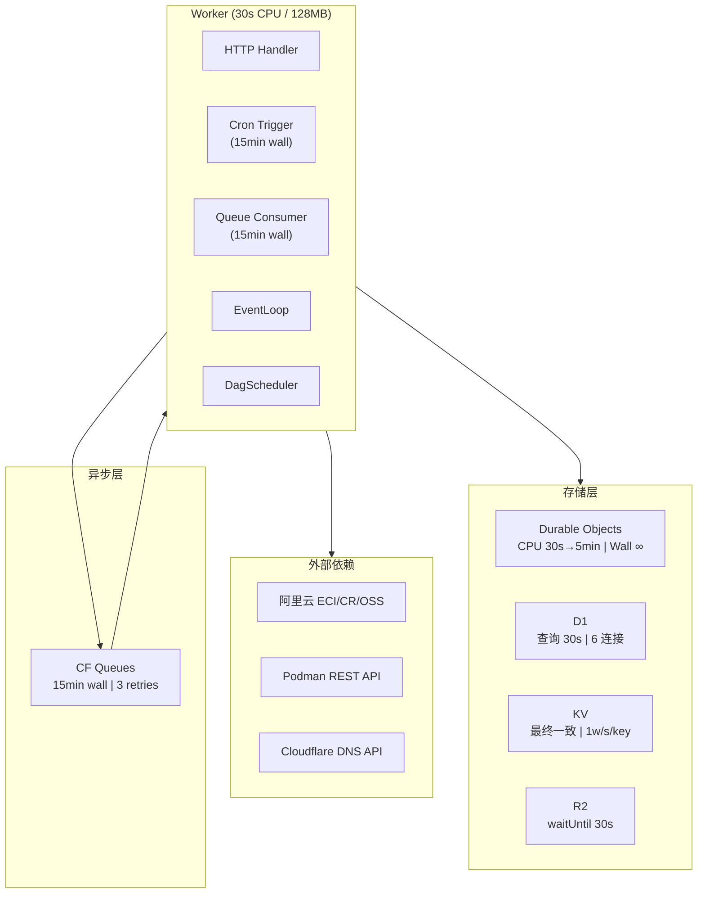
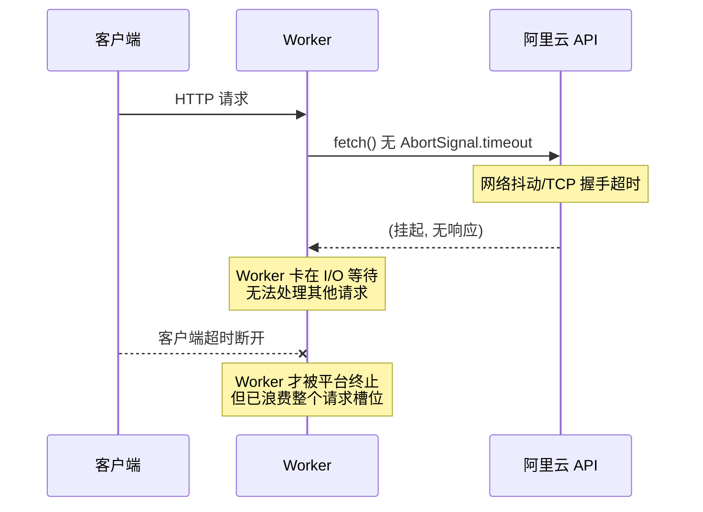
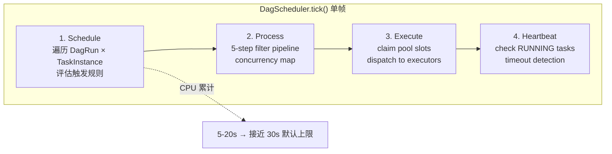
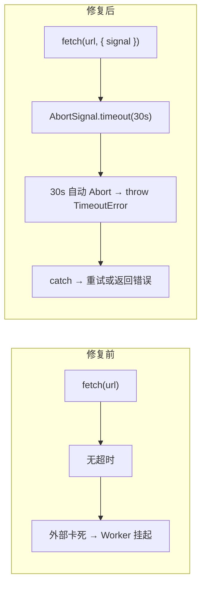

# Cloudflare Workers 运行时风险策略

## 平台限制总览

### Worker 层

| 指标 | Free | Paid | 硬上限 |
|------|------|------|--------|
| CPU 时间 / invocation | 10 ms | 30 s（默认） | **5 min**（可配 `cpu_ms`） |
| Wall clock — HTTP 请求 | 不限（客户端连接期间） | 同 | — |
| Wall clock — Cron | 10 ms | interval<1h→30s; ≥1h→15min | **15 min** |
| 内存 | 128 MB | 128 MB | **128 MB** |
| 子请求 / invocation | 50 | 1,000 | **1,000** |

### Durable Object

| 指标 | 限制 |
|------|------|
| CPU 时间 / request | 30 s（默认），可配至 **5 min** |
| Wall clock — RPC/HTTP | **不限**（呼叫方保持连接期间） |
| Wall clock — Alarm handler | **15 min** |
| 单 DO 吞吐 | ~1,000 req/s（超限返回 overloaded） |
| 计费粒度 | 128 MB × wall clock 时长 |

### D1

| 指标 | 限制 |
|------|------|
| 单查询最大时长 | **30 s** |
| 并发连接 / Worker invocation | **6** |
| 查询数 / Worker invocation | 1,000（Paid） |
| 单行/Blob 最大 | 2 MB |

### KV

| 指标 | 限制 |
|------|------|
| 一致性模型 | **最终一致**（传播 ≤ 60s） |
| 同 key 写入频率 | **1 write/s**（超限 → 429） |
| 值大小 | 25 MiB |
| `cacheTtl` 最小值 | 60 s |
| Negative lookup 缓存 | 是（未命中也缓存） |

### R2

| 指标 | 限制 |
|------|------|
| `ctx.waitUntil` 时限 | **30 s**（tee() 模式不可靠） |
| size 限制 | 无单对象上限 |
| 同 key 并发写 | 触达一定频率 → 429 |

### Queues

| 指标 | 限制 |
|------|------|
| Wall clock / invocation | **15 min** |
| CPU 时间 / invocation | 30 s（可配至 5 min） |
| 最大重试 | 100 次 |
| 单消息大小 | 128 KB |
| Batch size | 1–100 |
| Batch timeout | 0–60 s |
| 消息保留 | 最长 14 天 |

---

## 系统绑定与平台限制总览



---

## 逐组件风险评估

### R1 — Provider 外部调用无超时（高）

**影响范围：** 全链路。

**位置：**
```
src/providers/alibaba/rpc.ts           rpcCall() → fetch(signedUrl)
src/providers/alibaba/oss.ts           → fetch(url)
src/providers/podman/*.ts              → 8 处 fetch()
src/providers/cloudflare/dns.ts        → fetch(url, init)
src/providers/cloudflare/r2-s3.ts      → fetch(url, ...)
```

**现状：** 所有外部 `fetch()` 调用均未携带 `signal: AbortSignal.timeout(N)`。

**触发条件：**
- 阿里云 ECI/CR/OSS API 因网络抖动 TCP 握手超时
- Podman REST API 宿主机负载过高无响应
- Cloudflare DNS API 偶发慢响应

**后果：**



**缓解策略：**
1. 所有出站 `fetch()` 加 `AbortSignal.timeout(30_000)`
2. Provider 接口增加可选的 `AbortSignal` 参数，让上层调用者控制超时
3. Alibaba RPC 层 catch `TimeoutError` 并重试一次（阿里云 API 偶发抖动是常态）

**优先级：** P0 — 这是让外部故障内部化的最短路径。

---

### R2 — 未配置 `cpu_ms`（中高）

**影响范围：** DagScheduler, EventLoop, Queue consumer, HTTP handler。

**位置：** `wrangler.toml` 全文件。

**现状：** 没有 `[limits]` 段，CPU 预算为默认 **30 秒**。

**高 CPU 路径分析：**

| 路径 | 单次调用内容 | 估算 CPU |
|------|-------------|----------|
| DagScheduler.tick() | 4 阶段：遍历 DagRun × TaskInstance × 触发规则 × filter × execute | 5-20s |
| WorkflowRunner.executeJob() | DAG 任务链执行 × 多次 DO 读写 × provider 调用 | 10-25s |
| EventLoop.tick() | 批量 dispatch ≤20 事件 × 每个 handler 1 次 D1 查询 | 3-10s |
| AuditRouter GET /logs | R2 后端全量扫描所有 batch 文件 × 过滤 | 5-15s |

**触发条件：** 同时运行 3+ 个 workflow 时，单次 DagScheduler tick 可能超 30s CPU。

**后果：** Error 1102 `Exceeded CPU Time Limits`，请求/Queue message 被平台强制终止，状态可能不一致。

**缓解策略：**
1. 在 `wrangler.toml` 加 `[limits] cpu_ms = 120_000`（2 分钟安全线）
2. 长 CPU 路径加检查点：处理 N 个 task 后 `await scheduler.wait(0)` 让出 CPU
3. Queue consumer 侧，`handleWorkflowJobRun` 拆成多个 queue message（每步一个）

**优先级：** P0 — 一行配置，但影响面极大。

---

### R3 — Queue consumer 顺序处理 + batch timeout 不匹配（中）

**影响范围：** 异步任务处理延迟。

**位置：**
```
src/queue/consumer.ts       processMessages() — for-of 顺序处理
wrangler.toml:72            max_batch_timeout = 10
```

**现状：** `processMessages` 是 `for (const msg of messages)` 顺序处理。`handleImagePull` 调用远端 `imgProvider.pull()`（无超时的 HTTP fetch），如果单条消息处理 8 秒，10 秒 batch timeout 内只能处理 1 条消息。

**后果：**
- 剩余消息在下一次 consumer invocation 才处理，延迟 ≥ max_batch_timeout
- 如果 batch size=5 且每条消息都慢，5 条消息分散到 5 次 invocation，总延迟 ≥ 50s
- 队列积压时放大效应显著

**缓解策略：**
1. `max_batch_size` 降到 2，配 `max_batch_timeout = 5`
2. `handleImagePull` 加 20s 超时（在 R1 修复后自然解决）
3. 考虑 `Promise.allSettled` 并发处理非依赖的消息（当前 batch 内消息无依赖关系）

**优先级：** P1 — 性能退化，非正确性问题。

---

### R4 — DagScheduler 单帧过重（中）

**影响范围：** Workflow 调度准确性。

**位置：** `src/core/scheduler/dag-scheduler.ts` `tick()` 方法。

**现状：** 每次 tick 跑全量 4 阶段，所有 active DagRun 的所有 TaskInstance 都在一帧内处理。



**触发条件：** 3+ 个 active workflow × 每个 20+ task 时。

**后果：**
- 单帧 CPU 超时 → 整个 tick 废弃，状态不回滚
- 新 task 的调度延迟放大（`intervalMs` 默认 5000ms × 重试）
- Queue consumer 里 `handleWorkflowJobRun` 串行执行业务逻辑 + DAG schedule，CPU 预算更紧张

**缓解策略：**
1. 每个阶段加 `yieldPoint()`（`await new Promise(r => setTimeout(r, 0))`）让 Worker 刷新 CPU 计数器
2. 对单个 DagRun 的 task 处理数量加硬上限（如每帧最多处理 50 个 task instance）
3. `handleWorkflowJobRun` 改为每次只执行一个 step，通过 Queue retry 推进流水线

**优先级：** P1 — 默认配置下风险可控，workflow 规模增长后暴露。

---

### R5 — `ConsoleLogger` 无界内存增长（低）

**位置：** `src/core/audit/console-logger.ts:19`。

**现状：**
```typescript
#entries: StoredAuditEntry[] = [];  // 只 push，从不 trim
```

其他 logger 全有上限：`WorkersAuditLogger: 500`、`HybridAuditLogger: 2000`、`LocalAuditLogger: 2000`。

**后果：** 仅影响 `npm run dev` 本地开发。生产环境 `AUDIT_BACKEND=r2` 不走 ConsoleLogger。长期运行的 dev session 可能积累数万条日志对象（每条 ~300 bytes），数十 MB 内存增长。

**缓解策略：** 加 `MAX_ENTRIES = 2000` + `shift()`，与其他 logger 对齐。

**优先级：** P2 — 仅影响本地开发。

---

### R6 — KV 同 key 写入频率限制（低）

**位置：** `src/core/audit/hybrid-logger.ts:138-148`。

**现状：** `HybridAuditLogger.#persistToStore` 使用 `audit:ring:ids` 作为共享索引 key，每次审计条目写入都会 CAS 更新此 key。审计频率 > 1/s 时，KV 返回 429。

**已有缓解：** 3 次 CAS 重试循环，但未区分 CAS 冲突（版本不匹配 → 读新版本重试）和速率限制（429 → 指数退避）。

**后果：** 高审计频率下索引更新丢失，`queryFromStore` 可能漏掉最近的条目。不丢失数据（每个条目独立存储在其他 key），丢失的是索引记录。

**缓解策略：** 区分 `TransactConflictError` 和 HTTP 429，对后者用指数退避（起始 1s）。

**优先级：** P2 — 仅影响 Hybrid logger 的索引完整性。

---

### R7 — D1 30s 查询超时 + R2 全量扫描（低）

**位置：**
- 所有 D1 查询（查询时间取决于索引覆盖度）
- `src/core/audit/r2-logger.ts:169-226` `query()` 方法

**现状：** R2 logger 的 `query()` 对 `prefix` 下所有 batch 文件做 list → 逐个 get → 解析 JSON → 过滤。日志量大时（数万个 batch 文件），单次查询可能耗时十几秒。

**后果：** HTTP 请求 `/api/logs?facility=sandbox` 超时。

**缓解策略：**
1. audit log batch 文件按 facility + 时间分 prefix 存储（当前只用 `audit-logs/` 一个 prefix）
2. query 加时间范围强制过滤（如默认只查最近 24h）
3. D1 表加覆盖索引（需核查当前 schema）

**优先级：** P2 — 日志量增长后暴露。

---

## 无需处理

| 项 | 原因 |
|----|------|
| 128 MB 内存 OOM | 所有内存结构有界（ring buffer with capacity），正常操作安全 |
| D1 6 连接超限 | 单 invocation 查询远低于 6 并发 |
| Queue 重试耗尽 (max_retries=3) | 已配置。建议生产开 DLQ |
| KV 最终一致性写后读 | `CachedAtomicStore` + DO 强一致路径已覆盖 |
| R2 `waitUntil` 30s 超时 | 本项目无 tee() 模式 |
| WebSocket DO 超时 | DO RPC wall clock 不限，NotificationDO/LogStreamDO 稳定 |

---

## 修复优先级矩阵

| # | 风险 | 影响 | 概率 | 修复成本 | 优先级 |
|---|------|------|------|---------|--------|
| R1 | Provider fetch 无超时 | 全链路挂起 | 中（阿里云 API 偶发抖动） | 中（逐文件加 signal） | **P0** |
| R2 | 未配置 cpu_ms | Error 1102 | 中（workflow 多时触发） | 低（一行配置） | **P0** |
| R3 | Queue batch timeout 不匹配 | 性能退化 | 低（image pull 低频） | 低（调 batch size） | P1 |
| R4 | DagScheduler 单帧过重 | 调度延迟 | 低（当前规模小） | 中（加 yield point） | P1 |
| R5 | ConsoleLogger 无界 | 本地 OOM | 低（仅 dev） | 极低 | P2 |
| R6 | KV 429 退避不区分 | 索引丢失 | 极低 | 低 | P2 |
| R7 | D1/R2 日志查询超时 | 日志不可查 | 极低（需海量日志） | 中（改 prefix 结构） | P2 |

---

## P0 修复方案

### R1: Provider fetch 超时



```typescript
// rpc.ts — 最小侵入式修复
const DEFAULT_RPC_TIMEOUT_MS = 30_000;

export async function rpcCall(
  endpoint: string,
  accessKeyId: string,
  accessKeySecret: string,
  action: string,
  version: string,
  params: RpcParams,
  signal?: AbortSignal,  // 新增可选参数
): Promise<Record<string, unknown>> {
  // ... 签名逻辑不变 ...
  const effectiveSignal = signal ?? AbortSignal.timeout(DEFAULT_RPC_TIMEOUT_MS);
  const resp = await fetch(signedUrl, { method: 'POST', signal: effectiveSignal });
  // ... 解析逻辑不变 ...
}
```

其他 provider（Podman, DNS, S3, OSS）同理。

### R2: cpu_ms 配置

```toml
# wrangler.toml — 追加
[limits]
cpu_ms = 120_000  # 2 分钟，从默认 30s 提升。DagScheduler 单帧约 5-20s，留足安全边界。
```

---

## 参考资料

- [Cloudflare Workers Limits](https://developers.cloudflare.com/workers/platform/limits/)
- [Cloudflare Workers Pricing](https://developers.cloudflare.com/workers/platform/pricing/)
- [Durable Objects Limits](https://developers.cloudflare.com/durable-objects/platform/limits/)
- [D1 Limits](https://developers.cloudflare.com/d1/platform/limits/)
- [KV Limits](https://developers.cloudflare.com/kv/platform/limits/)
- [R2 Workers API](https://developers.cloudflare.com/r2/api/workers/workers-api-reference/)
- [Queues Limits & Batching](https://developers.cloudflare.com/queues/platform/limits/)
- [Queues Configuration](https://developers.cloudflare.com/queues/configuration/batching-retries/)
