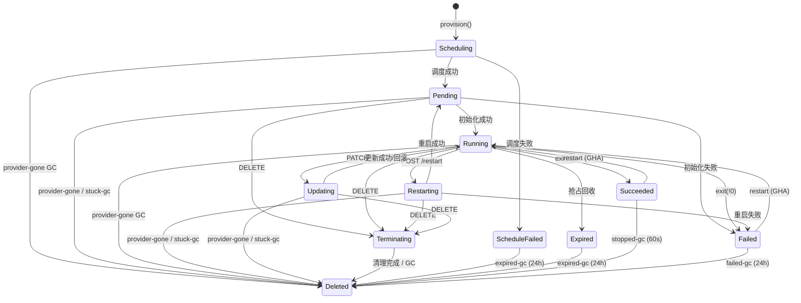
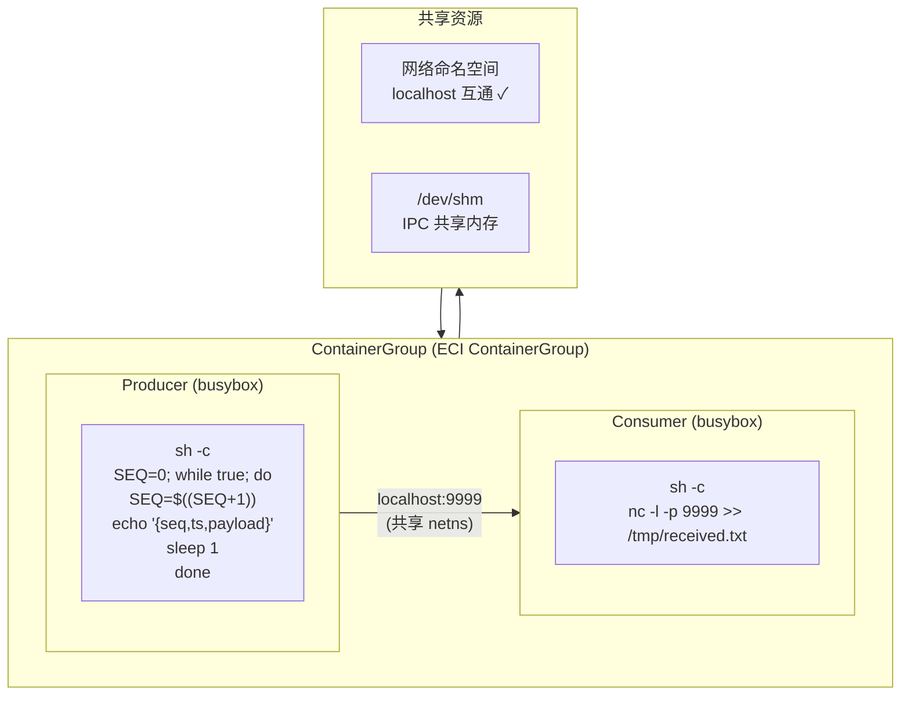
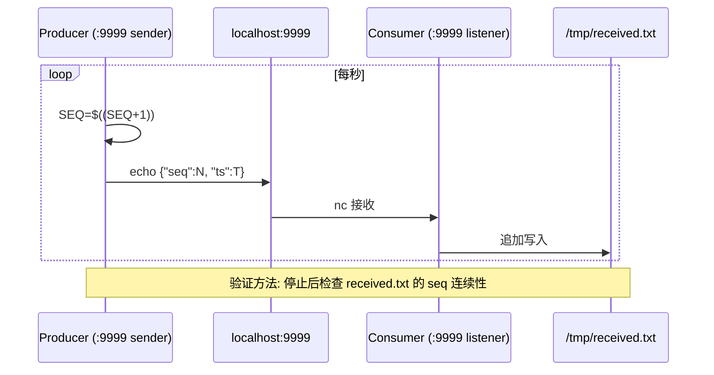
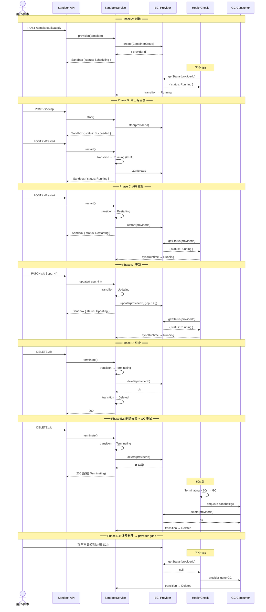

# Container Group 全生命周期验证真值表

> 基于 Producer-Consumer 模型验证 11 状态 SandboxStatus + 全 GC 路径
> 共享资源: localhost (netns)、EmptyDir (`/mnt/shared`)、IPC (`/dev/shm`)

## 1. 完整状态机 (11 态)



## 2. 实验拓扑



## 3. Producer-Consumer 数据流



## 4. GC 决策树

```mermaid
flowchart TD
    TICK["health:check tick"] --> IDX["scan sandbox:ids"]
    IDX --> FILTER{"status?"}

    FILTER -->|Deleted| SKIP["continue"]
    FILTER -->|Succeeded| S60{"duration > 60s?"}
    S60 -->|yes| SGC["stopped-gc"]
    S60 -->|no| SKIP

    FILTER -->|Failed| F60{"duration > 60s?"}
    F60 -->|yes| FGC["failed-gc"]
    F60 -->|no| SKIP

    FILTER -->|Terminating| T60{"duration > 60s?"}
    T60 -->|yes| TGC["terminating-gc"]
    T60 -->|no| SKIP

    FILTER -->|ScheduleFailed| SF24{"duration > 24h?"}
    SF24 -->|yes| EGC["expired-gc"]
    SF24 -->|no| SKIP

    FILTER -->|Expired| E24{"duration > 24h?"}
    E24 -->|yes| EGC
    E24 -->|no| SKIP

    FILTER -->|Scheduling/Pending/<br/>Restarting/Updating| GSTATE{"getStatus()?"}

    GSTATE -->|null| PGONE["provider-gone GC"]
    GSTATE -->|Running<br/>(Scheduling only)| PROMOTE["auto-promote → Running"]
    GSTATE -->|other| T10{"duration > 10min?"}
    T10 -->|yes| STUCK["stuck-gc"]
    T10 -->|no| SKIP

    FILTER -->|Running| CHKR{"healthMaxRetries=-1?"}
    CHKR -->|yes| SKIP
    CHKR -->|no| GSTAT{"getStatus()?"}
    GSTAT -->|null| PGONE
    GSTAT -->|ok| ALIVE{"anyRunning?"}
    ALIVE -->|no| FAIL{"fails ≥ maxRetries?"}
    FAIL -->|yes| EXIT["exited-gc"]
    FAIL -->|no| INCR["fail++"]
    ALIVE -->|yes| ALLOK{"allHealthy?"}
    ALLOK -->|yes| RESET["fail=0, mark stable"]
    ALLOK -->|no| UFAIL{"fails ≥ maxRetries?"}
    UFAIL -->|yes| UNHEALTHY["unhealthy-gc"]
    UFAIL -->|no| INCR

    PGONE --> DISPATCH["dispatchGc()"]
    SGC --> DISPATCH
    FGC --> DISPATCH
    TGC --> DISPATCH
    EGC --> DISPATCH
    STUCK --> DISPATCH
    EXIT --> DISPATCH
    UNHEALTHY --> DISPATCH

    DISPATCH --> MARKER{"marker 有效?"}
    MARKER -->|yes| SKIP
    MARKER -->|no| QUEUE{"Queue 可用?"}
    QUEUE -->|yes| ENQUEUE["入队 + 写 marker"]
    QUEUE -->|no| INLINE["inline: provider.delete()<br/>→ gcUpdateState → Deleted"]
```

## 5. 实验流程



## 6. 表 1: 完整生命周期 × 数据完整性真值矩阵

| # | 场景 | 源状态 | 操作/事件 | 目标状态 | Producer | Consumer | 网络 | 预期 |
|---|---|---|---|---|---|---|---|---|
| **A1** | 正常创建 | (none) | `provision()` | S→R | Running | Running | ✓ | 两容器 Running，Producer 发送 Consumer 接收 |
| **A2** | 调度失败 | (none) | `provision()` 资源不足 | S→SF | N/A | N/A | N/A | 无 providerId，24h auto-GC |
| **A3** | 调度中外部删 | S | 外部删 ECI | S⇢D | N/A | N/A | N/A | provider-gone GC 即时清理 |
| **B1** | 优雅停止 | R | `stop()` | Su | 终止 | 终止 | ✗ | Producer 停止，received.txt 保留 |
| **B2** | 软终态重启 | Su | `restart()` | R | 恢复 | 恢复 | ✓ | 新 Producer/Consumer 启动，seq 归零 |
| **B3** | 软终态删除 | Su | `DELETE` | T→D | N/A | N/A | ✗ | 资源释放，索引移除 |
| **B4** | 强制失败 | R | kill/oom | F | 终止 | 终止 | ✗ | 可能有数据截断 |
| **B5** | 失败重启 | F | `restart()` | R | 恢复 | 恢复 | ✓ | Consumer 容错，重新开始 |
| **C1** | API 重启 | R | `POST /restart` | Rs→R | 暂停→恢复 | 暂停→恢复 | 短暂断→恢复 | seq 连续 |
| **C2** | 重启中外部删 | Rs | 外部删 ECI | Rs⇢D | N/A | N/A | N/A | provider-gone GC |
| **C3** | 重启超时 | Rs | provider 无响应 10min | Rs⇢D | N/A | N/A | N/A | stuck-gc |
| **D1** | 规格更新 | R | `PATCH / {cpu:4}` | U→R | 暂停→恢复 | 暂停→恢复 | 短暂断→恢复 | 新 cpu=4 生效 |
| **D2** | 更新中外部删 | U | 外部删 ECI | U⇢D | N/A | N/A | N/A | provider-gone GC |
| **D3** | 更新超时 | U | provider 无响应 10min | U⇢D | N/A | N/A | N/A | stuck-gc |
| **E1** | 正常删除 | R | `DELETE` | T→D | N/A | N/A | ✗ | provider 确认删除后才标记 Deleted |
| **E2** | 删除失败重试 | R | `DELETE` provider 抛异常 | T→(60s)⇢D | N/A | N/A | — | 留在 T，健康检查 GC 重试 |
| **E3** | GC 消费者处理 | T | Queue consumer | D | N/A | N/A | N/A | consumer 先 delete 再 OCC 写 Deleted |
| **E4** | 运行时外部删 | R | 外部删 ECI | R⇢D | N/A | N/A | N/A | provider-gone 即时 GC |
| **F1** | 调度失败清理 | SF | 24h | SF⇢D | N/A | N/A | N/A | expired-gc |
| **F2** | 过期清理 | E | 24h | E⇢D | N/A | N/A | N/A | expired-gc |
| **F3** | 成功未重启清理 | Su | 60s | Su⇢D | N/A | N/A | N/A | stopped-gc |

## 7. 表 2: API 操作合法前置状态（完整 11 态）

| 状态 s | Create | Stop | Start | Restart | Update | Delete | Sync | Health |
|---|---|---|---|---|---|---|---|---|
| **(none)** | V | I | I | I | I | I | I | I |
| **Scheduling** | I | 409 | 409 | 409 | 409 | I | 404 | ✓ |
| **ScheduleFailed** | I | 409 | 409 | 409 | 409 | V(→D) | 404 | ✓ |
| **Pending** | I | 409 | 409 | 409 | 409 | V(→T) | ✓ | ✓ |
| **Running** | I | V(→Su/T) | 409 | V(→Rs) | V(→U) | V(→T) | ✓ | ✓ |
| **Succeeded** | I | 409 | V(→R) | V(→R) | 409 | V(→T) | ✓ | ✓ |
| **Failed** | I | 409 | V(→R) | V(→R) | 409 | V(→T) | ✓ | ✓ |
| **Restarting** | I | 409 | 409 | 409 | 409 | V(→T) | ✓ | ✓ |
| **Updating** | I | 409 | 409 | 409 | 409 | V(→T) | ✓ | ✓ |
| **Terminating** | I | 409 | 409 | 409 | 409 | I(幂等) | ✓ | ✓ |
| **Expired** | I | 409 | 409 | I | I | V(→D) | 404 | ✓ |
| **Deleted** | I | 404 | 404 | 404 | 404 | I(幂等) | 404 | 404 |

## 8. 表 3: GC 路径真值表

| GC 原因 | 触发条件 | 检测方式 | 延迟 | 适用状态 |
|---|---|---|---|---|
| `provider-gone` | `getStatus()` → null | 主动探测 | 即时 | S, P, Rs, U, R |
| `stopped-gc` | Succeeded > 60s | 超时 | 60s | Su |
| `failed-gc` | Failed > 24h | 超时 | 24h | F |
| `terminating-gc` | Terminating > 60s | 超时 | 60s | T |
| `stuck-gc` | 瞬态 > 10min | 超时 | 10min | S, P, Rs, U |
| `exited-gc` | 容器全退 + fail ≥ maxRetries | 计数 | maxRetries × tick | R |
| `unhealthy-gc` | 容器不健康 + fail ≥ maxRetries | 计数 | maxRetries × tick | R |
| `expired-gc` | 硬终态 > 24h | 超时 | 24h | SF, E |

> Note: `failed-gc` uses 24h window for audit data preservation (crash logs, metrics in failed container), matching `expired-gc` behavior.

## 9. 表 4: 共享资源生命周期

| 资源类型 | Create 时 | Running 时 | Succeeded 时 | Deleted 时 | Restart 后 |
|---|---|---|---|---|---|
| **localhost (netns)** | 可用 | 可用 | 不可用 | 不可用 | 可用 |
| **EmptyDir** | 创建 | 读写 | 保留(不可访问) | 销毁 | 新 EmptyDir |
| **/dev/shm (IPC)** | 可用 | 可用 | 保留 | 销毁 | 新 /dev/shm |
| **NFS** | 挂载 | 读写 | 可访问 | 卸载(NFS 仍存) | 重新挂载 |
| **Disk (云盘)** | 挂载 | 读写 | 保留 | 取决于 deleteWithInstance | 重新挂载 |
| **ConfigMap env** | 注入 | 只读 | 不可访问 | 销毁 | 重新注入 |
| **Secret 卷** | 注入 | 只读 | 保留 | 销毁 | 重新注入 |

## 10. 安全 & 活性属性

### Safety

| # | 属性 | 公式 |
|---|---|---|
| P1 | 终态不可复活 | ∀c: s(c)∈{SF,E,D} ⟹ ∀ω: δ(s(c),ω)=s(c) |
| P2 | Restarting 仅从 Running | s'(c)=Rs ⟹ s(c)=R |
| P3 | Updating 仅从 Running | s'(c)=U ⟹ s(c)=R |
| P4 | Terminating 仅从可删除状态 | s'(c)=T ⟹ s(c)∈{R,P,Rs,U,Su,F} |
| P5 | 容器 Running 蕴含 CG Running | ∃n: cs(c,n)=Running ⟹ s(c)=R |
| P6 | 删除须经 Terminating | s(c)→D 唯经由 s(c)→T→D（SF/E 除外） |
| P7 | provider delete 失败不跳 Deleted | provider.delete() 抛异常 ⟹ s(c) 留在 T |
| P8 | 硬终态 24h 清理 | s(c)∈{SF,E} ∧ duration>24h ⟹ expired-gc |

### Liveness

| # | 属性 | 公式 |
|---|---|---|
| L1 | 瞬态最终收敛 | s(c)∈{S,P,Rs,U} ↝ s(c)∈{R,SF,F,D} |
| L2 | Terminating 最终 Deleted | s(c)=T ↝ s(c)=D |
| L3 | 所有态可达 Deleted | ∀s∉T: ∃ω*: δ*(s,ω*)=D |
| L4 | 软终态可重启 | s(c)∈{Su,F} ⟹ δ(s(c),restart)=R |
