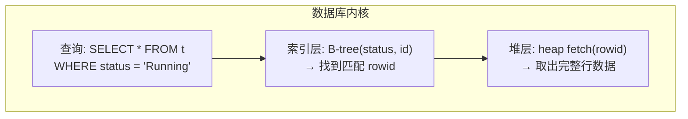
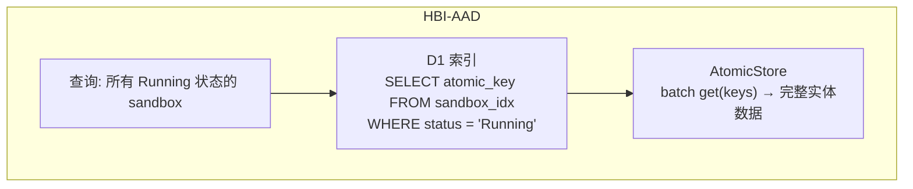

# D1 作为底层索引结构

## 心智模型：AtomicStore 是堆，D1 是索引

关系数据库内部结构：



把这个模型平移过来：



**D1 不存完整实体——只存索引列 + AtomicStore key。** 权威数据永远在 AtomicStore。D1 是一个可重建的、有结构的、可查询的指针层。

---

## 索引类型

### 1. 二级索引 — 加速条件过滤

最基础的形式。把 KV/DO 做不到的 WHERE 条件映射为 D1 索引。

```
sandbox_idx (status, creator_id, created_at) → atomic_key
```

```sql
CREATE TABLE sandbox_idx (
  atomic_key TEXT PRIMARY KEY,  -- 指向 AtomicStore
  status     TEXT NOT NULL,
  creator_id TEXT NOT NULL,
  created_at INTEGER NOT NULL
);
CREATE INDEX idx_sandbox_status ON sandbox_idx(status, created_at);
CREATE INDEX idx_sandbox_creator ON sandbox_idx(creator_id, created_at);
```

查询模式：
```
"Running 状态的 sandbox"        → WHERE status = 'Running'
"用户 X 的 sandbox"             → WHERE creator_id = 'user_123'
"最近创建的 Running sandbox"    → WHERE status = 'Running' ORDER BY created_at DESC
```

### 2. 覆盖索引 — 跳过 AtomicStore

当查询需要的所有列都在索引中时，直接返回 D1 数据，无需回表。

```
sandbox_list_idx (status, creator_id, name, created_at) → atomic_key (可选)
```

```sql
CREATE TABLE sandbox_list_idx (
  atomic_key TEXT PRIMARY KEY,
  status     TEXT NOT NULL,
  creator_id TEXT NOT NULL,
  name       TEXT NOT NULL,
  created_at INTEGER NOT NULL
);
```

列表 API 不需要完整实体——只需要 id/name/status/creator/时间。D1 直接返回，**零次 AtomicStore 调用**。

完整实体只在详情 API (GET /sandbox/:id) 时才从 AtomicStore 加载。

### 3. FTS5 全文索引 — 搜索

D1 支持 SQLite FTS5 全文搜索引擎。

```sql
-- FTS5 虚拟表
CREATE VIRTUAL TABLE sandbox_fts USING fts5(
  name,
  description,
  content='sandbox_list_idx',
  content_rowid='rowid'
);

-- 自动同步触发器
CREATE TRIGGER sandbox_fts_insert AFTER INSERT ON sandbox_list_idx BEGIN
  INSERT INTO sandbox_fts(rowid, name, description) VALUES (new.rowid, new.name, new.description);
END;
```

```typescript
// 搜索 API
async searchSandboxes(q: string): Promise<SandboxSummary[]> {
  const rows = await db.prepare(
    `SELECT s.atomic_key, s.name, s.status, s.created_at
     FROM sandbox_fts f
     JOIN sandbox_list_idx s ON f.rowid = s.rowid
     WHERE sandbox_fts MATCH ?
     ORDER BY rank
     LIMIT 50`
  ).bind(q).all();
  return rows.results;
}
```

**适用场景：**
- Pod 模板搜索：按名称、描述、标签搜索
- 镜像搜索：按 image name、tag、digest 搜索
- 审计日志搜索：按消息内容全文检索
- Action/Workflow 搜索：按 workflow 名称、描述搜索

### 4. JOIN 索引 — 跨实体关联

KV/DO 里数据是孤立的。D1 可以做关联查询。

```sql
-- 用户-权限组关联索引
CREATE TABLE user_perm_group_idx (
  user_id    TEXT NOT NULL,
  group_id   TEXT NOT NULL,
  group_name TEXT NOT NULL,
  PRIMARY KEY (user_id, group_id)
);
CREATE INDEX idx_upg_user ON user_perm_group_idx(user_id);
CREATE INDEX idx_upg_group ON user_perm_group_idx(group_id);

-- 沙箱-卷关联索引
CREATE TABLE sandbox_volume_idx (
  sandbox_id TEXT NOT NULL,
  volume_id  TEXT NOT NULL,
  mount_path TEXT NOT NULL,
  PRIMARY KEY (sandbox_id, volume_id)
);
```

```sql
-- "找到用户 X 所属权限组的所有规则" — 一次 JOIN
SELECT DISTINCT r.*
FROM user_perm_group_idx upg
JOIN perm_group_rules_idx r ON upg.group_id = r.group_id
WHERE upg.user_id = ?;

-- "列出所有挂载了 NFS 卷的 Running sandbox" — 两次 JOIN
SELECT DISTINCT s.atomic_key
FROM sandbox_volume_idx sv
JOIN sandbox_idx s ON sv.sandbox_id = s.atomic_key
WHERE sv.volume_id = ? AND s.status = 'Running';
```

### 5. 聚合索引 — 仪表盘/统计

KV 完全做不到的聚合查询。

```sql
-- 预聚合：sandbox 按状态计数
CREATE TABLE sandbox_stats (
  status      TEXT PRIMARY KEY,
  count       INTEGER NOT NULL,
  updated_at  INTEGER NOT NULL
);

-- 实时刷新
INSERT OR REPLACE INTO sandbox_stats (status, count, updated_at)
SELECT status, COUNT(*), unixepoch()
FROM sandbox_idx
GROUP BY status;
```

```typescript
// GET /api/dashboard/summary — 单次 D1 查询，无 AtomicStore 调用
async function getDashboardSummary(db: D1Database) {
  const [sandboxStats, volumeStats, recentActivity] = await Promise.all([
    db.prepare('SELECT * FROM sandbox_stats').all(),
    db.prepare('SELECT type, COUNT(*) as count FROM volume_idx GROUP BY type').all(),
    db.prepare(
      'SELECT atomic_key, name, status, created_at FROM sandbox_idx ORDER BY created_at DESC LIMIT 10'
    ).all(),
  ]);
  return { sandboxStats, volumeStats, recentActivity };
}
```

### 6. 图遍历索引 — 权限 DAG

`PermissionDag.evaluate()` 在内存中构建 DAG 并遍历。节点数大时（数百策略 × 数十权限组），每次请求重建 DAG 是纯 CPU 开销。

把 DAG 的邻接表存入 D1，用递归 CTE 做图遍历：

```sql
-- 策略 DAG 边索引
CREATE TABLE policy_dag_edge (
  from_id TEXT NOT NULL,
  to_id   TEXT NOT NULL,
  effect  TEXT NOT NULL,  -- 'allow' | 'deny'
  PRIMARY KEY (from_id, to_id)
);
CREATE INDEX idx_edge_to ON policy_dag_edge(to_id);

-- 用递归 CTE 从当前策略节点遍历所有祖先（找到能覆盖此资源的 deny）
WITH RECURSIVE ancestors AS (
  SELECT from_id, to_id, effect, 0 as depth
  FROM policy_dag_edge
  WHERE to_id = ?  -- 从当前策略开始

  UNION ALL

  SELECT e.from_id, e.to_id, e.effect, a.depth + 1
  FROM policy_dag_edge e
  JOIN ancestors a ON e.to_id = a.from_id
  WHERE a.depth < 10  -- 防止环
)
SELECT * FROM ancestors WHERE effect = 'deny' ORDER BY depth DESC LIMIT 1;
```

**但注意：** D1 的递归 CTE 性能有限（单线程 SQLite）。对于 <500 节点的 DAG，内存中遍历更快。这个索引适用于 DAG 节点数 >1000 的场景。

---

## 索引维护策略

### 同步维护（推荐）


优势：索引始终一致，无滞后。
代价：每实体 ~2ms 额外延迟。

### 异步维护（高写入量场景）


### 全量重建（兜底）

```sql
-- 任意时刻可从 AtomicStore 完全重建索引
DELETE FROM sandbox_idx;
-- 然后逐条 INSERT（通过 Worker 脚本遍历 AtomicStore）
```

D1 索引是可丢弃的——丢了就从 AtomicStore 重建。**D1 不是权威数据，是查询加速器。**

---

## 写入路径决策

| 索引类型 | 写入策略 | 理由 |
|---------|---------|------|
| 二级索引 | **同步** | 行小（~100 bytes），INSERT ~2ms |
| 覆盖索引 | **同步** | 同上 |
| FTS5 索引 | **同步 + 触发器** | SQLite 触发器自动维护 |
| JOIN 索引 | **同步** | 关联变更时同时更新 |
| 聚合索引 | **定时刷新** | 不需实时精确，30s 刷新一次 |
| 图遍历索引 | **同步** | 权限变更低频 |

---

## 索引设计总览

```sql
-- ═══ 1. Sandbox 索引 — 翻页/过滤/搜索/分组 ═══

CREATE TABLE sandbox_idx (
  atomic_key  TEXT PRIMARY KEY,
  status      TEXT NOT NULL,
  creator_id  TEXT NOT NULL,
  name        TEXT NOT NULL,
  description TEXT DEFAULT '',
  region      TEXT DEFAULT '',
  created_at  INTEGER NOT NULL,
  updated_at  INTEGER NOT NULL
);
CREATE INDEX idx_sandbox_status  ON sandbox_idx(status, created_at);
CREATE INDEX idx_sandbox_creator ON sandbox_idx(creator_id, created_at);

CREATE VIRTUAL TABLE sandbox_fts USING fts5(
  name, description,
  content='sandbox_idx', content_rowid='rowid'
);

-- ═══ 2. Volume 索引 ═══

CREATE TABLE volume_idx (
  atomic_key   TEXT PRIMARY KEY,
  type         TEXT NOT NULL,  -- NFSVolume | EmptyDirVolume | ...
  status       TEXT NOT NULL,
  name         TEXT NOT NULL,
  sandbox_id   TEXT,
  created_at   INTEGER NOT NULL
);
CREATE INDEX idx_volume_type ON volume_idx(type);
CREATE INDEX idx_volume_sandbox ON volume_idx(sandbox_id);

-- ═══ 3. Route ACL 索引 ═══

CREATE TABLE route_acl_idx (
  atomic_key    TEXT PRIMARY KEY,
  method        TEXT NOT NULL,
  path_prefix   TEXT NOT NULL,
  effect        TEXT NOT NULL,
  user_id       TEXT,
  user_group_id TEXT,
  priority      INTEGER NOT NULL DEFAULT 0
);
CREATE INDEX idx_acl_priority ON route_acl_idx(priority DESC);

-- ═══ 4. Permission 索引 — 策略/用户组/权限组 ═══

CREATE TABLE policy_idx (
  atomic_key TEXT PRIMARY KEY,
  name       TEXT NOT NULL,
  effect     TEXT NOT NULL,
  priority   INTEGER NOT NULL DEFAULT 0,
  enabled    INTEGER NOT NULL DEFAULT 1
);
CREATE INDEX idx_policy_effect ON policy_idx(effect, priority);

CREATE TABLE usergroup_idx (
  atomic_key TEXT PRIMARY KEY,
  name       TEXT NOT NULL,
  member_ids TEXT NOT NULL DEFAULT '[]'  -- JSON array
);

CREATE TABLE permgroup_idx (
  atomic_key     TEXT PRIMARY KEY,
  name           TEXT NOT NULL,
  user_group_ids TEXT NOT NULL DEFAULT '[]',
  user_ids       TEXT NOT NULL DEFAULT '[]'
);

-- ═══ 5. 关联索引 ═══

CREATE TABLE sandbox_volume_idx (
  sandbox_id TEXT NOT NULL,
  volume_id  TEXT NOT NULL,
  mount_path TEXT NOT NULL,
  PRIMARY KEY (sandbox_id, volume_id)
);

CREATE TABLE user_perm_group_idx (
  user_id  TEXT NOT NULL,
  group_id TEXT NOT NULL,
  PRIMARY KEY (user_id, group_id)
);

-- ═══ 6. 聚合表 ═══

CREATE TABLE sandbox_stats (
  status     TEXT PRIMARY KEY,
  count      INTEGER NOT NULL,
  updated_at INTEGER NOT NULL
);
```

---

## 读写比例估算

| 索引 | D1 行大小 | 写入频率 | 读取频率 | 缓存策略 |
|------|----------|---------|---------|---------|
| sandbox_idx | ~200B | 每分钟 1-10 次 | 每秒 5-20 次 | 覆盖索引，不走 AtomicStore |
| sandbox_fts | ~100B/词 | 跟随 sandbox_idx | 低频（用户搜索） | FTS5 内部管理 |
| route_acl_idx | ~100B | 每天 1-5 次 | **每次请求** | 内存常驻 + D1 兜底 |
| policy_idx | ~120B | 每周几次 | 每请求 1-3 次 | 内存常驻 + D1 兜底 |
| volume_idx | ~150B | 每分钟 1-5 次 | 每请求 0-1 次 | 列表走 D1，详情走 AtomicStore |
| sandbox_stats | ~40B | 30s 刷新 | 仪表盘加载 | 直接走 D1 |
| sandbox_volume_idx | ~80B | 创建/删除时 | 详情查询 | D1 |

---

## 不建索引的

| 实体 | 理由 |
|------|------|
| session / idempotency key | 纯单 key 精确查找 |
| template YAML | 变更极少，解析需要全量加载 |
| audit logs | 存在 R2，偶尔查询 |
| security JWT / presigned URL | 安全敏感，TTL 短 |
| system config / feature flags | 静态数据，内存缓存足够 |

---

## 实现路径

| Phase | 内容 | 解锁能力 |
|-------|------|---------|
| **1** | sandbox_idx + sandbox_list_idx (覆盖索引) | 翻页、按状态/创建者过滤、排序 |
| **2** | route_acl_idx + policy_idx | 消灭全量扫描，跨 Worker 共享 |
| **3** | sandbox_fts (全文索引) | 搜索 sandbox 名称/描述 |
| **4** | volume_idx + sandbox_volume_idx | Volume 列表 + "某个 sandbox 挂载了哪些卷" |
| **5** | user_perm_group_idx + sandbox_stats | 跨实体 JOIN + 仪表盘聚合 |

Phase 1 解锁的功能最多——翻页、过滤、排序——这是当前系统完全做不到的（全量 list + 内存过滤没有伸缩性）。

---

## 一句话

AtomicStore 是硬盘上的堆文件，D1 是 B-tree/哈希/倒排/聚合索引。索引只存指针 + 查询列，权威数据永不在索引中。索引丢了就全量重建——D1 是可丢弃的、可重建的、结构化的查询加速器。
