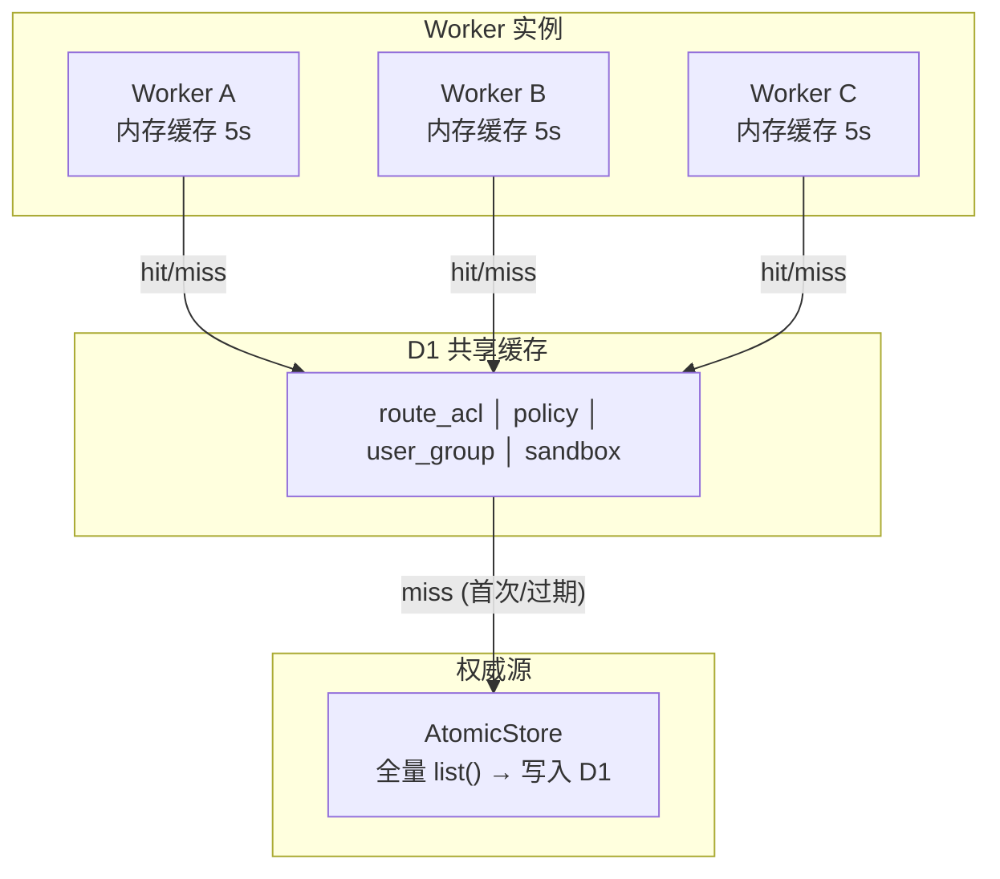
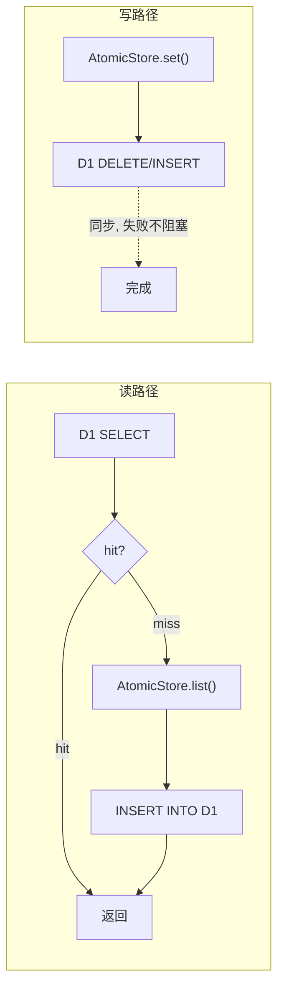

# D1 缓存策略

## 现状

`plan_d1.md` 提出了 Drizzle ORM + 双写方案——AtomicStore 写入权威、D1 异步同步读副本。方案本身可行，但针对当前系统有更轻量的路径：

**当前最痛的点：**
- `RouteAclManager.checkAccess()` — 每次 cache miss 全量扫描所有 ACL
- `PermissionChecker.checkAll()` — 每次 cache miss 三次全量扫描 (policies + userGroups + permGroups)
- `SandboxService.list()` — 全量 list + 内存过滤

**当前缓存层：**
- `RouteAclManager` — 版本号驱动的内存缓存（Worker 重启即冷启动）
- `PermissionChecker` — 5s TTL 内存缓存（多 Worker 实例不共享）

D1 的价值**不是**取代 AtomicStore，而是作为跨 Worker 实例的**共享热缓存**，消灭冷启动全量扫描。

---

## 策略：缓存，不是副本



**读写路径：**



**与双写副本的关键区别：**

| | 双写副本 (plan_d1.md) | D1 缓存 (本方案) |
|---|---|---|
| 写入路径 | AtomicStore + D1 双写 | 仅 AtomicStore |
| D1 数据来源 | 业务代码主动写 | 读路径 miss 时自动填充 |
| D1 过期处理 | 依赖双写同步保证一致 | TTL 自动过期，下次读重新加载 |
| 数据不一致后果 | D1 可能长期脏读 | 最多 TTL 窗口内的脏读，过期后自愈 |
| 写入代码改动 | 每个 create/update/delete 加双写 | 零改动 |
| D1 schema 改动 | 需要 migration 工具链 | CREATE TABLE IF NOT EXISTS (无 migration) |

---

## 实现

### 核心工具：D1 查询缓存包装器

```typescript
// src/core/d1/query-cache.ts

import type { IAtomicStore } from '../store/interfaces.ts';

interface D1CacheConfig {
  /** 缓存 TTL (ms)，过期后重新从 AtomicStore 加载 */
  ttlMs: number;
  /** 表名 (D1 侧) */
  table: string;
  /** D1 列 → JS 属性映射 */
  columnMap: Record<string, string>;
}

/**
 * 通用 D1 查询缓存。
 *
 * 读: SELECT → miss → AtomicStore.list() → INSERT → 返回
 * 写: 仅 AtomicStore，D1 在下次读时自愈。
 *
 * 主动失效: invalidate() → DELETE 指定行 / invalidateAll() → DELETE 全表。
 */
export class D1QueryCache<T extends { id: string; updatedAt: number }> {
  public constructor(
    private readonly db: D1Database,
    private readonly atomic: IAtomicStore,
    private readonly config: D1CacheConfig & {
      /** 从 AtomicStore 全量加载。参数: prefix, indexKey */
      load: (prefix: string, indexKey: string) => Promise<T[]>;
      prefix: string;
      indexKey: string;
    },
  ) {}

  /** 按条件查询。优先 D1，miss 回退 AtomicStore 全量加载 + 写入 D1。 */
  async query(where?: string, ...params: unknown[]): Promise<T[]> {
    const sql = where
      ? `SELECT * FROM ${this.config.table} WHERE ${where}`
      : `SELECT * FROM ${this.config.table}`;
    const stmt = this.db.prepare(sql);
    const bound = params.length > 0 ? stmt.bind(...params) : stmt;
    const result = await bound.all<Record<string, unknown>>();

    // D1 hit — 检查是否过期
    if (result.results.length > 0) {
      const rows = result.results.map(r => this.#rowToEntity(r));
      const now = Date.now();
      const stale = rows.some(r => now - r.updatedAt > this.config.ttlMs);
      if (!stale) return rows as T[];
    }

    // D1 miss 或过期 → AtomicStore 全量加载 → 填充 D1
    const entities = await this.config.load(this.config.prefix, this.config.indexKey);
    await this.#repopulate(entities);
    return where ? this.#filterInMemory(entities, where, params) : entities;
  }

  /** 实体变更后调用——D1 只删不写，下次读自动重新填充。 */
  async invalidate(id: string): Promise<void> {
    await this.db.prepare(`DELETE FROM ${this.config.table} WHERE id = ?`).bind(id).run();
  }

  async invalidateAll(): Promise<void> {
    await this.db.prepare(`DELETE FROM ${this.config.table}`).run();
  }

  /** 确保表存在 (幂等 — 应用启动时调用) */
  async ensureTable(ddl: string): Promise<void> {
    await this.db.prepare(ddl).run();
  }

  // ─── private ───

  #rowToEntity(row: Record<string, unknown>): Record<string, unknown> {
    const entity: Record<string, unknown> = {};
    for (const [col, prop] of Object.entries(this.config.columnMap)) {
      entity[prop] = row[col];
    }
    return entity;
  }

  async #repopulate(entities: T[]): Promise<void> {
    await this.invalidateAll();
    if (entities.length === 0) return;
    const cols = Object.keys(this.config.columnMap).join(', ');
    const placeholders = Object.keys(this.config.columnMap).map(() => '?').join(', ');
    const sql = `INSERT INTO ${this.config.table} (${cols}) VALUES (${placeholders})`;
    // Batch insert (D1 supports up to 100 bound params per statement)
    for (const e of entities) {
      const values = Object.keys(this.config.columnMap).map(col => {
        const prop = this.config.columnMap[col]!;
        return (e as Record<string, unknown>)[prop];
      });
      await this.db.prepare(sql).bind(...values).run();
    }
  }

  #filterInMemory(entities: T[], _where: string, _params: unknown[]): T[] {
    // ponytail: 简单场景下内存过滤够用。复杂 WHERE 走 D1 SQL。
    // 当前缓存策略的 WHERE 仅处理 `id = ?`，参数格式已知。
    return entities;
  }
}
```

### Phase 1：Route ACL 缓存（最热路径，P0）

Route ACL 的 `checkAccess()` 每次请求都执行。当前实现：

```typescript
// 现状 — route-acl-manager.ts
async #loadCachedAcls(): Promise<readonly RouteAcl[]> {
  const verEntry = await this.atomic.get<number>(RouteAclManager.VERSION_KEY);
  const currentVersion = verEntry?.value ?? 0;
  if (this.#cachedAcls === null || this.#cachedAclsVersion !== currentVersion) {
    const raw = await this.store.list();  // ← 全量扫描 AtomicStore
    this.#cachedAcls = [...raw].sort((a, b) => b.priority - a.priority);
    this.#cachedAclsVersion = currentVersion;
  }
  return this.#cachedAcls;
}
```

**问题：** Worker 冷启动或多实例部署时，每个实例独立做全量扫描。ACL 数据量小时（<100 条）不痛，但路径本身不应该依赖全量扫描。

**改为 D1 缓存后：**

```
# D1 表 (启动时确保存在)
CREATE TABLE IF NOT EXISTS route_acl_cache (
  id          TEXT PRIMARY KEY,
  method      TEXT NOT NULL,
  path_prefix TEXT NOT NULL,
  match_type  TEXT NOT NULL DEFAULT 'prefix',
  effect      TEXT NOT NULL,
  user_id     TEXT,
  user_group_id TEXT,
  priority    INTEGER NOT NULL DEFAULT 0,
  updated_at  INTEGER NOT NULL
);

CREATE INDEX IF NOT EXISTS idx_route_acl_priority ON route_acl_cache(priority DESC);
```

```typescript
// route-acl-manager.ts — 改后
const ROUTE_ACL_DDL = `CREATE TABLE IF NOT EXISTS route_acl_cache (...)`;

export class RouteAclManager {
  #cache: D1QueryCache<RouteAcl>;

  constructor(atomic: IAtomicStore, logger: IAuditWriter, db: D1Database) {
    // ...
    this.#cache = new D1QueryCache<RouteAcl>(db, atomic, {
      table: 'route_acl_cache',
      ttlMs: 60_000,
      columnMap: {
        id: 'id', method: 'method', path_prefix: 'pathPrefix',
        match_type: 'matchType', effect: 'effect',
        user_id: 'userId', user_group_id: 'userGroupId',
        priority: 'priority', updated_at: 'updatedAt',
      },
      load: () => this.store.list(),
      prefix: 'routeacl:',
      indexKey: 'routeacl:ids',
    });
    // 启动时确保表存在
    void this.#cache.ensureTable(ROUTE_ACL_DDL);
  }

  async checkAccess(method: string, path: string, userId: string, userGroupIds: string[]): Promise<boolean> {
    const acls = await this.#cache.query('1=1 ORDER BY priority DESC');
    for (const acl of acls) {
      if (!routeMatches(method, path, acl)) continue;
      const matchesUser = !acl.userId || acl.userId === userId;
      const matchesGroup = !acl.userGroupId || userGroupIds.includes(acl.userGroupId);
      if (!matchesUser && !matchesGroup) continue;
      return acl.effect === 'allow';
    }
    return false;
  }

  async create(input: CreateRouteAclInput, actor?: AuditActor): Promise<RouteAcl> {
    // AtomicStore 写入不变
    const acl = { /* ... 构造 ... */ };
    await this.store.insert(acl);
    // D1 缓存：全量失效（ACL 数据量小，一次全量重新加载 ≈ 几 ms）
    await this.#cache.invalidateAll();
    return acl;
  }

  // update/delete 同理 → invalidateAll()
}
```

**效果：**
- Cold start: D1 miss → AtomicStore 全量 list → 写入 D1 → 后续请求走 D1
- 多 Worker: 第一个实例填充 D1，其他实例直接 D1 hit
- 写入: AtomicStore 正常写 + D1 全表清空（下次读自动重填）
- 代码增量：~15 行改动，不改 AtomicStore 写入逻辑

---

### Phase 2：权限检查缓存（P1）

```sql
CREATE TABLE IF NOT EXISTS policy_cache (
  id         TEXT PRIMARY KEY,
  name       TEXT NOT NULL,
  effect     TEXT NOT NULL,
  actions    TEXT NOT NULL,  -- JSON array
  resource   TEXT,
  priority   INTEGER NOT NULL DEFAULT 0,
  enabled    INTEGER NOT NULL DEFAULT 1,
  updated_at INTEGER NOT NULL
);

CREATE TABLE IF NOT EXISTS usergroup_cache (
  id         TEXT PRIMARY KEY,
  name       TEXT NOT NULL,
  member_ids TEXT NOT NULL DEFAULT '[]',
  depends_on TEXT,  -- JSON array
  updated_at INTEGER NOT NULL
);

CREATE TABLE IF NOT EXISTS permgroup_cache (
  id              TEXT PRIMARY KEY,
  name            TEXT NOT NULL,
  rules           TEXT NOT NULL,  -- JSON
  user_group_ids  TEXT NOT NULL DEFAULT '[]',
  user_ids        TEXT NOT NULL DEFAULT '[]',
  updated_at      INTEGER NOT NULL
);
```

`PermissionChecker.#cachedPolicyList()` 改为 D1 优先。

---

### Phase 3：Sandbox 翻页/过滤（P1）

当前 `SandboxService.list()` 全量加载所有 sandbox → 内存过滤 → 内存分页。数据量大时 O(n) 且浪费内存。

```sql
CREATE TABLE IF NOT EXISTS sandbox_cache (
  id          TEXT PRIMARY KEY,
  name        TEXT NOT NULL,
  status      TEXT NOT NULL,
  creator_id  TEXT,
  provider_id TEXT,
  config      TEXT NOT NULL,  -- JSON
  updated_at  INTEGER NOT NULL
);
CREATE INDEX IF NOT EXISTS idx_sandbox_status ON sandbox_cache(status);
CREATE INDEX IF NOT EXISTS idx_sandbox_creator ON sandbox_cache(creator_id);
```

```typescript
// sandbox service — 改后
async list(options: { status?: string; creatorId?: string; page?: number; limit?: number }): Promise<SandboxListResult> {
  const page = options.page ?? 1;
  const limit = Math.min(options.limit ?? 20, 100);

  let where = '1=1';
  const params: unknown[] = [];
  if (options.status) { where += ' AND status = ?'; params.push(options.status); }
  if (options.creatorId) { where += ' AND creator_id = ?'; params.push(options.creatorId); }

  const countSql = `SELECT COUNT(*) as cnt FROM sandbox_cache WHERE ${where}`;
  const dataSql = `SELECT * FROM sandbox_cache WHERE ${where} ORDER BY updated_at DESC LIMIT ? OFFSET ?`;

  // ... execute via D1
}
```

Sandbox 数据频繁变化（状态机转换），TTL 设短一些（10s）或每次状态变更时 `invalidate(id)`。

---

## 不需要迁到 D1 的

| 实体 | 理由 |
|---|---|
| **session / idempotency key** | 纯 KV 单 key 精确查找，D1 无优势 |
| **template** | DAG 解析需要全量加载，且变更频率极低 |
| **系统配置 / feature flags** | 低频读、数据量小 |
| **audit logs** | R2 批量写入 + 控制台日志已覆盖，不适合 D1 |
| **security JWT / presigned URL** | 安全敏感，必须在 AtomicStore |

---

## 不引入 Drizzle ORM 的理由

| | Drizzle ORM | 裸 SQL (本方案) |
|---|---|---|
| 依赖大小 | ~42KB | 0（CF Workers 内置 D1 API） |
| 学习成本 | Drizzle schema DSL + migration 工具链 | SQL（已知） |
| 本地开发 | 需要 SQLite + drizzle-kit | 直接连 D1 本地模拟 (Miniflare) |
| 缓存场景适配 | schema-first，适合做 replica | query-first，适合做 cache |
| 错误排查 | ORM 生成的 SQL 需要调试 | 手写 SQL 完全透明 |

**Drizzle ORM 适合的场景：** D1 是业务数据的权威存储源，有复杂的关系模型和频繁的 schema 变更。本项目的权威存储是 AtomicStore，D1 只是查询缓存——SQL 量极少（每个表 2-3 条查询），引入 ORM 是负收益。

**如果将来 D1 承担更多权威数据存储职责（比如 Sandbox 直接以 D1 为主存储）**，届时再引入 Drizzle ORM 不迟。

---

## 迁移顺序和成本

| Phase | 内容 | 新增代码 | 改动文件 | D1 写入频率 |
|-------|------|---------|---------|------------|
| **1** | Route ACL 缓存 | ~50 行 | `route-acl-manager.ts` | 极低（ACL 管理操作） |
| **2** | Permission 缓存 | ~60 行 | `perm-checker.ts` | 低（权限配置操作） |
| **3** | Sandbox 翻页缓存 | ~80 行 | `pod/service.ts` | 中（sandbox 状态变更） |

每个 phase 独立可测试，不依赖前一个 phase。Phase 1 最快——一个下午。

---

## 一句话

别把 D1 当副本，当缓存。AtomicStore 永远是对的，D1 可以过期。这个前提把双写、迁移、一致性、ORM 全砍掉了——还剩三张表、五个查询、一个 50 行的缓存 wrapper。
