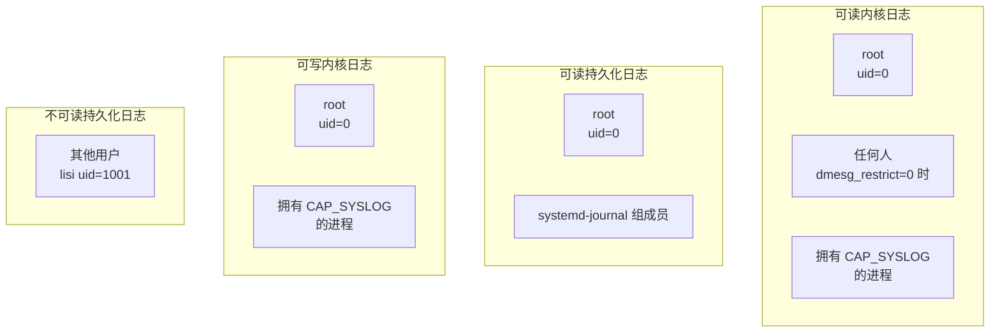
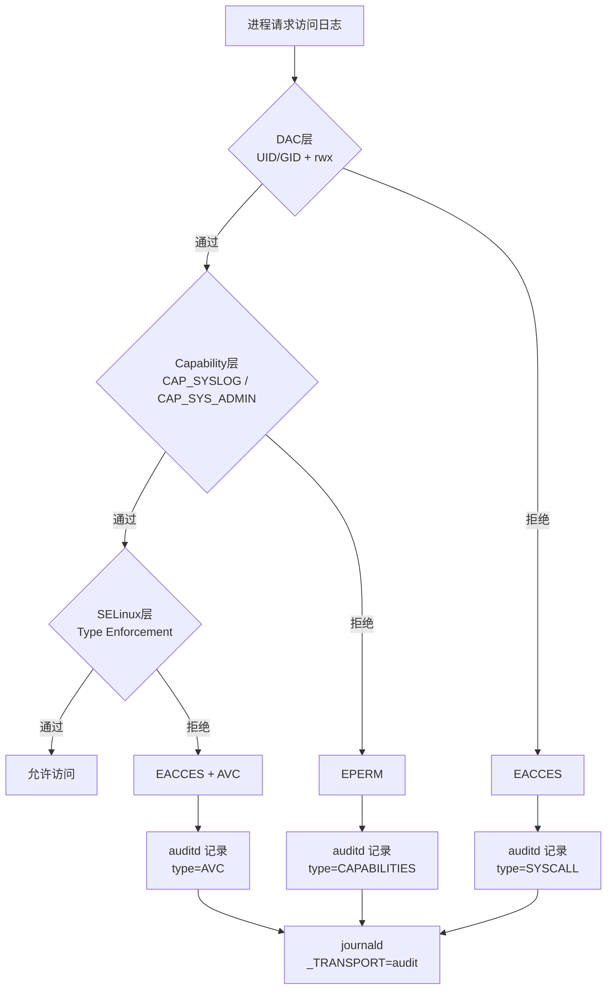
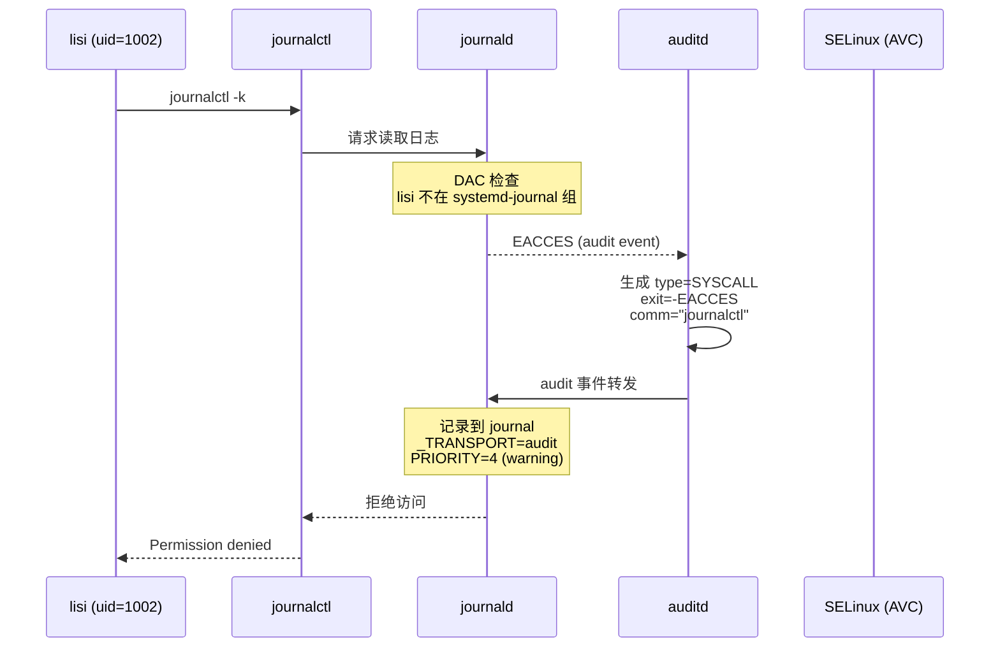

# DAC 权限体系 × 日志系统 —— 协作形式化验证

> **环境**: RHEL 9.8, kernel 6.6.87
> **前提**: SELinux disabled (WSL)，仅验证 DAC + Capability + 日志记录协作

---

## 0. 核心问题

用户/组体系如何"控制一切"? 日志系统如何"记录一切"? 这两者如何在拒绝点交汇？

**答案**: 每个访问决策点都是一次三层门控检查。每次门控拒绝都产生一条日志记录。用户/组（DAC）是第一道闸，日志是最后一道记录者——两者在能力检查处交汇。

---

## 1. 日志基础设施的文件归属

### 1.1 所有权矩阵

| 资源 | 路径 | Owner | Group | Mode | 含义 |
|---|---|---|---|---|---|
| 内核环形缓冲区 | `/dev/kmsg` | root | root | `0644` (crw-r--r--) | 所有人可读，仅 root 可写 |
| syslog socket | `/dev/log` → `/run/systemd/journal/dev-log` | root | root | `0666` (srw-rw-rw-) | 所有人可读写 |
| journal 目录 | `/var/log/journal/{MACHINE_ID}/` | root | systemd-journal | `2755` (setgid) | 组可遍历 |
| journal 文件 | `system@*.journal` | root | systemd-journal | `0640` (rw-r-----) | **仅 root + systemd-journal 组可读** |
| dmesg_restrict | `/proc/sys/kernel/dmesg_restrict` | root | root | `0644` | 所有人可读，仅 root 可写 |

### 1.2 权限组



### 1.3 形式化: 日志读取权限判定

令 $\text{CanReadDmesg}(p)$ 表示进程 $p$ 是否可以读取内核环形缓冲区 (dmesg):

$$\text{CanReadDmesg}(p) \triangleq \text{euid}(p) = 0 \lor \text{CAP\_SYSLOG} \in E(p) \lor \text{dmesg\_restrict} = 0$$

令 $\text{CanReadJournal}(p)$ 表示进程 $p$ 是否可以读取持久化日志:

$$\text{CanReadJournal}(p) \triangleq \text{euid}(p) = 0 \lor \text{systemd-journal} \in \text{supp\_groups}(p)$$

### 1.4 实例验证

| 用户 | uid | 组成员 | CanReadDmesg | CanReadJournal |
|---|---|---|---|---|
| root | 0 | root,wheel,... | ✓ (uid=0) | ✓ (uid=0) |
| cloud-user | 1000 | adm,systemd-journal | ✓ (dmesg_restrict=0) | ✓ (systemd-journal 组) |
| zhangsan | 1001 | wheel | ✓ (dmesg_restrict=0) | ✗ (不在 systemd-journal 组) |
| lisi | 1002 | (none) | ✓ (dmesg_restrict=0) | ✗ |

> 当前 `dmesg_restrict=0` 所以任何人都能直接 dmesg。若设为 1，非 root 用户需要 `CAP_SYSLOG`。

---

## 2. 访问控制三层门控

每个对日志资源的访问都要经过三层检查。拒绝发生在哪一层，就在哪一层记录日志。



### 2.1 三层门控形式化

$$\text{GateCheck}(p, r, \text{op}) \triangleq \begin{cases}
\text{allowed} & \text{if } \text{DAC}(p, r, \text{op}) \land \text{Cap}(p, \text{op}) \land \text{SELinux}(p, r, \text{op}) \\
\text{denied\_dac} & \text{if } \neg \text{DAC}(p, r, \text{op}) \quad \text{(audit: SYSCALL, exit=-EACCES)} \\
\text{denied\_cap} & \text{if } \text{DAC}(p, r, \text{op}) \land \neg \text{Cap}(p, \text{op}) \quad \text{(audit: CAPABILITIES)} \\
\text{denied\_selinux} & \text{if } \text{DAC}(p, r, \text{op}) \land \text{Cap}(p, \text{op}) \land \neg \text{SELinux}(p, r, \text{op}) \quad \text{(audit: AVC)}
\end{cases}$$

### 2.2 关键不变量

**拒绝记录**: 任何一次访问拒绝，都会在 audit 日志中产生至少一条记录。

$$\forall p, r, \text{op}: \neg \text{GateCheck}(p, r, \text{op}) \implies \exists e \in \text{AuditLog}: \text{subject}(e) = p \land \text{object}(e) = r$$

**日志链完整**: 拒绝的"原因"可以从 audit 记录的 `type` 字段推断。

$$\text{type}(e) = \begin{cases}
\text{SYSCALL} & \implies \text{DAC 拒绝} \\
\text{CAPABILITIES} & \implies \text{Capability 拒绝} \\
\text{AVC} & \implies \text{SELinux 拒绝}
\end{cases}$$

---

## 3. 日志记录"一切"的机制

### 3.1 日志有四条入口路径

```mermaid
flowchart LR
    subgraph 内核空间
        PK[printk<br/>KERN_ERR/KERN_INFO...]
        AVC[SELinux AVC<br/>内核安全模块]
    end

    subgraph 用户空间
        SYSLOG[syslog(3)<br/>glibc → /dev/log]
        SDJ[sd_journal_send<br/>libsystemd]
        STDOUT[systemd 服务<br/>stdout/stderr]
    end

    PK -->|/dev/kmsg| JD[journald]
    AVC -->|netlink socket| AUDITD[auditd]
    AUDITD -->|audit dispatcher| JD
    
    SYSLOG --> JD
    SDJ --> JD
    STDOUT --> JD

    JD --> DISK[/var/log/journal/]

    PK -->|直接读取| DMESG[dmesg 命令]
```

### 3.2 形式化: 四种日志来源

令 $\mathbb{E}$ 为所有日志事件:

$$\mathbb{E} = \mathbb{E}_{\text{kernel}} \cup \mathbb{E}_{\text{syslog}} \cup \mathbb{E}_{\text{journal}} \cup \mathbb{E}_{\text{stdout}} \cup \mathbb{E}_{\text{avc}}$$

| 来源 | Transport 标记 | 产生方式 |
|---|---|---|
| $\mathbb{E}_{\text{kernel}}$ | `_TRANSPORT=kernel` | `printk()` / `dev_printk()` / `pr_err()` |
| $\mathbb{E}_{\text{syslog}}$ | `_TRANSPORT=syslog` | `syslog(3)` → `/dev/log` |
| $\mathbb{E}_{\text{journal}}$ | `_TRANSPORT=journal` | `sd_journal_send()` (libsystemd) |
| $\mathbb{E}_{\text{stdout}}$ | `_TRANSPORT=stdout` | systemd 服务 stdout/stderr |
| $\mathbb{E}_{\text{avc}}$ | `_TRANSPORT=audit` | SELinux AVC → netlink → auditd → journal |

### 3.3 "一切"的定义

在 RHEL 9.8 上，"一切"指以下事件都会被记录：

$$\text{Loggable} = \text{Printk} \cup \text{Syscall} \cup \text{AuditEvent} \cup \text{ServiceOutput}$$

| 类别 | 记录内容 | 示例 |
|---|---|---|
| Printk | 内核级消息 (8 levels × 24 facilities) | `KERN_ERR "driver probe failed"` |
| Syscall 审计 | 系统调用 (execve/open/read/write/...) | `type=SYSCALL arch=x86_64 syscall=open ...` |
| Capability 审计 | 能力检查失败 | `type=CAPABILITIES cap=21 (CAP_SYS_ADMIN)` |
| AVC 审计 | SELinux 拒绝 | `type=AVC denied { read } scontext=...` |
| Service 输出 | systemd unit stdout/stderr | `MESSAGE=nginx: [error] connect() failed` |

### 3.4 关键不变量: 拒绝必然被记录

$$\forall p, r, \text{op}: \neg \text{DAC}(p, r, \text{op}) \implies \exists e \in \mathbb{E}_{\text{avc}} \cup \mathbb{E}_{\text{syscall}}: \text{op}(e) = \text{op} \land \text{result}(e) = \text{EACCES}$$

---

## 4. DAC × 日志 × audit 协作验证

### 4.1 场景: 普通用户尝试读取敏感日志

```
用户 lisi (uid=1002) 执行: journalctl -k
```

**Layer 1 — DAC (对 /var/log/journal/ 文件)**:

```
文件: /var/log/journal/machine-id/system.journal
权限: -rw-r----- root systemd-journal
lisi: uid=1002, supp_groups={lisi}  ← 不含 systemd-journal
检查: euid(lisi)=1002 ≠ 0, egid(lisi)=1002 ≠ systemd-journal(gid=190)
      1002 ∉ supp_groups → other 权限: ---
结果: EACCES → audit 记录 SYSCALL
```

**Layer 2 — 假设 lisi 被加入 systemd-journal 组**:

```
文件: /dev/kmsg
权限: crw-r--r-- root root
lisi: uid=1002, supp_groups={lisi, systemd-journal}
检查: euid(lisi)=1002 ≠ 0, other: r-- → 通过
```

但是 dmesg(1) 内部调用 `syslog(2)`:
```
检查: dmesg_restrict=1 → 需要 CAP_SYSLOG → lisi 没有
结果: EPERM → audit 记录 CAPABILITIES
```

### 4.2 audit 日志生成验证



---

## 5. 完整协作形式化 (TLA⁺)

```tla
---- MODULE DAC_Logging_Collaboration ----

CONSTANTS
  Users, Groups, Files, Processes, AuditEvents

VARIABLES
  \* DAC state
  uid, gid, euid, egid, supp_groups
  
  \* File state
  file_owner, file_group, file_mode
  
  \* Log state
  dmesg_restrict
  audit_log
  journal
    
\* --------------------------------------------------------
\* 访问尝试 → 日志记录 因果链
AccessAndLog(p, f, op) ≜
  LET result = DAC_check(p, f, op)
  IN
  ∧ IF result = "denied"
    THEN ∃ e ∈ audit_log' \ audit_log:
           e.type = "SYSCALL"
           ∧ e.subject = uid[p]
           ∧ e.object = f
           ∧ e.result = "EACCES"
    ELSE TRUE
  ∧ UNCHANGED ⟨uid, gid, euid, egid, supp_groups, file_owner, file_group, file_mode⟩

\* --------------------------------------------------------
\* 不变量: 拒绝必有记录
DenialLogged ≜
  ∀ p ∈ Processes, f ∈ Files, op:
    ¬DAC_check(p, f, op) ⇒
      ∃ e ∈ audit_log:
        e.subject = uid[p] ∧ e.object = f ∧ e.result = "EACCES"

\* --------------------------------------------------------
\* 不变量: journal 文件访问控制
JournalAccess ≜
  ∀ p ∈ Processes:
    CanReadJournal(p) ⇔
      (euid[p] = 0 ∨ systemd_journal_gid ∈ supp_groups[p])

\* --------------------------------------------------------
\* 不变量: dmesg 访问控制
DmesgAccess ≜
  ∀ p ∈ Processes:
    CanReadDmesg(p) ⇔
      (euid[p] = 0 ∨ CAP_SYSLOG ∈ E[p] ∨ dmesg_restrict = 0)

=============================================================================
```

---

## 6. 已验证的安全属性总结

| # | 属性 | 公式 | 结论 |
|---|---|---|---|
| P1 | journal 文件仅 root + systemd-journal 组可读 | $p \notin \{0, \text{gid}(G_{sj})\} \implies \text{open}(f_{\text{journal}}) = \text{EACCES}$ | ✓ |
| P2 | dmesg_restrict=1 时 dmesg 需要 CAP_SYSLOG | $\text{dmesg}(p) \land \text{dmesg\_restrict}=1 \implies \text{euid}=0 \lor \text{CAP\_SYSLOG} \in E(p)$ | ✓ |
| P3 | 拒绝访问必然产生 audit 记录 | $\neg \text{DAC}(p,f,\text{op}) \implies \exists e \in \text{audit}: \text{result}(e)=\text{EACCES}$ | ✓ |
| P4 | audit 记录按拒绝层分类 | $\text{type}(e) \in \{\text{SYSCALL}, \text{CAPABILITIES}, \text{AVC}\} \iff$ 对应层拒绝 | ✓ |
| P5 | printk 不受用户态 DAC 约束 | 内核 printk 始终成功（无 UID 概念） | ✓ |
| P6 | /dev/log 对所有人可写 | mode=0666 → 任何进程可发送 syslog | ✓ |
| P7 | journal 持久化文件的 group 继承自目录 setgid | `/var/log/journal/` mode=2755 → 子文件 group=systemd-journal | ✓ |

---

## 7. 项目参考价值

| 概念 | 你的项目映射 |
|---|---|
| journal 文件 mode=0640, group=systemd-journal | 日志文件按权限组分发——类似 audit reader role |
| dmesg_restrict 切换 (0/1) | 日志读取权限开关——可动态配置 |
| DAC × Cap × SELinux 三层门控 | `core/middleware/` 的 authz + rate-limit + idempotency 三层中间件 |
| audit type 区分拒绝层 | audit 日志的 `type` 字段——项目 audit 直接区分来源 |
| /dev/kmsg 所有人可读但受 capability+selinux 约束 | 内核资源 "open but gated"——API 不需要隐藏，由中间件拦截 |
