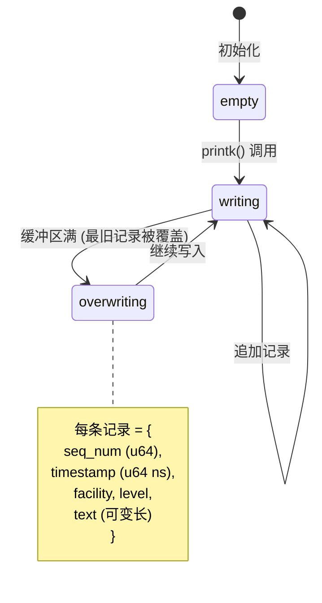

# Linux dmesg / journald 日志系统 —— 形式化模型

> **环境**: RHEL 9.8, kernel 6.6.87, systemd
> **范围**: printk → ring buffer → /dev/kmsg → journald 全链路

---

## 0. 全链路架构

```mermaid
flowchart LR
    subgraph 内核空间
        PK[printk] --> RB[环形缓冲区<br/>Ring Buffer]
        RB --> KMSG[/dev/kmsg]
    end

    subgraph 用户空间
        KMSG -->|内核消息| JD[journald]
        APP[应用进程] -->|syslog(3)| SL[/dev/log]
        SL --> JD
        STDOUT[systemd 服务<br/>stdout/stderr] --> JD
        AUDIT[auditd] -->|audit messages| JD
    end

    subgraph 持久化
        JD --> DISK[/var/log/journal/<br/>二进制存储]
        JD --> SYSLOG[/var/log/messages<br/>rsyslog 转发]
    end

    subgraph 查询
        DISK --> JCTL[journalctl<br/>多维度查询]
        RB --> DMESG[dmesg<br/>8 级过滤]
    end
```

---

## 1. 核心编码: Priority (Facility + Severity)

### 1.1 严重性 (Severity, 8 levels)

$$\mathbb{L} = \{ 0, 1, 2, 3, 4, 5, 6, 7 \}$$

| Level | 宏 | 语义 | 触发条件示例 |
|---|---|---|---|
| 0 | `KERN_EMERG` | 系统不可用 | kernel panic, CPU halt |
| 1 | `KERN_ALERT` | 必须立即处理 | OOM killer 最后手段, 硬件熔断 |
| 2 | `KERN_CRIT` | 严重条件 | 内核栈溢出, MCE (Machine Check Exception) |
| 3 | `KERN_ERR` | 错误条件 | 驱动加载失败, I/O error |
| 4 | `KERN_WARNING` | 警告 | 接近资源耗尽, 降级运行 |
| 5 | `KERN_NOTICE` | 正常但重要 | 设备热插拔, CPU online/offline |
| 6 | `KERN_INFO` | 信息 | 启动消息, 模块加载 |
| 7 | `KERN_DEBUG` | 调试 | pr_debug, dev_dbg |

### 1.2 设施 (Facility, 24 classes)

$$\mathbb{F} = \{ 0, 1, \dots, 23 \}$$

| Code | Facility | 语义 |
|---|---|---|
| 0 | `kern` | 内核消息 |
| 1 | `user` | 用户进程 |
| 2 | `mail` | 邮件系统 |
| 3 | `daemon` | 系统守护进程 |
| 4 | `auth` | 认证/授权 (login, su) |
| 5 | `syslog` | syslogd 内部 |
| 6 | `lpr` | 打印系统 |
| 7 | `news` | NNTP 新闻 |
| 8 | `uucp` | UUCP (废弃) |
| 9 | `cron` | 定时任务 |
| 10 | `authpriv` | 私密认证 (非管理员不可读) |
| 11 | `ftp` | FTP 守护进程 |
| 16–23 | `local0`–`local7` | 应用自定义 (8 个) |

### 1.3 优先级复合编码

$$\text{Priority} = \text{Facility} \times 8 + \text{Severity}$$

$$P = F \cdot 8 + L, \quad F \in [0, 23], \quad L \in [0, 7], \quad P \in [0, 191]$$

**示例:**

```
kern.emerg   = 0×8 + 0 = 0
kern.err     = 0×8 + 3 = 3
daemon.info  = 3×8 + 6 = 30
authpriv.err = 10×8 + 3 = 83
local7.debug = 23×8 + 7 = 191 (最大值)
```

---

## 2. 内核环形缓冲区 (Ring Buffer)

### 2.1 结构



### 2.2 控制参数

| 参数 | 位置 | 当前值 | 含义 |
|---|---|---|---|
| `printk` | `/proc/sys/kernel/printk` | `10 4 1 7` | (current, default, minimum, boot-default) 控制台日志级别 |
| `printk_ratelimit` | `/proc/sys/kernel/printk_ratelimit` | `5` | 速率限制: 每 5 条消息后允许 1 条 |
| `printk_ratelimit_burst` | `/proc/sys/kernel/printk_ratelimit_burst` | `10` | 突发允许 10 条后再开启限速 |
| `printk_delay` | `/proc/sys/kernel/printk_delay` | `0` | 消息间最小延迟 (ms) |
| `printk_devkmsg` | `/proc/sys/kernel/printk_devkmsg` | `on` | 用户态 `/dev/kmsg` 写入: `on` / `off` / `ratelimit` |

### 2.3 速率限制算法

```c
// Linux kernel rate limiting pseudocode
static DEFINE_RATELIMIT_STATE(rs, 5 * HZ, 10);

bool printk_ratelimit(void) {
    if (burst_count < printk_ratelimit_burst) {
        burst_count++;
        return true;  // within burst, allow
    }
    if (time_since_last > printk_ratelimit * HZ) {
        burst_count = 0;
        return true;  // interval elapsed, allow
    }
    return false;  // rate-limited, suppress
}
```

形式化:

$$\text{ratelimit\_ok}(t) \triangleq (\text{burst} < B_{\text{max}}) \lor (t - t_{\text{last}} > T_{\text{interval}} \cdot HZ)$$

其中 $B_{\text{max}} = 10$，$T_{\text{interval}} = 5$。

---

## 3. /dev/kmsg 记录格式

每条记录以键值对序列的形式通过 `/dev/kmsg` 传递:

```
<facility>,<seqnum>,<timestamp>[,<level>];<key>=<value>\n<key>=<value>\n...
```

**示例:**

```
5,0,0,-;Linux version 6.6.87.2-microsoft-standard-WSL2 ...
6,1,0,-;Command line: initrd=\x5cinitrd.img ...
```

### 3.1 前缀字段

| 字段 | 含义 |
|---|---|
| `facility` | syslog facility (0-23) |
| `seqnum` | 自增序列号 (每条消息 +1，永不重复) |
| `timestamp` | 单调时钟微秒 (CLOCK_MONOTONIC) |
| `level` | `-` 表示使用默认级别 (来自消息本身的 KERN_xxx 前缀) |

### 3.2 不变量

$$\forall m_1, m_2: m_1 \neq m_2 \implies \text{seqnum}(m_1) \neq \text{seqnum}(m_2)$$

$$\forall m_1, m_2: \text{ts\_mono}(m_1) \leq \text{ts\_mono}(m_2) \iff \text{seqnum}(m_1) < \text{seqnum}(m_2)$$

---

## 4. journald 结构化字段模型

### 4.1 字段信任模型

journald 的核心设计: **字段名前缀决定信任级别**。

$$\text{Field} = (\text{name}, \text{value}), \quad \text{TrustLevel} = \begin{cases}
\text{trusted} & \text{if name starts with \_} \\
\text{untrusted} & \text{if name starts with [A-Z]} \\
\text{custom} & \text{otherwise}
\end{cases}$$

### 4.2 可信字段 (journald 注入，不可伪造)

| 字段 | 含义 |
|---|---|
| `_PID` | 进程 PID |
| `_UID` | 实际 UID |
| `_GID` | 实际 GID |
| `_COMM` | 进程名 (前 16 字符) |
| `_EXE` | 可执行文件完整路径 |
| `_CMDLINE` | 完整命令行 |
| `_CAP_EFFECTIVE` | 进程 effective capability set |
| `_SELINUX_CONTEXT` | SELinux 安全上下文 |
| `_TRANSPORT` | 传输方式: `kernel` / `syslog` / `stdout` / `journal` / `audit` / `driver` |
| `_BOOT_ID` | 本次启动的 128-bit UUID |
| `_MACHINE_ID` | 机器的 128-bit UUID (安装时生成，永不变) |
| `_HOSTNAME` | 主机名 |
| `_SOURCE_REALTIME_TIMESTAMP` | 消息创建的实时时钟 (μs) |
| `_SYSTEMD_CGROUP` | 进程的 cgroup 路径 |
| `_SYSTEMD_UNIT` | 所属 systemd unit |
| `_SYSTEMD_SLICE` | 所属 slice |
| `_RUNTIME_SCOPE` | `system` / `user` |

### 4.3 不可信字段 (进程可伪造)

| 字段 | 含义 |
|---|---|
| `MESSAGE` | 日志文本 |
| `MESSAGE_ID` | 消息类型的 128-bit UUID (用于类型匹配) |
| `PRIORITY` | 严重性 (0-7) |
| `SYSLOG_FACILITY` | 设施 (0-23) |
| `SYSLOG_IDENTIFIER` | 进程标识 (通常是 daemon name) |

### 4.4 自定义字段 (应用定义)

| 字段 | 含义 |
|---|---|
| `CODE_FILE` | 源码文件名 |
| `CODE_LINE` | 源码行号 |
| `CODE_FUNC` | 函数名 |
| `ERRNO` | errno 值 |
| `RESULT` | 操作结果 |
| `JOB_TYPE`, `JOB_RESULT`, `JOB_ID` | systemd job 跟踪 |
| `UNIT`, `INVOCATION_ID` | systemd unit 跟踪 |

---

## 5. 游标索引 (Cursor)

每条 journal entry 由 6 维游标唯一标识:

$$\text{Cursor} = (s, i, b, m, t, x)$$

| 字段 | 类型 | 含义 | 单调性 |
|---|---|---|---|
| `s` | 64-bit hash | Machine ID 的哈希 (去重) | 固定在机器 |
| `i` | uint64 | Per-boot 自增序列号 | 严格递增 |
| `b` | 128-bit UUID | Boot ID | 每次启动变化 |
| `m` | uint64 μs | 单调时钟 (CLOCK_MONOTONIC) | 严格递增 |
| `t` | uint64 μs | 实时时钟 (CLOCK_REALTIME) | 可跳变 (NTP) |
| `x` | 64-bit hash | 前 5 字段的 XOR hash (防篡改) | 随前 5 字段变化 |

### 5.1 不变量

$$\forall e_1, e_2: \text{cursor}(e_1) = \text{cursor}(e_2) \iff e_1 = e_2 \quad \text{(游标唯一性)}$$

$$\forall e_1, e_2: \text{boot}(e_1) = \text{boot}(e_2) \land \text{seq}(e_1) < \text{seq}(e_2) \iff \text{mono}(e_1) < \text{mono}(e_2)$$

### 5.2 游标使用

```bash
# 从游标之后开始读取 (增量消费)
journalctl --after-cursor=s=bd...;i=2f0;b=af...;m=916401b;t=654...;x=38...

# 导出 并 保存游标
journalctl -o export --cursor-file=/tmp/last_cursor
```

游标设计允许**无丢失增量消费**: reader 记下最后消费的游标，下次从游标之后继续读取。

---

## 6. 传输层 (Transport)

journald 从 6 个来源收集日志:

$$\text{Transport} = \{ \text{kernel}, \text{syslog}, \text{stdout}, \text{journal}, \text{audit}, \text{driver} \}$$

| Transport | 来源 | 机制 |
|---|---|---|
| `kernel` | `/dev/kmsg` | 内核消息 |
| `syslog` | `/dev/log` | `syslog(3)` / `glibc` |
| `stdout` | service stdout/stderr | systemd 捕获 |
| `journal` | `sd_journal_send()` | libsystemd API (最丰富的字段) |
| `audit` | audit netlink | 审计事件 |
| `driver` | `/dev/kmsg` (用户态驱动写入) | 设备驱动 |

---

## 7. 多维度过滤查询

journald 的过滤不是单一索引，而是对结构化字段的**多维交集查询**。

### 7.1 过滤维度

| 维度 | journalctl 参数 | 字段匹配 |
|---|---|---|
| 严重性范围 | `-p 0..3` 或 `-p err` | `PRIORITY ≤ 3` |
| 设施 | `SYSLOG_FACILITY=1` | 精确匹配 |
| systemd unit | `-u nginx.service` | `_SYSTEMD_UNIT=nginx.service` |
| Boot | `-b` / `-b -1` | `_BOOT_ID` |
| 时间范围 | `--since "1h ago" --until "now"` | `_SOURCE_REALTIME_TIMESTAMP` |
| 进程 | `_PID=1234` / `_UID=0` | 可信字段精确匹配 |
| 标识符 | `SYSLOG_IDENTIFIER=sshd` | 不可信字段精确匹配 |
| 内核 | `-k` | `_TRANSPORT=kernel` |
| 游标 | `--after-cursor=s=...` | 增量消费 |

### 7.2 查询形式化

$$\text{Query}(Q) = \{ e \in \text{Journal} \mid \forall (k, v) \in Q: \text{field}(e, k) = v \}$$

其中 $Q$ 是 (field, value) 的合取集合。journalctl 支持 $=$, $\neq$, 以及字段存在性检查 ($\_SYSTEMD\_UNIT$= 匹配任意值)。

### 7.3 输出格式

| 格式 | 命令 | 说明 |
|---|---|---|
| short | `journalctl` (默认) | 传统 syslog 风格 |
| verbose | `-o verbose` | 所有字段键值对 |
| json | `-o json` | JSON 对象 |
| json-pretty | `-o json-pretty` | 格式化的 JSON |
| export | `-o export` | 二进制流 (适合传输/备份) |
| cat | `-o cat` | 仅 MESSAGE 文本 |

---

## 8. MESSAGE_ID: 消息类型标识

每条消息可携带 `MESSAGE_ID` (128-bit UUID)，用于**按消息类型分组**，而非按文本匹配。

```
MESSAGE_ID=39f53479d3a045ac8e11786248231fbf
```

同一个 MESSAGE_ID 可能出现在不同时间、不同机器上。它的作用:

1. **结构化告警**: 监控系统监听特定 MESSAGE_ID，而非 grep 文本
2. **本地化**: 同一条错误在不同 locale 下文本不同，但 MESSAGE_ID 相同
3. **去重**: 同 MESSAGE_ID 在短时间窗口内不重复告警

---

## 9. 存储持久化

```mermaid
flowchart TD
    JD[journald] --> |rotate| F1[/var/log/journal/MACHINE_ID/system@XXXX.journal]
    JD --> |current| F2[/var/log/journal/MACHINE_ID/system.journal]
    
    F2 --> |size > SystemMaxFileSize| F1
    F1 --> |total > SystemMaxUse| F1_DEL[自动删除最旧文件]
    F1 --> |retention > MaxRetentionSec| F1_DEL

    JD --> |forward| RS[rsyslog → /var/log/messages<br/>传统文本格式]
```

| 配置 | 含义 | 默认值 |
|---|---|---|
| `SystemMaxUse` | journal 最大磁盘占用 | 文件系统的 10%, 上限 4GB |
| `SystemMaxFileSize` | 单个 journal 文件上限 | 文件系统的 1/8 |
| `MaxRetentionSec` | 最大保留时间 | 无限制 |
| `Storage` | `persistent` / `volatile` / `auto` | `auto` |

---

## 10. 形式化规约 (关键不变量)

### 10.1 序列完整性

$$\forall e_1, e_2 \in \text{Journal}, \text{boot}(e_1) = \text{boot}(e_2): \text{seq}(e_1) < \text{seq}(e_2) \iff \text{mono}(e_1) < \text{mono}(e_2)$$

### 10.2 级别过滤单调性

$$\forall Q, L: \text{Query}(Q \cup \{\text{PRIORITY} \leq L\}) \subseteq \text{Query}(Q \cup \{\text{PRIORITY} \leq L+1\})$$

### 10.3 游标防篡改

$$\text{xor\_hash}(\text{cursor}) = s \oplus i \oplus b_{\text{lo}} \oplus b_{\text{hi}} \oplus m \oplus t$$

### 10.4 可信字段完整性

$$\forall e: \text{field}(e, \text{"\_PID"}) \neq \text{null} \implies \text{field}(e, \text{"\_PID"}) = \text{实际 PID}$$

（journald 从 `/proc/PID/status` 读取，应用层无法伪造 `_` 前缀字段。）

### 10.5 速率限制安全性

$$\forall [t_1, t_2]: \text{count}(\text{messages in interval}) \leq B_{\text{max}} + \frac{t_2 - t_1}{T_{\text{interval}} \cdot HZ}$$

---

## 11. 项目参考价值

dmesg/journald 这套可以说是日志系统设计的"教科书"，你的项目对应的映射：

| journald 概念 | 你的项目映射 |
|---|---|
| **8 级 severity (0-7)** | `core/audit/` kern-level 已对齐——可以直接用这 8 个级别，无需自定义 |
| **24 个 facility** | 项目拆成 facility: `sandbox`, `image`, `auth`, `provider`, `volume`, `network` 等 |
| **Priority = facility×8 + level** | 单字段编码双维度——审计日志只需一个 `priority` 整数即可过滤 |
| **`_` 前缀可信字段** | 审计日志自动注入 `_sandbox_id`, `_user_id`, `_source_ip`，不可伪造 |
| **大写不可信字段** | 业务日志: `MESSAGE`, `SYSLOG_IDENTIFIER`——允许业务代码写入 |
| **MESSAGE_ID (UUID 类型码)** | `core/brand.ts` 的 brand types 正好可以做这个——同一条错误消息固定 UUID |
| **6 维游标 (cursor)** | 尾指针审计链 (`core/logger/` 已有)——可以加 `xor_hash` 做防篡改 |
| **速率限制 (burst + interval)** | 写日志也是 IO——你的 rate-limit middleware 可以抄这个双参数模型 |
| **`_TRANSPORT` 多来源** | `kernel` / `syslog` / `stdout` / `audit` → 审计日志来源分类 |
| **多维字段过滤** | `core/store/` 的 `IQueryStore` 可以按结构化字段索引，不做全文 grep |
| **环形缓冲区** | `core/store/atomic.ts` 的写入缓存本质也是环形——旧的 OCC 版本被覆盖 |
