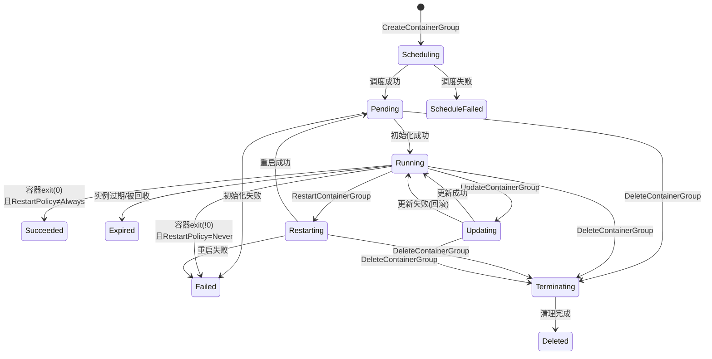
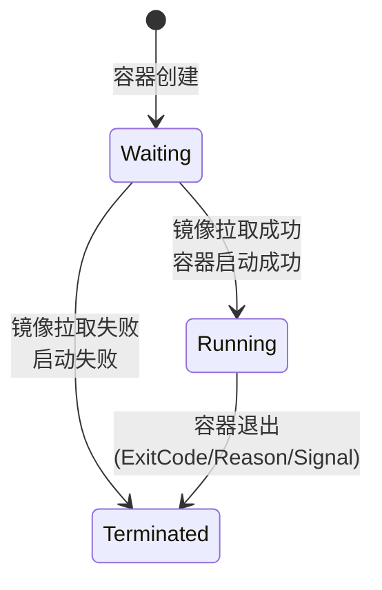

# 阿里云 ECI 容器组生命周期 —— 形式化模型

> **数据源**: `https://api.aliyun.com/meta/v1/products/Eci/versions/2018-08-08/api-docs.json`
> **API 版本**: 2018-08-08
> **默认地域**: cn-hangzhou

---

## 1. 状态集合

$$\mathbb{S} = \{ \text{Scheduling}, \text{ScheduleFailed}, \text{Pending}, \text{Running}, \text{Succeeded}, \text{Failed}, \text{Restarting}, \text{Updating}, \text{Terminating}, \text{Expired}, \text{Deleted} \}$$

### 1.1 状态说明

| 状态 | 含义 | 类型 |
|---|---|---|
| `Scheduling` | 实例创建中，正在调度到底层计算资源 | 瞬态 |
| `ScheduleFailed` | 调度失败——资源不足、库存不足或参数非法 | 终态 |
| `Pending` | 启动中——拉取镜像、初始化容器 | 瞬态 |
| `Running` | 正常运行 | 稳态 |
| `Succeeded` | 运行成功退出 (exit 0) | 终态 |
| `Failed` | 运行失败——容器异常退出、镜像拉取失败等 | 终态 |
| `Restarting` | 重启中 | 瞬态 |
| `Updating` | 更新中——UpdateContainerGroup 触发 | 瞬态 |
| `Terminating` | 终止中——DeleteContainerGroup 触发 | 瞬态 |
| `Expired` | 已过期——抢占式实例被系统回收、到期 | 终态 |
| `Deleted` | 已删除——底层资源已从阿里云移除 | 终态* |

> `Deleted` 是逻辑终态：`Terminating` 完成后，资源从阿里云系统移除。

### 1.2 子状态 (PodStatus Conditions)

每个容器组的 `PodStatus.Conditions[]` 包含以下条件项，每个条件值为 $\{\text{True}, \text{False}, \text{Unknown}\}$：

| 条件类型 | 说明 |
|---|---|
| `PodScheduled` | 已调度到底层节点 |
| `Initialized` | Init 容器已执行完毕 |
| `ContainersReady` | 所有容器已就绪 |
| `Ready` | Pod 可接收流量 |
| `PodReadyToStartContainers` | Sandbox/网络已就绪 |
| `ContainerHasSufficientDisk` | 磁盘空间充足 |
| `ContainerInstanceCreated` | ECI 实例已创建 |
| `Unschedulable` | 无法调度 |

### 1.3 容器级状态

$$\text{ContainerState} \in \{ \text{Waiting}, \text{Running}, \text{Terminated} \}$$

| 状态 | 含义 | 可用字段 |
|---|---|---|
| `Waiting` | 容器启动中（拉镜像等） | Reason, Message |
| `Running` | 容器正在运行 | StartedAt |
| `Terminated` | 容器已停止 | ExitCode, Reason, Signal, Message, StartedAt, FinishedAt |

---

## 2. 初始状态

$$\text{Init} \triangleq (\text{status} = \text{"Scheduling"})$$

`CreateContainerGroup` API 调用成功后，容器组立即进入 `Scheduling` 状态。

---

## 3. 状态转移函数

$$\delta: \mathbb{S} \times \text{Operation} \times \text{ExitCondition} \to \mathbb{S}$$

### 3.1 主转移规则 (18 条)

| # | 源状态 | 触发条件 | 目标状态 |
|---|---|---|---|
| T1 | `Scheduling` | 系统: 调度成功 | `Pending` |
| T2 | `Scheduling` | 系统: 调度失败 | `ScheduleFailed` |
| T3 | `Pending` | 系统: 初始化成功 | `Running` |
| T4 | `Pending` | 系统: 初始化失败 | `Failed` |
| T5 | `Running` | 系统: 容器 exit(0) | `Succeeded` |
| T6 | `Running` | 系统: 容器 exit(!0) | `Failed` |
| T7 | `Running` | API: RestartContainerGroup | `Restarting` |
| T8 | `Running` | API: UpdateContainerGroup | `Updating` |
| T9 | `Running` | API: DeleteContainerGroup | `Terminating` |
| T10 | `Running` | 系统: 实例过期 | `Expired` |
| T11 | `Restarting` | 系统: 重启成功 | `Pending` |
| T12 | `Restarting` | 系统: 重启失败 | `Failed` |
| T13 | `Updating` | 系统: 更新成功 | `Running` |
| T14 | `Updating` | 系统: 更新失败 | `Running` (回滚) |
| T15 | `Terminating` | 系统: 清理完成 | `Deleted` |
| T16 | `Restarting` | API: DeleteContainerGroup | `Terminating` |
| T17 | `Updating` | API: DeleteContainerGroup | `Terminating` |
| T18 | `Pending` | API: DeleteContainerGroup | `Terminating` |

### 3.2 终态规则

定义终态集合：

$$\mathbb{T} = \{ \text{ScheduleFailed}, \text{Succeeded}, \text{Failed}, \text{Expired}, \text{Deleted} \}$$

一旦 $s \in \mathbb{T}$，对任意操作 $\text{op}$ 有 $\delta(s, \text{op}) = s$（状态不变，API 返回 `NotSupport` 错误）。

> 元数据保留策略: 终态实例的元数据在终止后保留 1 小时；超过 1 小时后，仅保留最近 100 个终态实例的元数据。

---

## 4. API 操作与合法前置状态

| 操作 | 合法前置状态 | 目标状态 |
|---|---|---|
| `CreateContainerGroup` | (无——新建资源) | `Scheduling` |
| `DescribeContainerGroups` | 任意状态 | (只读) |
| `DescribeContainerGroupStatus` | 任意状态 | (只读) |
| `DescribeContainerGroupEvents` | 任意状态 | (只读事件) |
| `UpdateContainerGroup` | `Running` | `Updating` |
| `DeleteContainerGroup` | `Running`, `Pending`, `Restarting`, `Updating` | `Terminating` |
| `RestartContainerGroup` | `Running` | `Restarting` |
| `ResizeContainerGroupVolume` | `Running` | `Running` (状态不变) |
| `ExecContainerCommand` | `Running` | `Running` (状态不变) |
| `CommitContainer` | `Running` | `Running` (状态不变) |

---

## 5. 形式化规范 (TLA⁺ 风格)

```tla
---- MODULE ECI_ContainerGroup ----

CONSTANTS
  CgId              \* 所有容器组 ID 的集合
  终态集合          \* {"ScheduleFailed", "Succeeded", "Failed", "Expired", "Deleted"}

VARIABLES
  状态              \* [CgId -> 状态值]
  容器状态          \* [CgId -> [容器名 -> 容器状态值]]

----
TypeOK ≜
  ∧ 状态 ∈ [CgId -> {"Scheduling","ScheduleFailed","Pending","Running",
                      "Succeeded","Failed","Restarting","Updating",
                      "Terminating","Expired","Deleted"}]
  ∧ 容器状态 ∈ [CgId -> [容器名 -> {"Waiting","Running","Terminated"}]]

----
Init ≜
  ∧ 状态    = [cg ∈ CgId ↦ "Scheduling"]
  ∧ 容器状态 = [cg ∈ CgId ↦ [cn ∈ DOMAIN 容器状态[cg] ↦ "Waiting"]]

----
\* T1-T2: 调度结果
调度结果(cg) ≜
  IF 状态[cg] = "Scheduling"
  THEN ∨ ∧ 状态' = [状态 EXCEPT ![cg] = "Pending"]
          ∧ UNCHANGED 容器状态
        ∨ ∧ 状态' = [状态 EXCEPT ![cg] = "ScheduleFailed"]
          ∧ UNCHANGED 容器状态
  ELSE UNCHANGED ⟨状态, 容器状态⟩

\* T3-T4: 初始化结果
初始化结果(cg) ≜
  IF 状态[cg] = "Pending"
  THEN ∨ ∧ 状态' = [状态 EXCEPT ![cg] = "Running"]
          ∧ 容器状态' = [容器状态 EXCEPT ![cg] = 启动容器(cg)]
        ∨ ∧ 状态' = [状态 EXCEPT ![cg] = "Failed"]
          ∧ UNCHANGED 容器状态
  ELSE UNCHANGED ⟨状态, 容器状态⟩

\* T5-T6, T10: 运行期结果
运行结果(cg) ≜
  IF 状态[cg] = "Running"
  THEN ∨ ∧ 状态' = [状态 EXCEPT ![cg] = "Succeeded"]
          ∧ UNCHANGED 容器状态
        ∨ ∧ 状态' = [状态 EXCEPT ![cg] = "Failed"]
          ∧ UNCHANGED 容器状态
        ∨ ∧ 状态' = [状态 EXCEPT ![cg] = "Expired"]
          ∧ UNCHANGED 容器状态
  ELSE UNCHANGED ⟨状态, 容器状态⟩

\* T7: RestartContainerGroup API
重启操作(cg) ≜
  IF 状态[cg] = "Running"
  THEN ∧ 状态' = [状态 EXCEPT ![cg] = "Restarting"]
       ∧ UNCHANGED 容器状态
  ELSE UNCHANGED ⟨状态, 容器状态⟩

\* T11-T12: 重启结果
重启结果(cg) ≜
  IF 状态[cg] = "Restarting"
  THEN ∨ ∧ 状态' = [状态 EXCEPT ![cg] = "Pending"]
          ∧ UNCHANGED 容器状态
        ∨ ∧ 状态' = [状态 EXCEPT ![cg] = "Failed"]
          ∧ UNCHANGED 容器状态
  ELSE UNCHANGED ⟨状态, 容器状态⟩

\* T8: UpdateContainerGroup API
更新操作(cg) ≜
  IF 状态[cg] = "Running"
  THEN ∧ 状态' = [状态 EXCEPT ![cg] = "Updating"]
       ∧ UNCHANGED 容器状态
  ELSE UNCHANGED ⟨状态, 容器状态⟩

\* T13-T14: 更新结果
更新结果(cg) ≜
  IF 状态[cg] = "Updating"
  THEN ∧ 状态' = [状态 EXCEPT ![cg] = "Running"]
       ∧ UNCHANGED 容器状态
  ELSE UNCHANGED ⟨状态, 容器状态⟩

\* T9, T16-T18: DeleteContainerGroup API
删除操作(cg) ≜
  IF 状态[cg] ∈ {"Running", "Pending", "Restarting", "Updating"}
  THEN ∧ 状态' = [状态 EXCEPT ![cg] = "Terminating"]
       ∧ UNCHANGED 容器状态
  ELSE UNCHANGED ⟨状态, 容器状态⟩

\* T15: 终止结果
终止结果(cg) ≜
  IF 状态[cg] = "Terminating"
  THEN ∧ 状态' = [状态 EXCEPT ![cg] = "Deleted"]
       ∧ UNCHANGED 容器状态
  ELSE UNCHANGED ⟨状态, 容器状态⟩

----
Next ≜
  ∃ cg ∈ CgId:
    ∨ 调度结果(cg)
    ∨ 初始化结果(cg)
    ∨ 运行结果(cg)
    ∨ 重启操作(cg) ∨ 重启结果(cg)
    ∨ 更新操作(cg) ∨ 更新结果(cg)
    ∨ 删除操作(cg) ∨ 终止结果(cg)

----
\* 不变式 (Safety)

\* P1: 终态不可复活
无复活 ≜
  ∀ cg ∈ CgId:
    状态[cg] ∈ 终态集合 ⇒ 状态'[cg] = 状态[cg]

\* P2: 重启只能从 Running 发起
重启合法性 ≜
  ∀ cg ∈ CgId:
    状态'[cg] = "Restarting" ⇒ 状态[cg] = "Running"

\* P3: 更新只能从 Running 发起
更新合法性 ≜
  ∀ cg ∈ CgId:
    状态'[cg] = "Updating" ⇒ 状态[cg] = "Running"

\* P4: 删除只能从非终态、非 Terminating 状态发起
删除合法性 ≜
  ∀ cg ∈ CgId:
    状态'[cg] = "Terminating" ⇒ 状态[cg] ∈ {"Running","Pending","Restarting","Updating"}

\* P5: 容器 Running 蕴含 CG Running
容器运行蕴含CG运行 ≜
  ∀ cg ∈ CgId, cn ∈ DOMAIN 容器状态[cg]:
    容器状态[cg][cn] = "Running" ⇒ 状态[cg] = "Running"

----
\* 活性 (Liveness) — ↝ 表示 "leads to" (eventually)

调度收敛 ≜
  ∀ cg ∈ CgId:
    状态[cg] = "Scheduling" ↝ 状态[cg] ∈ {"Pending", "ScheduleFailed"}

初始化收敛 ≜
  ∀ cg ∈ CgId:
    状态[cg] = "Pending" ↝ 状态[cg] ∈ {"Running", "Failed"}

重启收敛 ≜
  ∀ cg ∈ CgId:
    状态[cg] = "Restarting" ↝ 状态[cg] ∈ {"Pending", "Failed", "Terminating"}

更新收敛 ≜
  ∀ cg ∈ CgId:
    状态[cg] = "Updating" ↝ 状态[cg] = "Running"

终止收敛 ≜
  ∀ cg ∈ CgId:
    状态[cg] = "Terminating" ↝ 状态[cg] = "Deleted"

----
规约 ≜ Init ∧ □[Next]_⟨状态, 容器状态⟩
        ∧ 调度收敛 ∧ 初始化收敛
        ∧ 重启收敛 ∧ 更新收敛 ∧ 终止收敛
        ∧ 无复活

=============================================================================
```

### 5.1 Safety 公式 (LaTeX)

**P1 终态不可复活**：

$$\forall c \in \mathcal{C}: s(c) \in \mathbb{T} \implies s'(c) = s(c)$$

**P2 重启前置条件**：

$$\forall c \in \mathcal{C}: s'(c) = \text{Restarting} \implies s(c) = \text{Running}$$

**P3 更新前置条件**：

$$\forall c \in \mathcal{C}: s'(c) = \text{Updating} \implies s(c) = \text{Running}$$

**P4 删除前置条件**：

$$\forall c \in \mathcal{C}: s'(c) = \text{Terminating} \implies s(c) \in \{ \text{Running}, \text{Pending}, \text{Restarting}, \text{Updating} \}$$

**P5 容器运行蕴含 CG 运行**：

$$\forall c \in \mathcal{C}, n \in \text{containers}(c): \text{containerState}(c, n) = \text{Running} \implies s(c) = \text{Running}$$

### 5.2 Liveness 公式 (LaTeX)

**L1 调度收敛**：

$$\forall c \in \mathcal{C}: s(c) = \text{Scheduling} \leadsto s(c) \in \{ \text{Pending}, \text{ScheduleFailed} \}$$

**L2 初始化收敛**：

$$\forall c \in \mathcal{C}: s(c) = \text{Pending} \leadsto s(c) \in \{ \text{Running}, \text{Failed} \}$$

**L3 重启收敛**：

$$\forall c \in \mathcal{C}: s(c) = \text{Restarting} \leadsto s(c) \in \{ \text{Pending}, \text{Failed}, \text{Terminating} \}$$

**L4 更新收敛**：

$$\forall c \in \mathcal{C}: s(c) = \text{Updating} \leadsto s(c) = \text{Running}$$

**L5 终止收敛**：

$$\forall c \in \mathcal{C}: s(c) = \text{Terminating} \leadsto s(c) = \text{Deleted}$$

### 5.3 规约公式 (LaTeX)

$$\text{Spec} \triangleq \text{Init} \land \Box[\text{Next}]_{\langle s, cs \rangle} \land \bigwedge_{i=1}^{5} L_i \land \text{NoResurrection}$$

---

## 6. 状态机图 (Mermaid)

### 6.1 容器组生命周期状态机



### 6.2 RestartPolicy 条件下的转移子图

```mermaid
stateDiagram-v2
    Running --> Restarting: 容器退出

    Restarting --> Pending: 重启

    Pending --> Running: 初始化成功
    Pending --> Failed: 初始化失败

    note right of Running: RestartPolicy=Always: exit(0)和exit(!0)都重启<br/>RestartPolicy=OnFailure: 仅exit(!0)重启<br/>RestartPolicy=Never: 不重启,直接终态

    state Failed <<terminal>>
    state Succeeded <<terminal>>
```

### 6.3 容器级状态 (Container-level)



---

## 7. 完整 API 接口清单

### 容器组管理
| API | HTTP 方法 | 类型 |
|---|---|---|
| `CreateContainerGroup` | POST/GET | 读写 |
| `UpdateContainerGroup` | POST/GET | 写 |
| `DeleteContainerGroup` | POST/GET | 写 |
| `DescribeContainerGroups` | POST/GET | 读 |
| `DescribeContainerGroupStatus` | POST | 读 |
| `DescribeContainerGroupEvents` | POST | 读 |
| `ResizeContainerGroupVolume` | GET/POST | 写 |
| `RestartContainerGroup` | POST/GET | 写 |

### 容器操作
| API | HTTP 方法 | 类型 |
|---|---|---|
| `ExecContainerCommand` | POST/GET | 写 |
| `DescribeContainerLog` | POST/GET | 读 |
| `CommitContainer` | GET/POST | 读写 |
| `DescribeCommitContainerTask` | POST/GET | 读 |

### 其他接口（不影响容器组生命周期）
| API | 用途 |
|---|---|
| `CreateImageCache` / `DeleteImageCache` / `UpdateImageCache` / `DescribeImageCaches` | 镜像缓存 |
| `CreateDataCache` / `DeleteDataCache` / `UpdateDataCache` / `CopyDataCache` / `DescribeDataCaches` | 数据缓存 |
| `CreateVirtualNode` / `DeleteVirtualNode` / `UpdateVirtualNode` / `DescribeVirtualNodes` | 虚拟节点 |
| `DescribeContainerGroupMetric` / `DescribeMultiContainerGroupMetric` | 监控 |
| `CreateInstanceOpsTask` / `DescribeInstanceOpsRecords` | 运维操作 |
| `TagResources` / `ListTagResources` / `UntagResources` | 标签 |
| `ListUsage` / `DescribeContainerGroupPrice` / `DescribeAvailableResource` | 其他 |
| `DescribeRegions` | 地域查询 |

---

## 8. 关键参数: RestartPolicy

令 $p \in \{ \text{Always}, \text{OnFailure}, \text{Never} \}$ 为 `RestartPolicy`，令 $x \in \mathbb{Z}$ 为容器退出码：

| $p$ | $x = 0$ | $x \neq 0$ |
|---|---|---|
| `Always` | $\to \text{Pending}$ (重启) | $\to \text{Pending}$ (重启) |
| `OnFailure` | $\to \text{Succeeded}$ (终态) | $\to \text{Pending}$ (重启) |
| `Never` | $\to \text{Succeeded}$ (终态) | $\to \text{Failed}$ (终态) |

---

## 9. 关键参数: Force 删除

令 $f \in \{ \text{true}, \text{false} \}$ 为 `Force` 参数：

| $f$ | 行为 |
|---|---|
| `false` (默认) | 等待 $\text{TerminationGracePeriodSeconds}$，SIGTERM → 等待 → SIGKILL |
| `true` | 跳过超时，立即 SIGKILL |

---

## 10. 关键参数: 过期与生命周期

| 参数 | 所属 API | 作用 |
|---|---|---|
| `SpotStrategy` | CreateContainerGroup | $\neq \text{NoSpot}$ 时实例可被回收 $\to \text{Expired}$ |
| `SpotDuration` | CreateContainerGroup | 抢占式实例保护期（小时），$0$ 表示无保护 |
| `ActiveDeadlineSeconds` | CreateContainerGroup | 实例有效期限（秒），超时强制退出 |
| `TerminationGracePeriodSeconds` | CreateContainerGroup | 关闭缓冲时间（秒） |
| `FixedIpRetainHour` | CreateContainerGroup | 固定 IP 释放后保留时长（小时），默认 48 |
