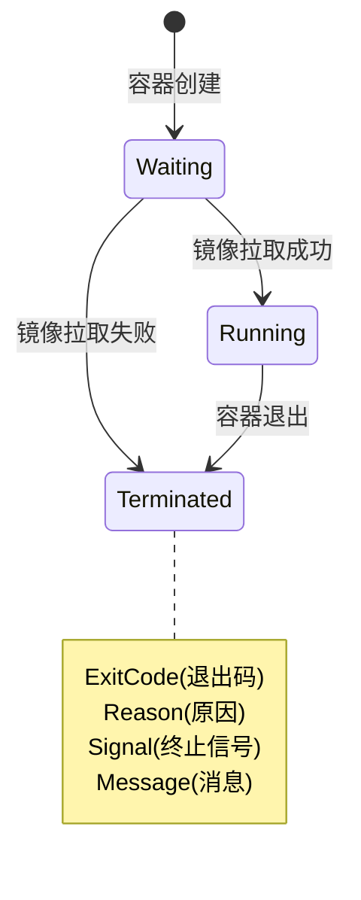
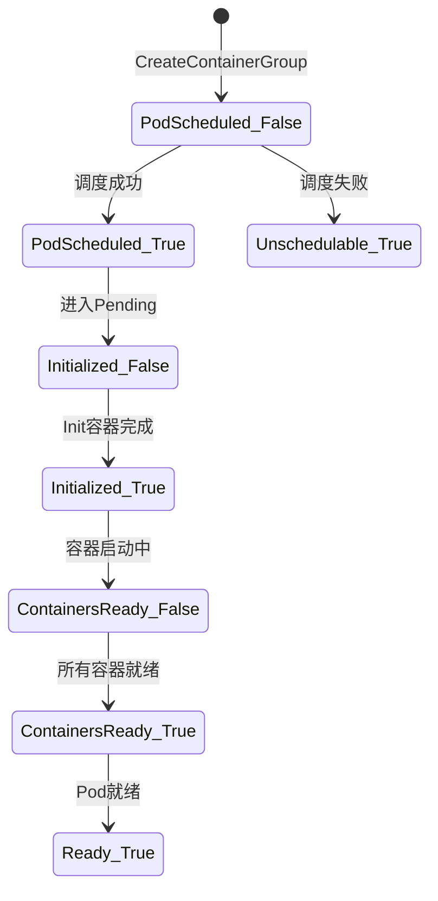

# 阿里云 ECI 容器组 —— 真值表

> **数据源**: `https://api.aliyun.com/meta/v1/products/Eci/versions/2018-08-08/api-docs.json`
> **API 版本**: 2018-08-08
> **默认地域**: cn-hangzhou
> **生成时间**: 2026-06-24

---

## 真值表约定

- **V** = 合法转移（API 返回 2xx）
- **I** = 非法操作（API 返回错误，状态不变）
- **终态\*** = `Deleted` 是唯一元数据可被清理的终态（>1 小时、>100 个/地域）
- **—**  = 该事件在当前状态下不可能发生

---

## 转移函数形式化定义

$$\delta: \mathbb{S} \times \Omega \to \mathbb{S}$$

其中 $\Omega = \{ \text{CreateCG}, \text{DeleteCG}, \text{RestartCG}, \text{UpdateCG}, \text{ResizeVol}, \text{ExecCmd}, \text{Commit}, \text{SchedOk}, \text{SchedFail}, \text{InitOk}, \text{InitFail}, \text{Exit0}, \text{ExitNon0}, \text{Expire}, \text{RestartOk}, \text{UpdateOk}, \text{TermOk} \}$

---

## 表 1: 完整状态 × 操作真值矩阵

行 = 当前状态，列 = API 操作或系统事件。

| 当前状态 $s$ | CreateCG | DeleteCG | RestartCG | UpdateCG | ResizeVol | ExecCmd | Commit | SchedOk | SchedFail | InitOk | InitFail | Exit0 | ExitNon0 | Expire | RestartOk | UpdateOk | TermOk |
|---|---|---|---|---|---|---|---|---|---|---|---|---|---|---|---|---|---|
| **(无)** | `Scheduling` | I | I | I | I | I | I | — | — | — | — | — | — | — | — | — | — |
| **Scheduling** | I | I | I | I | I | I | I | `Pending` | `ScheduleFailed` | — | — | — | — | — | — | — | — |
| **ScheduleFailed** | I | I | I | I | I | I | I | — | — | — | — | — | — | — | — | — | — |
| **Pending** | I | `Terminating` | I | I | I | I | I | — | — | `Running` | `Failed` | — | — | — | — | — | — |
| **Running** | I | `Terminating` | `Restarting` | `Updating` | `Running`* | `Running`* | `Running`* | — | — | — | — | `Succeeded`† | `Failed`† | `Expired` | — | — | — |
| **Succeeded** | I | I | I | I | I | I | I | — | — | — | — | — | — | — | — | — | — |
| **Failed** | I | I | I | I | I | I | I | — | — | — | — | — | — | — | — | — | — |
| **Restarting** | I | `Terminating` | I | I | I | I | I | — | — | — | — | — | — | — | `Pending` | — | — |
| **Updating** | I | `Terminating` | I | I | I | I | I | — | — | — | — | — | — | — | — | `Running` | — |
| **Terminating** | I | I | I | I | I | I | I | — | — | — | — | — | — | — | — | — | `Deleted` |
| **Expired** | I | I | I | I | I | I | I | — | — | — | — | — | — | — | — | — | — |
| **Deleted** | I | I | I | I | I | I | I | — | — | — | — | — | — | — | — | — | — |

\* 操作不改变 CG 状态（仅副作用：扩缩容/执行命令/制作镜像）
† 实际结果取决于 `RestartPolicy`（详见表 4）

### 终态判定公式

$$\text{IsTerminal}(s) \triangleq s \in \{ \text{ScheduleFailed}, \text{Succeeded}, \text{Failed}, \text{Expired}, \text{Deleted} \}$$

$$\forall s \in \mathbb{S}, \omega \in \Omega: \text{IsTerminal}(s) \implies \delta(s, \omega) = s$$

---

## 表 2: API 前置条件与后置条件真值表

| # | 操作 | 前置条件 | 后置条件（成功时） | 违反前置条件时的错误 |
|---|---|---|---|---|
| 1 | `CreateContainerGroup` | 资源不存在；Region=cn-hangzhou；有效的 VSwitchId、SecurityGroupId、Container[] | $s' = \text{Scheduling}$；返回 ContainerGroupId | `InvalidParameter`、`QuotaExceeded`、`InsufficientResource` |
| 2 | `DeleteContainerGroup` | $s \in \{ \text{Running}, \text{Pending}, \text{Restarting}, \text{Updating} \}$；有效的 ContainerGroupId | $s' = \text{Terminating}$ → 最终 $s'' = \text{Deleted}$ | `InvalidContainerGroupId.NotFound`、`NotSupport`（终态） |
| 3 | `DeleteContainerGroup` ($f=\text{true}$) | 同上 | $s' = \text{Terminating}$；跳过优雅等待期 | 同上 |
| 4 | `RestartContainerGroup` | $s = \text{Running}$；有效的 ContainerGroupId | $s' = \text{Restarting}$ → (系统) → $\text{Pending}$ → $\text{Running}$ | `NotFound`、`NotSupport` |
| 5 | `UpdateContainerGroup` | $s = \text{Running}$；有效的 ContainerGroupId | $s' = \text{Updating}$ → (系统) → $\text{Running}$ | `NotFound`、`NotSupport`、`InvalidParameter` |
| 6 | `ResizeContainerGroupVolume` | $s = \text{Running}$；VolumeName 存在；$V_{\text{new}} \in [V_{\min}, V_{\max}]$ | $s' = \text{Running}$（状态不变） | `NotFound`、`VolumeNotFound` |
| 7 | `ExecContainerCommand` | $s = \text{Running}$；$\|\text{Command}\| \leq 256$ | $s' = \text{Running}$（状态不变） | `NotFound`、`ContainerNotFound` |
| 8 | `CommitContainer` | $s = \text{Running}$；有效 Image 配置 | $s' = \text{Running}$（状态不变） | `NotFound`、`ContainerNotFound` |

---

## 表 3: 系统驱动转移真值表

| # | 源状态 $s$ | 系统条件 | 目标状态 $s'$ | 可逆？ |
|---|---|---|---|---|
| S1 | `Scheduling` | 调度成功 | `Pending` | 否 |
| S2 | `Scheduling` | 调度失败 | `ScheduleFailed` | 否（终态） |
| S3 | `Pending` | 镜像拉取成功 + 容器初始化完成 | `Running` | 否 |
| S4 | `Pending` | 镜像拉取失败 / 初始化异常 | `Failed` | 否（终态） |
| S5 | `Running` | $\forall k: \text{exitCode}_k = 0 \land p \neq \text{Always}$ | `Succeeded` | 否（终态） |
| S6 | `Running` | $\exists k: \text{exitCode}_k \neq 0 \land p = \text{Never}$ | `Failed` | 否（终态） |
| S7 | `Running` | $\exists k: \text{exitCode}_k \neq 0 \land p \in \{ \text{Always}, \text{OnFailure} \}$ | → 重启循环 | 是 |
| S8 | `Running` | $\forall k: \text{exitCode}_k = 0 \land p = \text{Always}$ | → 重启循环 | 是 |
| S9 | `Running` | 抢占式实例被回收 | `Expired` | 否（终态） |
| S10 | `Running` | ActiveDeadlineSeconds 到期 | `Expired` | 否（终态） |
| S11 | `Restarting` | 重启成功 | `Pending` → `Running` | 是 |
| S12 | `Restarting` | 重启失败 | `Failed` | 否（终态） |
| S13 | `Updating` | 更新成功 | `Running` | 是 |
| S14 | `Updating` | 更新失败 | `Running`（自动回滚） | 是 |
| S15 | `Terminating` | 清理完成 | `Deleted` | 否（终态） |

---

## 表 4: RestartPolicy × 容器退出码真值表

令 $p \in \{ \text{Always}, \text{OnFailure}, \text{Never} \}$，$x_k$ 为容器 $k$ 的退出码。

| $p$ | $\forall k: x_k = 0$ | $\exists k: x_k \neq 0$ |
|---|---|---|
| `Always` | 重启 | 重启 |
| `OnFailure` | `Succeeded`（终态） | 重启 |
| `Never` | `Succeeded`（终态） | `Failed`（终态） |

**重启循环路径**：

$$\text{Running} \xrightarrow{\text{exit}} \text{Restarting} \xrightarrow{\text{restart-ok}} \text{Pending} \xrightarrow{\text{init-ok}} \text{Running}$$

### RestartPolicy 状态机

```mermaid
stateDiagram-v2
    Running --> Restarting: 容器退出

    Restarting --> Pending: 重启成功
    Restarting --> Failed: 重启失败

    Pending --> Running: 初始化成功
    Pending --> Failed: 初始化失败

    note left of Running: Always: exit(0)和exit(!0)都重启<br/>OnFailure: 仅exit(!0)重启,exit(0)进入Succeeded<br/>Never: 均不重启,直接终态

    state Failed <<terminal>>
    state Succeeded <<terminal>>
```

---

## 表 5: DeleteContainerGroup Force 参数真值表

令 $f \in \{ \text{true}, \text{false} \}$，$g = \text{TerminationGracePeriodSeconds}$。

| $f$ | $s$ | 优雅等待？ | 转移路径 |
|---|---|---|---|
| `false` | Running | 是：SIGTERM → 等 $g$ 秒 → SIGKILL | $\text{Running} \to \text{Terminating} \xrightarrow{g} \text{Deleted}$ |
| `false` | Pending | 是 | $\text{Pending} \to \text{Terminating} \to \text{Deleted}$ |
| `false` | Restarting | 是 | $\text{Restarting} \to \text{Terminating} \to \text{Deleted}$ |
| `false` | Updating | 是 | $\text{Updating} \to \text{Terminating} \to \text{Deleted}$ |
| `true` | Running | 否：立即 SIGKILL | $\text{Running} \to \text{Terminating} \to \text{Deleted}$（更快） |
| `true` | Pending | 否 | $\text{Pending} \to \text{Terminating} \to \text{Deleted}$（更快） |
| `true` | $\text{IsTerminal}(s)$ | N/A | 错误：`NotSupport` |

---

## 表 6: UpdateContainerGroup UpdateType 真值表

| UpdateType | 含义 | 状态变化 |
|---|---|---|
| `RenewUpdate` | 全量更新——需填写所有参数；List 不支持单条目更新 | 完整资源替换 |
| `IncrementalUpdate` | 增量更新——仅更新指定字段 | 部分资源修改 |

两种模式：$\text{Running} \to \text{Updating} \to \text{Running}$

---

## 表 7: 容器级状态真值表

| 容器状态 | 含义 | 合法蕴含的 CG 状态 |
|---|---|---|
| `Waiting` | 容器启动中（拉镜像、创建） | $\{ \text{Pending}, \text{Restarting} \}$ |
| `Running` | 容器正在运行 | $\{ \text{Running} \}$（Terminating 早期 SIGKILL 前短暂共存） |
| `Terminated` | 容器已停止 | $\{ \text{Running}, \text{Succeeded}, \text{Failed}, \text{Restarting} \}$ |

### 容器状态机



### 容器-CG 蕴含关系

$$\forall c \in \mathcal{C}, n \in \text{names}(c): \text{containerState}(c, n) = \text{Running} \implies \text{status}(c) = \text{Running}$$

> 注：Terminating 期间在收到 SIGKILL 前，容器可能短暂保持 Running，这是 GracePeriod 的预期行为。

---

## 表 8: PodStatus Conditions 真值表

每个 condition $q \in \mathcal{Q}$ 有 $q.\text{type}$ 和 $q.\text{status} \in \{ \text{True}, \text{False}, \text{Unknown} \}$。

| Condition 类型 | $\text{True}$ 含义 | $\text{False}$ 含义 | 相关 CG 状态 |
|---|---|---|---|
| `PodScheduled` | 已调度到底层资源 | 调度失败 | Scheduling, ScheduleFailed, Pending, Running |
| `Initialized` | Init 容器执行完毕 | Init 容器执行中/失败 | Pending, Running |
| `ContainersReady` | 所有容器就绪 | 部分容器未就绪 | Pending, Running |
| `Ready` | Pod 可接收流量 | 尚未就绪 | Running(True)，其他(False) |
| `PodReadyToStartContainers` | Sandbox/网络就绪 | Sandbox 未就绪 | Pending |
| `ContainerHasSufficientDisk` | 磁盘空间充足 | 磁盘压力 | Running |
| `ContainerInstanceCreated` | ECI 实例已创建 | 尚未创建 | Scheduling, Pending |
| `Unschedulable` | 无法调度 | 可调度 | ScheduleFailed(True) |

### Condition 状态机 (簡化 Ready 条件)



---

## 表 9: 完整状态可达性矩阵

令 $\mathbb{S}$ 为全部 11 状态。$R \subseteq \mathbb{S} \times \mathbb{S}$ 为可达性关系。$\checkmark$ = 直接一步可达，$\to$ = 间接可达，$\times$ = 不可达。

$$R(s_i, s_j) \triangleq \exists \omega \in \Omega: \delta(s_i, \omega) = s_j$$

| $s_i \setminus s_j$ | Sche | SchF | Pend | Run | Succ | Fail | Rest | Upd | Term | Exp | Del |
|---|---|---|---|---|---|---|---|---|---|---|---|
| **Scheduling** | — | ✓ | ✓ | → | → | → | → | → | → | → | → |
| **ScheduleFailed** | ✗ | — | ✗ | ✗ | ✗ | ✗ | ✗ | ✗ | ✗ | ✗ | ✗ |
| **Pending** | ✗ | ✗ | — | ✓ | → | ✓ | → | → | ✓ | → | → |
| **Running** | ✗ | ✗ | → | — | ✓ | ✓ | ✓ | ✓ | ✓ | ✓ | → |
| **Succeeded** | ✗ | ✗ | ✗ | ✗ | — | ✗ | ✗ | ✗ | ✗ | ✗ | ✗ |
| **Failed** | ✗ | ✗ | ✗ | ✗ | ✗ | — | ✗ | ✗ | ✗ | ✗ | ✗ |
| **Restarting** | ✗ | ✗ | ✓ | → | → | ✓ | — | ✗ | ✓ | ✗ | → |
| **Updating** | ✗ | ✗ | ✗ | ✓ | → | → | ✗ | — | ✓ | ✗ | → |
| **Terminating** | ✗ | ✗ | ✗ | ✗ | ✗ | ✗ | ✗ | ✗ | — | ✗ | ✓ |
| **Expired** | ✗ | ✗ | ✗ | ✗ | ✗ | ✗ | ✗ | ✗ | ✗ | — | ✗ |
| **Deleted** | ✗ | ✗ | ✗ | ✗ | ✗ | ✗ | ✗ | ✗ | ✗ | ✗ | — |

### 可达性闭包

$$\forall s \in \mathbb{T} \setminus \{\text{Deleted}\}: R^*(s) = \{s\} \quad \text{(终态无出边)}$$

$$R^*(\text{Scheduling}) = \mathbb{S}$$

---

## 表 10: 幂等性保证真值表

| 操作 | 幂等？ | 机制 | 公式 |
|---|---|---|---|
| `CreateContainerGroup` | 是 | `ClientToken` | $\text{same}(\text{token}) \implies \text{same}(\text{CgId})$ |
| `DeleteContainerGroup` | 是（效果上） | `ClientToken` + 已删除返回 `NotFound` | $s = \text{Deleted} \implies \text{DeleteCG}(c) = \text{NotFound}$ |
| `UpdateContainerGroup` | 是 | `ClientToken` | $\text{same}(\text{token}) \implies \text{no-op}$ |
| `RestartContainerGroup` | 是 | `ClientToken` | 已在重启中 $\implies$ 无操作 |
| `ResizeContainerGroupVolume` | 部分 | `ClientToken` | $V_{\text{target}} = V_{\text{current}} \implies$ 无操作 |
| `ExecContainerCommand` | 否 | 每次新建 exec 会话 | $\text{token}_1 \neq \text{token}_2 \implies \text{session}_1 \neq \text{session}_2$ |
| `CommitContainer` | 否 | 每次新建提交任务 | $\text{token}_1 \neq \text{token}_2 \implies \text{task}_1 \neq \text{task}_2$ |

---

## 验证结论

### 安全属性 (Safety) —— 必须始终成立

| # | 属性 | 公式 | 验证 |
|---|---|---|---|
| P1 | 终态不可复活 | $\forall c: s(c) \in \mathbb{T} \implies \forall \omega: \delta(s(c), \omega) = s(c)$ | ✓ |
| P2 | 重启前置条件 | $s'(c) = \text{Restarting} \implies s(c) = \text{Running}$ | ✓ |
| P3 | 更新前置条件 | $s'(c) = \text{Updating} \implies s(c) = \text{Running}$ | ✓ |
| P4 | 删除前置条件 | $s'(c) = \text{Terminating} \implies s(c) \in \{ \text{Running}, \text{Pending}, \text{Restarting}, \text{Updating} \}$ | ✓ |
| P5 | 执行命令前置条件 | $\text{ExecCmd}(c) \text{ success} \implies s(c) = \text{Running}$ | ✓ |
| P6 | 容器 Running 蕴含 CG Running | $\exists n: cs(c,n) = \text{Running} \implies s(c) = \text{Running}$ | ✓ |
| P7 | 扩缩容前置条件 | $\text{ResizeVol}(c) \text{ success} \implies s(c) = \text{Running}$ | ✓ |

### 活性 (Liveness) —— 必须最终成立

| # | 属性 | 公式 | 验证 |
|---|---|---|---|
| L1 | 调度收敛 | $s(c) = \text{Scheduling} \leadsto s(c) \in \{ \text{Pending}, \text{ScheduleFailed} \}$ | ✓ |
| L2 | 初始化收敛 | $s(c) = \text{Pending} \leadsto s(c) \in \{ \text{Running}, \text{Failed} \}$ | ✓ |
| L3 | 重启收敛 | $s(c) = \text{Restarting} \leadsto s(c) \in \{ \text{Pending}, \text{Failed}, \text{Terminating} \}$ | ✓ |
| L4 | 更新收敛 | $s(c) = \text{Updating} \leadsto s(c) = \text{Running}$ | ✓ |
| L5 | 终止收敛 | $s(c) = \text{Terminating} \leadsto s(c) = \text{Deleted}$ | ✓ |

### 可达性 (Reachability)

| # | 属性 | 公式 | 验证 |
|---|---|---|---|
| R1 | 新建可到 Running | $\exists \omega^*: \delta^*(\varnothing, \omega^*) = \text{Running}$ | ✓ |
| R2 | Running 可被删除 | $\text{Running} \in \text{dom}(\delta(\cdot, \text{DeleteCG}))$ | ✓ |
| R3 | Running 可被重启 | $\delta(\text{Running}, \text{RestartCG}) = \text{Restarting}$ | ✓ |
| R4 | Running 可被更新 | $\delta(\text{Running}, \text{UpdateCG}) = \text{Updating}$ | ✓ |
| R5 | 终态不可复活 | $\mathbb{T} \cap \text{dom}(\delta(\cdot, \omega)) = \varnothing, \forall \omega$ | ✓ |
| R6 | 抢占式可过期 | $\delta(\text{Running}, \text{Expire}) = \text{Expired}$ | ✓ |
