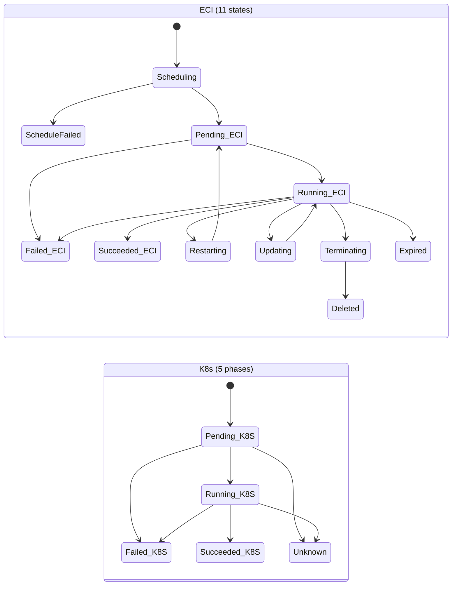

# ECI ContainerGroup × K8s Pod —— 完整对比分析

> **ECI API**: 2018-08-08, 70 个 CreateContainerGroup 参数
> **K8s**: v1.30+ Pod spec

---

## 0. 核心结论

**ECI ContainerGroup 就是 K8s Pod**——阿里云在 Pod 语义之上包装了自己的 API。两者在容器编排层面的抽象完全对应（Container/InitContainer/Volume/RestartPolicy/DnsConfig），但 ECI 暴露了更多云基础设施细节（EIP/Spot/带宽/镜像缓存），而 K8s 有更丰富的应用层原语（Probe/Sidecar/Condition/ServiceAccount）。

---

## 1. 概念映射矩阵

### 1.1 一对一映射

| ECI | K8s Pod | 说明 |
|---|---|---|
| `ContainerGroupName` | `metadata.name` | |
| `Container[]` | `spec.containers[]` | 完全对应 |
| `InitContainer[]` | `spec.initContainers[]` | 完全对应 |
| `Volume[]` | `spec.volumes[]` | ECI 直接挂 NFS/FlexVolume/DiskVolume |
| `RestartPolicy` | `spec.restartPolicy` | 相同枚举: Always / OnFailure / Never |
| `DnsConfig` | `spec.dnsConfig` | NameServer / Search / Option |
| `HostAliase[]` | `spec.hostAliases` | |
| `TerminationGracePeriodSeconds` | `spec.terminationGracePeriodSeconds` | |
| `ActiveDeadlineSeconds` | `spec.activeDeadlineSeconds` | K8s 在 Job 中，ECI 在 ContainerGroup |
| `ShareProcessNamespace` | `spec.shareProcessNamespace` | |
| `HostName` | `spec.hostname` | |
| `Cpu` | `resources.requests.cpu` / `resources.limits.cpu` | ECI 不区分 request/limit |
| `Memory` | `resources.requests.memory` / `resources.limits.memory` | ECI 不区分 request/limit |
| `Tag[]` | `metadata.labels` / `metadata.annotations` | ECI 用 Tag 统一 |
| `ImageRegistryCredential[]` | `spec.imagePullSecrets[]` | |
| `SecurityContext.Sysctl` | `spec.securityContext.sysctls` | |
| `NtpServer[]` | (通过 NTP DaemonSet 或节点配置) | ECI 直接内置 |

### 1.2 ECI 独有 (K8s Pod 没有)

| ECI 参数 | 说明 | 为什么 K8s 没有 |
|---|---|---|
| `SpotStrategy` / `SpotPriceLimit` / `SpotDuration` | 抢占式实例策略 | K8s 通过节点标签 + taint 间接实现 |
| `AutoCreateEip` / `EipBandwidth` / `EipISP` | 自动创建弹性公网 IP | K8s 通过 Service(LoadBalancer)+Ingress 解耦 |
| `FixedIp` / `FixedIpRetainHour` | 实例释放后保留固定 IP | K8s 通过 StatefulSet + Headless Service 间接实现 |
| `AutoMatchImageCache` / `ImageSnapshotId` | 自动镜像缓存匹配 | K8s 无内置镜像缓存 (kubelet 有本地 image cache，但不可控) |
| `ImageAccelerateMode` | nydus/dadi/p2p/imc 镜像加速 | K8s 通过 CRI 插件实现 |
| `ComputeCategory` | economy / general 算力类别 | K8s 通过 nodeSelector + taint 间接实现 |
| `IngressBandwidth` / `EgressBandwidth` | 实例级带宽限制 (bps) | K8s 通过 CNI 网络策略 (不同实现) |
| `CpuOptionsCore` / `CpuOptionsThreadsPerCore` | CPU 物理核/超线程配置 | K8s 通过 kubelet CPUManager 策略间接实现 |
| `EphemeralStorage` | 增加的临时存储 (GiB) | K8s 有 ephemeral-storage request/limit，但不支持"增加" |
| `DataCacheBucket` / `DataCachePL` | 数据缓存 Bucket + 性能等级 | K8s 无对应（通过 PV/PVC） |
| `ScheduleStrategy` | 多可用区调度 (VSwitchOrdered/VSwitchRandom) | K8s 通过 topologySpreadConstraints |
| `PrivateIpAddress` | 指定私网 IP | K8s 无 (Pod IP 由 CNI 动态分配) |
| `OsType` / `CpuArchitecture` | 指定 OS / CPU 架构 | K8s 通过 nodeSelector (kubernetes.io/arch, kubernetes.io/os) |
| `RamRoleName` | 绑定 RAM 角色 | K8s 通过 ServiceAccount + IRSA (EKS) |
| `PlainHttpRegistry` / `InsecureRegistry` | 自建镜像仓库配置 | K8s 通过 CRI 配置 (containerd config.toml) |
| `CorePattern` | core dump 路径 | K8s 通过节点级配置 |
| `ContainerResourceView` | 容器内看到的资源 = 申请的资源 | K8s 通过 cgroup 自动实现 |
| `StrictSpot` | 周期执行 (定时 ECI) | K8s 通过 CronJob |
| `EliminationStrategy` | 镜像缓存 LRU 淘汰 | K8s 通过 kubelet image GC |

### 1.3 K8s 独有 (ECI 没有)

| K8s 概念 | 说明 | ECI 如何补? |
|---|---|---|
| **Probes** (liveness/readiness/startup) | 容器健康检查 | ECI 无内置探针——需要应用层自己实现或通过 ExecContainerCommand 轮询 |
| **Sidecar Containers** (restartPolicy: Always) | 与 Pod 同生命周期的辅助容器 | ECI 无——用 InitContainer 模拟但语义不同 |
| **Pod Conditions** | PodScheduled / Initialized / ContainersReady / Ready | ECI 只有单一 Status 字段 |
| **ServiceAccount** | Pod 身份认证 | ECI 用 RamRoleName 替代 |
| **Affinity / AntiAffinity** | Pod 间调度约束 | ECI 无——单实例调度，无节点概念 |
| **Tolerations** | 容忍节点 taint | ECI 无节点概念，因此不需要 |
| **TopologySpreadConstraints** | 拓扑分布约束 | ECI 用 ScheduleStrategy 部分替代 |
| **ConfigMap / Secret (volume)** | 配置文件挂载 | ECI Volume 支持 NFS/ConfigMap/SecretVolume |
| **EmptyDir** | 临时存储卷 | ECI 用 EphemeralStorage |
| **PVC** | 持久卷声明 | ECI 通过独立 API (CreateDataCache) 或 NFS Volume |
| **PodDisruptionBudget** | 自愿中断预算 | ECI 无 |
| **RuntimeClass** | 指定容器运行时 | ECI 固定为安全沙箱 (Kata Containers) |
| **PreStop hook** | 容器停止前钩子 | ECI 无——仅 TerminationGracePeriodSeconds |
| **PostStart hook** | 容器启动后钩子 | ECI 无 |

---

## 2. 状态模型对比

### 2.1 状态粒度

| ECI | K8s | 说明 |
|---|---|---|
| `Scheduling` | (隐藏在 `Pending` 内) | ECI 将调度暴露为第一级状态 |
| `ScheduleFailed` | `Pending` + `PodScheduled=False` | ECI 将失败显式化为独立状态 |
| `Pending` | `Pending` | 一致 |
| `Running` | `Running` | 一致 |
| `Succeeded` | `Succeeded` | 一致 |
| `Failed` | `Failed` | 一致 |
| `Restarting` | `Running` (内部重启) | ECI 将重启暴露为独立状态 |
| `Updating` | `Running` (滚动更新/原地更新) | ECI 将更新暴露为独立状态 |
| `Terminating` | `Running` + `deletionTimestamp` | ECI 将终止暴露为独立状态；K8s 用 deletionTimestamp 标记 |
| `Expired` | `Failed` (或直接被回收) | ECI 有抢占式实例过期概念 |
| `Deleted` | (etcd 中已删除) | ECI 保留元数据 1h |

**ECI 暴露了 11 个状态，K8s 只有 5 个 Phase。** 这不是因为 ECI 更复杂——而是因为 ECI 把 K8s 隐藏在 Phase 内部的过渡状态全部显式化为一级状态，更适合做计费和审计。

### 2.2 状态转移对比

| ECI 状态 | K8s 等价表示 |
|---|---|
| `Scheduling` | `phase=Pending`, `condition:PodScheduled=False`, `reason=Scheduling` |
| `ScheduleFailed` | `phase=Pending`, `condition:PodScheduled=False`, `reason=Unschedulable` |
| `Pending` | `phase=Pending`, containers 在 Waiting |
| `Running` | `phase=Running` |
| `Restarting` | `phase=Running`, container lastState 在 Waiting，state=Running |
| `Updating` | `phase=Running` (原地更新) 或新 Pod (替换更新) |
| `Terminating` | `phase=Running` + `metadata.deletionTimestamp ≠ null` |
| `Expired` | `phase=Failed`, `reason=Evicted` 或 `Terminated` |
| `Deleted` | 从 etcd 移除 |

---

## 3. API 操作对比

| 操作 | ECI | K8s |
|---|---|---|
| **创建** | `CreateContainerGroup` | `POST /api/v1/namespaces/{ns}/pods` |
| **查询** | `DescribeContainerGroups` / `DescribeContainerGroupStatus` | `GET /pods` / `GET /pods/{name}/status` |
| **更新** | `UpdateContainerGroup` (原地更新) | `PATCH /pods/{name}` (部分字段) 或替换整个 Pod |
| **删除** | `DeleteContainerGroup` (Force=true/false) | `DELETE /pods/{name}` (gracePeriodSeconds) |
| **重启** | `RestartContainerGroup` | `DELETE` + 依赖控制器重建 (Pod 本身不支持 restart) |
| **执行命令** | `ExecContainerCommand` | `GET /pods/{name}/exec` (SPDY/WebSocket) |
| **查看日志** | `DescribeContainerLog` | `GET /pods/{name}/log` |
| **扩容卷** | `ResizeContainerGroupVolume` | `PATCH pvc/{name}` (PVC 级别，非 Pod) |
| **制作镜像** | `CommitContainer` | 无——需外部工具 (kaniko/buildah) |
| **事件查询** | `DescribeContainerGroupEvents` | `GET /events?fieldSelector=involvedObject.name={name}` |

---

## 4. 网络模型对比

| 维度 | ECI | K8s |
|---|---|---|
| 网络隔离 | 安全组 (SecurityGroupId) | NetworkPolicy (CNI 插件) |
| 子网 | VSwitch (VSwitchId，最多 10 个) | CNI subnet (通常 1 个) |
| 公网 IP | 自动创建 EIP / 绑定已有 EIP | Service(type=LoadBalancer) 或 Ingress |
| 带宽 | IngressBandwidth / EgressBandwidth (bps) | CNI 带宽限制 (取决于插件) |
| IPv6 | Ipv6AddressCount + IPv6 网关带宽 | Dual-stack CNI |
| 固定 IP | FixedIp=true + FixedIpRetainHour | StatefulSet + Headless Service |
| DNS | DnsConfig (NameServer/Search/Option) | dnsConfig + dnsPolicy |

---

## 5. 安全模型对比

| 维度 | ECI | K8s |
|---|---|---|
| 实例身份 | RamRoleName (绑定 RAM 角色) | ServiceAccount (绑定 IAM/IRSA) |
| 安全上下文 | SecurityContext.Sysctl / HostSecurityContext.Sysctl | securityContext (全功能: runAsUser/fsGroup/capabilities/seccompProfile/SELinux) |
| 镜像仓库认证 | ImageRegistryCredential[] | imagePullSecrets[] |
| sysctl | 显式分安全/非安全 sysctl | 通过 PodSecurityPolicy/PodSecurity 限制 |
| 网络策略 | 安全组 (ECI 外，VPC 级) | NetworkPolicy |

---

## 6. 存储模型对比

| 维度 | ECI | K8s |
|---|---|---|
| 临时存储 | `EphemeralStorage` (GiB，额外增加的) | `ephemeral-storage` request/limit |
| 持久卷 | NFSVolume / DiskVolume / FlexVolume (直接声明) | PV/PVC (抽象层) |
| 数据缓存 | DataCache (独立 API: CreateDataCache/DescribeDataCaches) | 无内置，通过 CSI 或 init container |
| 镜像缓存 | ImageCache (独立 API: CreateImageCache/UpdateImageCache/DeleteImageCache) | kubelet 本地 cache (不可控) |
| 卷扩容 | ResizeContainerGroupVolume (Pod 级) | PATCH PVC (PVC 级，需 CSI 支持) |

**关键差异**: ECI 的 Volume 是声明式直接挂载——你提供一个 NFS 地址，ECI 直接挂载。K8s 通过 PV/PVC 抽象了一层，解耦了消费者和提供者。ECI 的设计更简单但更耦合，K8s 更灵活但更复杂。

---

## 7. 计费粒度对比

ECI 之所以比 K8s 多那么多状态，根本原因是**计费**:

| ECI 状态 | 是否计费 | K8s 等价 |
|---|---|---|
| `Scheduling` | 否 | Pending (部分计费——节点已分配) |
| `ScheduleFailed` | 否 | Pending (部分) |
| `Pending` | 否（镜像拉取中） | Pending |
| `Running` | **是** | Running |
| `Restarting` | **是** | Running |
| `Updating` | **是** | Running (旧 Pod 仍在) |
| `Terminating` | **是**（直至清理完成） | Running + deletionTimestamp (仍计费至 SIGKILL) |
| `Succeeded` / `Failed` | 否（资源已回收） | Succeeded / Failed |
| `Expired` | 否 | Evicted |
| `Deleted` | 否 | N/A |

ECI 把 `Restarting` 和 `Updating` 独立出来，是为了在计费系统的对账单上清晰地标注"这段时间是客户主动触发的重启/更新，资源仍在占用"。K8s 不关心计费粒度，所以都藏在 `Running` 里。

---

## 8. 形式化差异

### ECI 转移函数

$$\delta_{\text{ECI}}: \mathbb{S}_{11} \times \Omega_{\text{ECI}} \to \mathbb{S}_{11}$$

$$\mathbb{S}_{11} = \{\text{Scheduling}, \text{ScheduleFailed}, \text{Pending}, \text{Running}, \text{Succeeded}, \text{Failed}, \text{Restarting}, \text{Updating}, \text{Terminating}, \text{Expired}, \text{Deleted}\}$$

### K8s 转移函数

$$\delta_{\text{K8s}}: \mathbb{P}_5 \times \Omega_{\text{K8s}} \to \mathbb{P}_5$$

$$\mathbb{P}_5 = \{\text{Pending}, \text{Running}, \text{Succeeded}, \text{Failed}, \text{Unknown}\}$$

### ECI 状态的 K8s 投影

$$\pi: \mathbb{S}_{11} \to \mathbb{P}_5$$

$$\pi(s) = \begin{cases}
\text{Pending} & s \in \{\text{Scheduling}, \text{ScheduleFailed}, \text{Pending}\} \\
\text{Running}  & s \in \{\text{Running}, \text{Restarting}, \text{Updating}, \text{Terminating}\} \\
\text{Succeeded} & s = \text{Succeeded} \\
\text{Failed}    & s \in \{\text{Failed}, \text{Expired}\} \\
\text{(removed)} & s = \text{Deleted}
\end{cases}$$

**ECI 是 K8s 的细化 (refinement)**——每个 K8s phase 内部可以进一步分解为 ECI 的子状态。这符合 TLA⁺ 的精化映射关系。

---

## 9. 项目参考价值

| 你的项目 | 应抄 ECI 的 | 应抄 K8s 的 |
|---|---|---|
| `features/sandbox/` 状态机 | 11 个显式状态（便于计费/审计） | Phase + Conditions 双层结构（宏观+细节解耦） |
| `core/events/health-check.ts` | — | Probes (liveness vs readiness vs startup) |
| `features/template/` InitContainer | 串行 Init 容器（已有） | Sidecar 容器 (restartPolicy: Always) |
| `providers/alibaba/eci-container.ts` | 全量 ECI API 参数（已有） | — |
| Volume 模型 | 直接声明式 Volume (ECI 风格) | PV/PVC 抽象层 (K8s 风格，更解耦) |
| 网络隔离 | SecurityGroup (ECI 风格) | NetworkPolicy (可能更灵活) |
| 镜像缓存 | ImageCache API (ECI 风格) | — |
| 实例身份 | RamRoleName (ECI 风格) | ServiceAccount (K8s 风格) |
