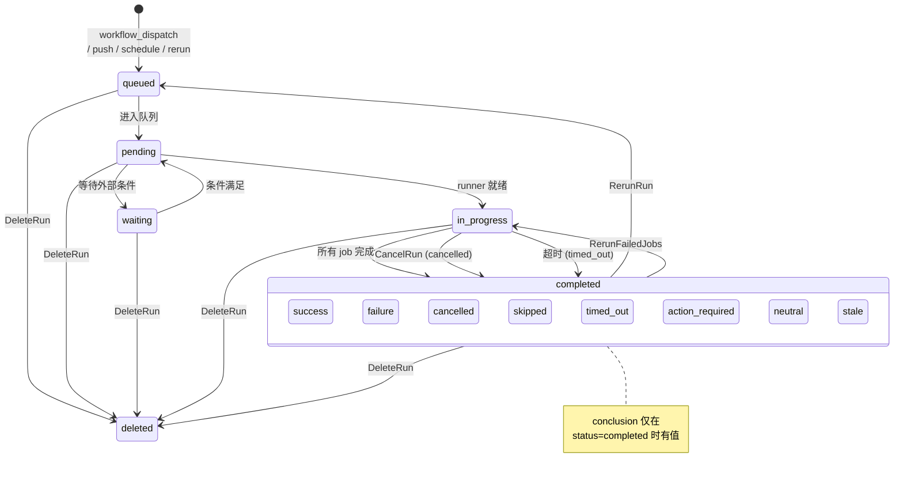
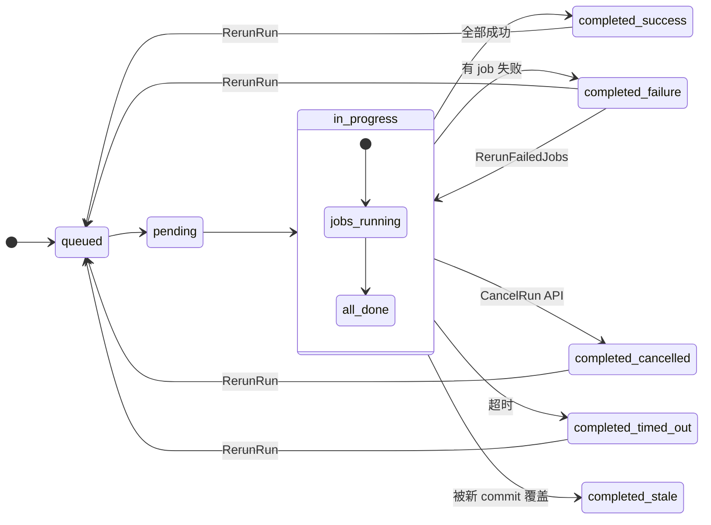
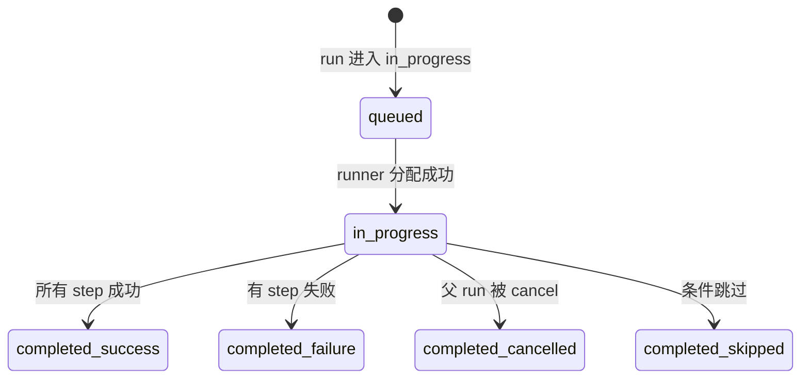

# GitHub Actions Workflow Run 生命周期 —— 形式化模型

> **数据源**: `https://unpkg.com/@github/openapi@5.7.2/dist/api.github.com.json`
> **注意**: 本文仅建模 workflow run / job 的生命周期，不涉及 runner、secret、artifact、image-cache 等外围资源。

---

## 1. 状态集合

### 1.1 Workflow Run 状态

$$\mathbb{S}_{\text{run}} = \{ \text{queued}, \text{pending}, \text{in\\\_progress}, \text{requested}, \text{waiting}, \text{completed} \}$$

| 状态 | 含义 | 类型 |
|---|---|---|
| `queued` | 运行已创建，等待进入队列 | 瞬态 |
| `pending` | 等待分配 runner / 等待审批 | 瞬态 |
| `in_progress` | 正在执行 job(s) | 稳态 |
| `requested` | GitHub 内部使用，外部分发请求 | 内部瞬态 |
| `waiting` | GitHub 内部使用，等待外部条件 | 内部瞬态 |
| `completed` | 运行结束，查看 conclusion 获取结果 | 软终态† |

> † `completed` 可通过 `rerun` 重新回到 `queued`，因此是"软终态"。真正不可逆的终态是 `deleted`（资源从系统移除）。

### 1.2 Workflow Run Conclusion (仅 status=completed 时有意义)

$$\mathbb{C}_{\text{run}} = \{ \text{success}, \text{failure}, \text{cancelled}, \text{skipped}, \text{timed\\\_out}, \text{action\\\_required}, \text{neutral}, \text{stale} \}$$

| Conclusion | 含义 |
|---|---|
| `success` | 所有 job 执行成功 |
| `failure` | 至少一个 job 失败 |
| `cancelled` | 被手动取消 |
| `skipped` | 被跳过（分支/路径条件不满足） |
| `timed_out` | 超过 workflow 超时限制 |
| `action_required` | 需要手动干预（如 pending deployment approval） |
| `neutral` | 中性结果 |
| `stale` | 运行已过时（新 commit push 后旧 run 被标记） |

### 1.3 Job 状态

$$\mathbb{S}_{\text{job}} = \{ \text{queued}, \text{in\\\_progress}, \text{completed} \}$$

### 1.4 Job Conclusion (仅 status=completed 时有意义)

$$\mathbb{C}_{\text{job}} = \{ \text{success}, \text{failure}, \text{cancelled}, \text{skipped}, \text{timed\\\_out}, \text{action\\\_required}, \text{neutral}, \text{startup\\\_failure} \}$$

### 1.5 Step 状态 (Job 内最小执行单元)

$$\mathbb{S}_{\text{step}} = \{ \text{queued}, \text{in\\\_progress}, \text{completed} \}$$

$$\mathbb{C}_{\text{step}} = \{ \text{success}, \text{failure}, \text{cancelled}, \text{skipped}, \text{timed\\\_out}, \text{action\\\_required} \}$$

---

## 2. 初始状态

$$\text{Init} \triangleq (s_{\text{run}} = \text{"queued"})$$

触发方式：

| 触发方式 | 说明 |
|---|---|
| `POST /workflows/{id}/dispatches` | API 手动触发（workflow_dispatch 事件） |
| Git push / PR | repository_dispatch 自动触发 |
| Schedule (cron) | 定时触发 |
| `POST /runs/{id}/rerun` | 重新运行（同一 run_id，状态从 completed → queued） |

---

## 3. 状态转移函数

### 3.1 Workflow Run 转移

$$\delta_{\text{run}}: \mathbb{S}_{\text{run}} \times \Omega \to \mathbb{S}_{\text{run}}$$

| # | 源状态 | 触发条件 | 目标状态 |
|---|---|---|---|
| T1 | `queued` | 系统: 进入队列 | `pending` |
| T2 | `pending` | 系统: runner 就绪 / 审批通过 | `in_progress` |
| T3 | `pending` | 系统: 等待条件 | `waiting` |
| T4 | `waiting` | 系统: 条件满足 | `pending` |
| T5 | `in_progress` | 系统: 所有 job 完成 | `completed` (conclusion 由 job 结果决定) |
| T6 | `in_progress` | API: cancel | `completed` (conclusion=`cancelled`) |
| T7 | `in_progress` | 系统: 超时 | `completed` (conclusion=`timed_out`) |
| T8 | `in_progress` | 系统: 新 commit 使运行过时 | `completed` (conclusion=`stale`) |
| T9 | `completed` | API: rerun | `queued` |
| T10 | `completed` | API: rerun-failed-jobs | `in_progress`（仅重跑失败 job） |
| T11 | `completed` | API: delete | `deleted`（资源移除） |
| T12 | 任意非 deleted | API: delete | `deleted` |

### 3.2 Job 转移

$$\delta_{\text{job}}: \mathbb{S}_{\text{job}} \times \Omega \to \mathbb{S}_{\text{job}}$$

| # | 源状态 | 触发条件 | 目标状态 |
|---|---|---|---|
| J1 | `queued` | 系统: runner 分配 | `in_progress` |
| J2 | `in_progress` | 系统: 所有 step 完成 | `completed` (conclusion 由 step 结果决定) |
| J3 | `in_progress` | 系统: 父 run 被 cancel | `completed` (conclusion=`cancelled`) |

---

## 4. API 操作与合法前置状态

| 操作 | HTTP | 合法前置状态 | 目标状态 / 效果 |
|---|---|---|---|
| `CreateDispatch` | POST /workflows/{id}/dispatches | (无——新建 run) | queued |
| `GetRun` | GET /runs/{id} | 任意（含 deleted?→404） | (只读) |
| `ListRuns` | GET /runs | 任意 | (只读) |
| `CancelRun` | POST /runs/{id}/cancel | in_progress, pending, queued | completed (conclusion=cancelled) |
| `RerunRun` | POST /runs/{id}/rerun | completed | queued |
| `RerunFailedJobs` | POST /runs/{id}/rerun-failed-jobs | completed | in_progress |
| `DeleteRun` | DELETE /runs/{id} | 任意非 deleted | deleted (资源移除) |
| `GetJob` | GET /jobs/{id} | 任意 | (只读) |
| `ListJobsForRun` | GET /runs/{id}/jobs | 任意 | (只读) |

---

## 5. 形式化规范 (TLA⁺ 风格)

```tla
---- MODULE GitHub_Actions_WorkflowRun ----

CONSTANTS
  RunId             \* 所有 workflow run ID 的集合
  JobId             \* 所有 job ID 的集合

VARIABLES
  runStatus         \* [RunId -> RunStatus]
  runConclusion     \* [RunId -> Conclusion ∪ {null}]
  jobStatus         \* [JobId -> JobStatus]
  jobConclusion     \* [JobId -> Conclusion ∪ {null}]
  runJobs           \* [RunId -> SUBSET JobId]

----
RunStatus  ≜ {"queued", "pending", "in_progress", "requested", "waiting", "completed", "deleted"}
Conclusion ≜ {"success", "failure", "cancelled", "skipped", "timed_out", "action_required", "neutral", "stale", "startup_failure"}
JobStatus  ≜ {"queued", "in_progress", "completed"}

----
TypeOK ≜
  ∧ runStatus     ∈ [RunId -> RunStatus]
  ∧ runConclusion ∈ [RunId -> Conclusion ∪ {null}]
  ∧ jobStatus     ∈ [JobId -> JobStatus]
  ∧ jobConclusion ∈ [JobId -> Conclusion ∪ {null}]
  ∧ runJobs       ∈ [RunId -> SUBSET JobId]

----
\* 不变量: conclusion 仅在 status=completed 时非 null
ConclusionInvariant ≜
  ∀ r ∈ RunId: runConclusion[r] ≠ null ⇒ runStatus[r] = "completed"

\* 不变量: job conclusion 仅在 job status=completed 时非 null
JobConclusionInvariant ≜
  ∀ j ∈ JobId: jobConclusion[j] ≠ null ⇒ jobStatus[j] = "completed"

----
\* 安全性: 取消只能从活跃状态
CancelValid ≜
  ∀ r ∈ RunId:
    runStatus'[r] = "completed" ∧ runConclusion'[r] = "cancelled"
    ⇒ runStatus[r] ∈ {"queued", "pending", "in_progress", "requested", "waiting"}

\* 安全性: rerun 只能从 completed
RerunValid ≜
  ∀ r ∈ RunId:
    runStatus'[r] = "queued" ∧ runStatus[r] = "completed"
    ⇒ TRUE  \* 仅 rerun 操作可触发

\* 安全性: delete 后不可查询
DeleteIrreversible ≜
  ∀ r ∈ RunId:
    runStatus[r] = "deleted" ⇒ runStatus'[r] = "deleted"

----
\* 活性: queued 最终到达 pending 或 deleted
QueuedResolves ≜
  ∀ r ∈ RunId:
    runStatus[r] = "queued" ↝ runStatus[r] ∈ {"pending", "deleted"}

\* 活性: pending 最终到达 in_progress 或 completed 或 deleted
PendingResolves ≜
  ∀ r ∈ RunId:
    runStatus[r] = "pending" ↝ runStatus[r] ∈ {"in_progress", "completed", "deleted"}

\* 活性: in_progress 最终到达 completed 或 deleted
InProgressResolves ≜
  ∀ r ∈ RunId:
    runStatus[r] = "in_progress" ↝ runStatus[r] ∈ {"completed", "deleted"}

\* 活性: completed 最终 rerun / rerun-failed / delete 或保持
CompletedResolves ≜
  ∀ r ∈ RunId:
    runStatus[r] = "completed" ↝ runStatus[r] ∈ {"queued", "in_progress", "deleted"}

=============================================================================
```

---

## 6. 状态机图 (Mermaid)

### 6.1 Workflow Run 生命周期



### 6.2 带 Conclusion 的细化视图



### 6.3 Job 生命周期



### 6.4 Step 生命周期 (Job 内)

```mermaid
stateDiagram-v2
    [*] --> queued: job 进入 in_progress

    queued --> in_progress: 开始执行
    queued --> skipped: if 条件为 false

    in_progress --> completed_success: exit 0
    in_progress --> completed_failure: exit ≠ 0
    in_progress --> completed_cancelled: job 被 cancel

    note right of in_progress: continue-on-error: true<br/>时 failure 不阻塞 job
```

---

## 7. 完整 API 接口清单

### Workflow Run 管理
| API | HTTP 方法 | 作用 |
|---|---|---|
| `CreateDispatch` | POST /workflows/{id}/dispatches | 手动触发 workflow |
| `GetRun` | GET /runs/{id} | 获取单个 run 详情 |
| `ListRuns` | GET /runs | 列出 runs（可按 status/conclusion/branch/actor 过滤） |
| `CancelRun` | POST /runs/{id}/cancel | 取消运行中的 run |
| `RerunRun` | POST /runs/{id}/rerun | 重新运行（completed → queued） |
| `RerunFailedJobs` | POST /runs/{id}/rerun-failed-jobs | 仅重跑失败 job |
| `DeleteRun` | DELETE /runs/{id} | 删除 run（不可逆） |
| `GetRunTiming` | GET /runs/{id}/timing | 获取 run 的时长统计 |
| `ListRunArtifacts` | GET /runs/{id}/artifacts | 列出 run 的 artifacts |
| `GetRunLogs` | GET /runs/{id}/logs | 下载 run 日志 |

### Job 管理
| API | HTTP 方法 | 作用 |
|---|---|---|
| `GetJob` | GET /jobs/{id} | 获取单个 job 详情 |
| `ListJobsForRun` | GET /runs/{id}/jobs | 列出 run 下所有 job |
| `GetJobLogs` | GET /jobs/{id}/logs | 下载 job 日志 |

### Workflow 定义
| API | HTTP 方法 | 作用 |
|---|---|---|
| `GetWorkflow` | GET /workflows/{id} | 获取 workflow 定义 |
| `ListWorkflows` | GET /workflows | 列出 repo 下所有 workflow |
| `ListWorkflowRuns` | GET /workflows/{id}/runs | 列出某 workflow 的所有 run |
| `GetWorkflowTiming` | GET /workflows/{id}/timing | 获取 workflow 的时长统计 |

---

## 8. 关键参数: Run 过滤

`GET /repos/{owner}/{repo}/actions/runs` 的 `status` 参数接受 14 个值的并集：

$$\text{FilterParam} \in \mathbb{S}_{\text{run}} \cup \mathbb{C}_{\text{run}}$$

即：`completed`, `action_required`, `cancelled`, `failure`, `neutral`, `skipped`, `stale`, `success`, `timed_out`, `in_progress`, `queued`, `requested`, `waiting`, `pending`

---

## 9. Conclusion 判定规则

Workflow run 的 conclusion 由其所有 job 的 conclusion 决定：

$$\text{runConclusion} = \begin{cases}
\text{cancelled} & \text{if CancelRun was called} \\
\text{timed\\\_out} & \text{if timeout exceeded} \\
\text{stale} & \text{if newer commit pushed} \\
\text{skipped} & \text{if all jobs skipped} \\
\text{success} & \text{if } \forall j: \text{conc}(j) = \text{success} \\
\text{failure} & \text{if } \exists j: \text{conc}(j) = \text{failure} \\
\text{action\\\_required} & \text{if } \exists j: \text{conc}(j) = \text{action\\\_required} \\
\text{neutral} & \text{if } \forall j: \text{conc}(j) \in \{\text{success}, \text{neutral}, \text{skipped}\} \\
\end{cases}$$

---

## 10. GitHub × ECI 建模对比

| 维度 | ECI ContainerGroup | GitHub Actions WorkflowRun |
|---|---|---|
| 状态数 | 11 | 6 (+ deleted) |
| 硬终态 | ScheduleFailed, Succeeded, Failed, Expired, Deleted | deleted |
| 软终态 | 无（completed 不可 rerun） | completed（可 rerun 回到 queued） |
| 子资源 | Container (Waiting/Running/Terminated) | Job (queued/in_progress/completed) → Step (queued/in_progress/completed) |
| 状态+结果分层 | 仅 status，无 conclusion | status + conclusion 双层 |
| 创建 | CreateContainerGroup | workflow_dispatch / push / schedule / rerun |
| 删除 | DeleteContainerGroup → Terminating → Deleted | DeleteRun → deleted (立即) |
| 修改 | UpdateContainerGroup | 无（run 创建后不可修改配置） |
| 重启 | RestartContainerGroup | RerunRun / RerunFailedJobs |
| 取消 | 无直接取消（Delete 走 Terminating） | CancelRun → completed(cancelled) |
