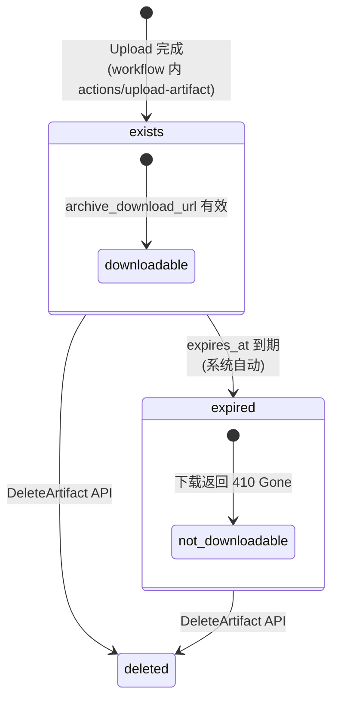

# GitHub Actions Artifact —— 生命周期模型

> **数据源**: `https://unpkg.com/@github/openapi@5.7.2/dist/api.github.com.json`

---

## 1. 状态集合

Artifact 是 workflow run 产生的文件归档。由 TTL 驱动过期，无"运行中"概念——创建即存在，过期/删除即消失。

$$\mathbb{S}_{\text{artifact}} = \{ \text{exists}, \text{expired}, \text{deleted} \}$$

| 状态 | 含义 | 类型 |
|---|---|---|
| `exists` | 已上传完成，可下载 | 稳态 |
| `expired` | TTL 到期，系统标记过期（不可下载） | 软终态 |
| `deleted` | 手动删除，资源回收 | 硬终态 |

---

## 2. Artifact 属性 (Schema)

| 属性 | 类型 | 说明 |
|---|---|---|
| `id` | number | 唯一 ID |
| `name` | string | 名称 |
| `size_in_bytes` | number | 大小（字节） |
| `url` | string | API URL |
| `archive_download_url` | string | 下载 URL |
| `expired` | boolean | 是否已过期 |
| `created_at` | string | 创建时间 |
| `expires_at` | string | 过期时间 |

---

## 3. 状态转移

| # | 源 | 触发 | 目标 |
|---|---|---|---|
| A1 | (无) | `POST /actions/runs/{run_id}/artifacts` (upload) | `exists` |
| A2 | `exists` | 系统: `expires_at` 到期 | `expired` |
| A3 | `exists` | `DELETE /actions/artifacts/{id}` | `deleted` |
| A4 | `expired` | `DELETE /actions/artifacts/{id}` | `deleted` |

---

## 4. 状态机图

---

## 5. 默认 TTL 策略

| 场景 | 默认保留期 |
|---|---|
| 普通 artifact | 90 days |
| 可由 repo/org 设置调整 | 1–400 days 或自定义 |

---

## 6. API 清单

| 操作 | HTTP | 说明 |
|---|---|---|
| `ListArtifacts` | GET /repos/{o}/{r}/actions/artifacts | 列出 repo 所有 artifact |
| `GetArtifact` | GET /repos/{o}/{r}/actions/artifacts/{id} | 获取元数据 |
| `DeleteArtifact` | DELETE /repos/{o}/{r}/actions/artifacts/{id} | 删除 |
| `DownloadArtifact` | GET /repos/{o}/{r}/actions/artifacts/{id}/{format} | 下载（format=zip） |
| `ListRunArtifacts` | GET /repos/{o}/{r}/actions/runs/{run_id}/artifacts | 列出某 run 的 artifact |
| `ListWorkflowRunArtifacts` | (同 ListRunArtifacts) | |

---

## 7. 真值表

### 7.1 API × 状态

| 操作 | exists | expired | deleted |
|---|---|---|---|
| `GetArtifact` | V (200) | V (200, expired=true) | I (404) |
| `DownloadArtifact` | V (302 redirect) | I (410 Gone) | I (404) |
| `DeleteArtifact` | V (204) | V (204) | I (404) |
| `ListArtifacts` | V (出现在列表中) | V (出现在列表中) | N/A (不出现) |

### 7.2 可达性

| $s_i \setminus s_j$ | exists | expired | deleted |
|---|---|---|---|
| **exists** | — | ✓ | ✓ |
| **expired** | ✗ | — | ✓ |
| **deleted** | ✗ | ✗ | — |

---

## 8. 不变量 (LaTeX)

**TTL 约束**：

$$\forall a: \text{now} > \text{expires\_at}(a) \implies \text{expired}(a) = \text{true}$$

**过期不可下载**：

$$\text{expired}(a) = \text{true} \implies \text{DownloadArtifact}(a) = 410 \text{ Gone}$$

**删除不可逆**：

$$\text{status}(a) = \text{deleted} \implies \text{GetArtifact}(a) = 404$$

**大小非负**：

$$\forall a: \text{size\_in\_bytes}(a) \geq 0$$

**Run 关联性**：

$$\forall a: \exists r \in \text{RunId}: a \in \text{artifacts}(r)$$

---

## 9. 项目参考价值

| GitHub 概念 | 可映射 |
|---|---|
| TTL 驱动过期 (expires_at) | 沙箱到期自动回收 / Spot 实例保护期 |
| expired ≠ deleted (软删除模式) | 终态元数据保留策略（1h / 100 条） |
| 下载 URL 一次性/短期有效 | S3 presigned URL |
| 按 run 关联查询 | Blob 按 SandboxId 索引 (`IBlobStore`) |
| 固定 90 天默认值 | 存储配额策略 |
