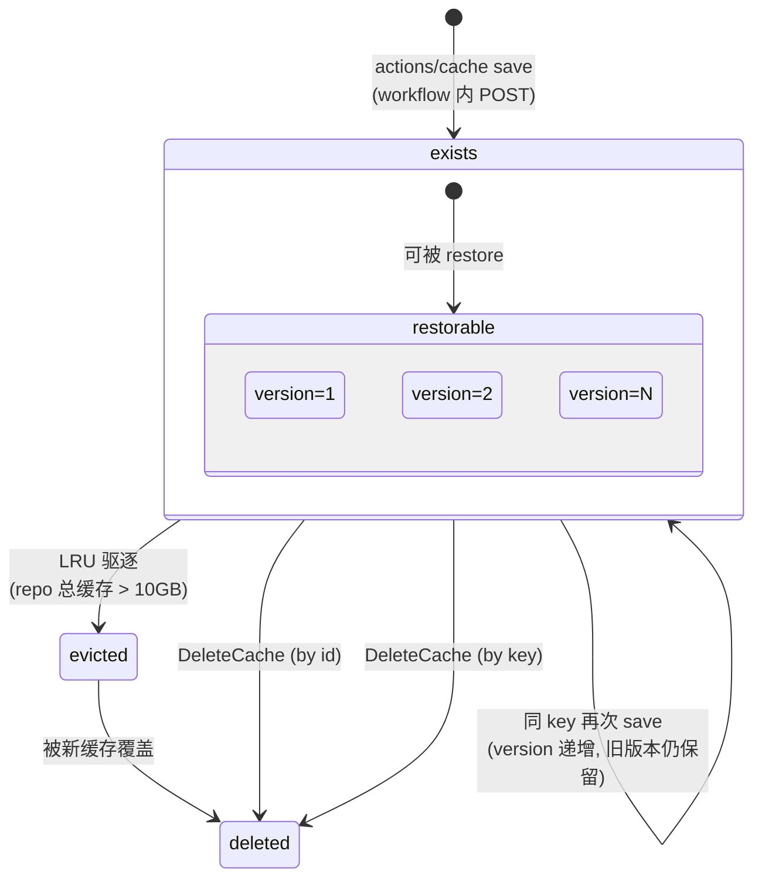

# GitHub Actions Cache —— 生命周期模型

> **数据源**: `https://unpkg.com/@github/openapi@5.7.2/dist/api.github.com.json`
> **补充**: `GET/DELETE /repos/{owner}/{repo}/actions/caches`

---

## 1. 状态集合

Cache 与 Artifact 不同——它没有"expired"独立状态，而是由 GitHub 按 LRU 自动驱逐。手动删除后立即消失。

$$\mathbb{S}_{\text{cache}} = \{ \text{exists}, \text{evicted}, \text{deleted} \}$$

| 状态 | 含义 | 触发者 |
|---|---|---|
| `exists` | 缓存可用，可被 workflow restore | 系统/用户 |
| `evicted` | 被 GitHub LRU 自动驱逐（达 10GB 上限后） | 系统 |
| `deleted` | 手动删除 | 用户 |

---

## 2. Cache 属性

| 属性 | 类型 | 说明 |
|---|---|---|
| `id` | number | 唯一 ID |
| `key` | string | 缓存键（如 `node-modules-${{ hashFiles(...) }}`） |
| `version` | string | 缓存版本（同 key 下自动递增） |
| `size_in_bytes` | number | 大小 |
| `ref` | string | 关联的 Git ref (如 `refs/heads/main`) |
| `last_accessed_at` | string | 最后访问时间 |
| `created_at` | string | 创建时间 |

---

## 3. 状态转移

| # | 源 | 触发 | 目标 |
|---|---|---|---|
| C1 | (无) | workflow 内 `actions/cache@v4` save / `POST /caches` | `exists` |
| C2 | `exists` | 系统: repo 总缓存超 10GB → LRU 驱逐最久未访问的 | `evicted` |
| C3 | `exists` | `DELETE /actions/caches/{id}` | `deleted` |
| C4 | `exists` | `DELETE /actions/caches?key=KEY` | `deleted` |
| C5 | `evicted` | 被后续新缓存覆盖（Git ref 可能重用 key） | `deleted` |

---

## 4. 状态机图

---

## 5. 驱逐策略 (Eviction)

GitHub 的 cache 驱逐不是 per-key 的，而是 repo 级别的：

| 约束 | 值 |
|---|---|
| Repo 总缓存上限 | 10 GB |
| 驱逐策略 | LRU (Least Recently Used) |
| 驱逐粒度 | 单个 cache entry |
| 超过 7 天未访问 | 自动删除 |
| `last_accessed_at` | 每次 `cache restore` 时更新 |

---

## 6. API 清单

| 操作 | HTTP | 说明 |
|---|---|---|
| `ListCaches` | GET /repos/{o}/{r}/actions/caches | 列出（可按 key/ref/sort 过滤） |
| `DeleteCache` | DELETE /repos/{o}/{r}/actions/caches/{id} | 按 ID 删除单个 |
| `DeleteCachesByKey` | DELETE /repos/{o}/{r}/actions/caches?key=K | 按 key 删除所有匹配（可选 `&ref=R`） |

### List 查询参数

| 参数 | 类型 | 说明 |
|---|---|---|
| `key` | string | 精确匹配 cache key |
| `ref` | string | 过滤 Git ref (如 `refs/heads/main`) |
| `sort` | string | `last_accessed_at` / `size_in_bytes` / `created_at` |
| `direction` | string | `asc` / `desc` |
| `per_page` | integer | 每页数量 (max 100) |

---

## 7. 真值表

### 7.1 API × 状态

| 操作 | exists | evicted | deleted |
|---|---|---|---|
| `ListCaches` | V (出现在列表) | ✗ (不出现) | ✗ (不出现) |
| `DeleteCache` (by id) | V (204) | I (404) | I (404) |
| `DeleteCachesByKey` | V (204, 批量) | I (404) | I (404) |
| `Restore` (workflow) | V (hit) | ✗ (miss, 需重建) | ✗ (miss) |

### 7.2 可达性

| $s_i \setminus s_j$ | exists | evicted | deleted |
|---|---|---|---|
| **exists** | — | ✓ | ✓ |
| **evicted** | ✗ | — | → (覆盖) |
| **deleted** | ✗ | ✗ | — |

---

## 8. Cache vs Artifact 对比

| 维度 | Cache | Artifact |
|---|---|---|
| 用途 | 加速构建（依赖缓存） | 保留构建产物 |
| 创建方式 | workflow 内 `actions/cache` | workflow 内 `actions/upload-artifact` |
| 恢复方式 | `actions/cache` restore (key 匹配) | GET download URL |
| 版本管理 | 同 key 多次 save → version 递增 | 无版本概念 |
| TTL | LRU (10GB 上限) + 7 天未访问 | 固定 90 天 |
| 驱逐 | 系统自动（LRU） | 系统自动（expires_at） |
| 删除 API | by id / by key (+ ref) | by id only |
| Git ref 关联 | 是（存储时记录 ref） | 否（仅关联 run） |

---

## 9. 不变量 (LaTeX)

**Repo 容量上限**：

$$\sum_{c \in \text{repo}} \text{size}(c) \leq 10 \text{ GB}$$

**LRU 驱逐**：

$$\text{evict}(c) \iff \sum \text{size} > 10\text{GB} \land c = \arg\min_{c'} \text{lastAccessed}(c')$$

**7 天未访问驱逐**：

$$\text{now} - \text{lastAccessed}(c) > 7 \text{ days} \implies \text{status}(c) = \text{evicted}$$

**版本递增**：

$$\text{save}(K, V_{\text{new}}) \implies \text{version}(K) = \text{version}(K) + 1$$

**Key + Ref 唯一性**：

$$\forall c_1, c_2: \text{key}(c_1) = \text{key}(c_2) \land \text{ref}(c_1) = \text{ref}(c_2) \implies \text{version}(c_1) \neq \text{version}(c_2)$$

---

## 10. 项目参考价值

| GitHub 概念 | 可映射 |
|---|---|
| LRU 驱逐 (10GB 上限) | 镜像缓存淘汰策略 (`EliminationStrategy=LRU`) |
| key + ref 复合索引 | SandboxId + VersionId 复合查询 |
| version 递增（旧版本共存） | OCC 版本号 + 写入缓冲 |
| 7 天未访问自动清理 | 沙箱 GC 超时路径 |
| `last_accessed_at` 访问时更新 | 冷热数据分层 |
| key-based 批量删除 | `DeleteCachesByKey` → 按标签批量清沙箱 |
