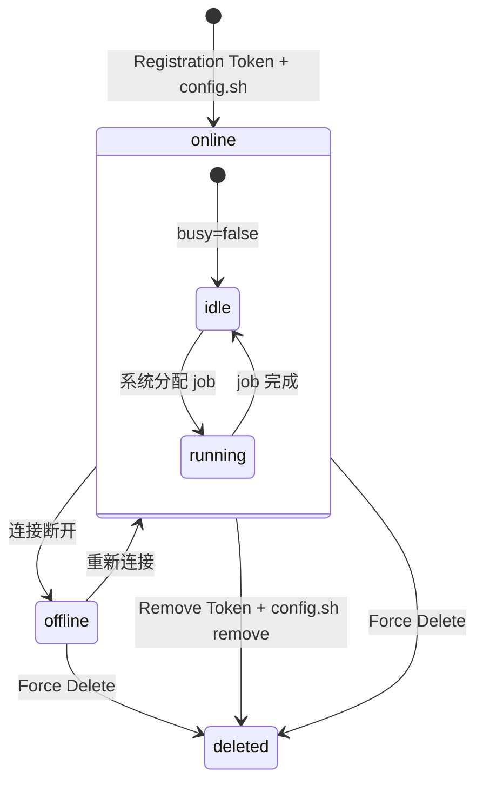

# GitHub Actions Self-Hosted Runner —— 生命周期模型

> **数据源**: `https://unpkg.com/@github/openapi@5.7.2/dist/api.github.com.json`
> **适用层级**: Enterprise / Organization / Repository

---

## 1. 状态集合

$$\mathbb{S}_{\text{runner}} = \{ \text{online}, \text{offline}, \text{deleted} \}$$

Runner 无 "creating" 瞬态——注册即 `online`，删除即 `deleted`。`busy` 是独立布尔标志。

| 状态 | 含义 | 类型 |
|---|---|---|
| `online` | 已连接，可接收 job | 稳态 |
| `offline` | 未连接（进程退出/网络断开） | 稳态 |
| `deleted` | 已从系统移除 | 终态 |

### busy 标志

$$\text{busy} \in \{ \text{true}, \text{false} \}, \quad \text{busy} = \text{true} \implies \text{status} = \text{online}$$

| busy | 含义 |
|---|---|
| `true` | 正在执行 job |
| `false` | 空闲，可接收新 job |

---

## 2. Runner 属性 (Schema)

| 属性 | 类型 | 说明 |
|---|---|---|
| `id` | number | 唯一 ID |
| `name` | string | 名称 |
| `os` | string | linux / win / mac |
| `status` | string | `online` / `offline` |
| `busy` | boolean | 是否执行中 |
| `labels` | array | 标签（用于 job 路由匹配） |

---

## 3. 状态转移

| # | 源 | 触发 | 目标 |
|---|---|---|---|
| R1 | (无) | `POST registration-token` → `config.sh --token X` | `online` |
| R2 | `online` | 进程退出 / 网络断开 | `offline` |
| R3 | `offline` | 进程重启并重连 | `online` |
| R4 | `offline` | `DELETE /runners/{id}` (Force) | `deleted` |
| R5 | `online` | `POST remove-token` → `config.sh remove --token X` | `deleted` |
| R6 | `online` | `DELETE /runners/{id}` (Force, 机器不存在) | `deleted` |

---

## 4. 状态机图

---

## 5. API 清单

### Runner CRUD

| 操作 | HTTP | 说明 |
|---|---|---|
| `ListRunners` | GET /runners | 列出（可按 status 过滤） |
| `GetRunner` | GET /runners/{id} | 单个详情 |
| `DeleteRunner` | DELETE /runners/{id} | 强制删除 |
| `ListRunnerApps` | GET /runners/downloads | 可下载的 runner 二进制 |
| `CreateRegistrationToken` | POST /runners/registration-token | 注册 token (1h TTL) |
| `CreateRemoveToken` | POST /runners/remove-token | 移除 token (1h TTL) |

### Runner Group

| 操作 | HTTP |
|---|---|
| List / Create / Get / PATCH / Delete | GET/POST/GET/PATCH/DELETE /runner-groups[/{id}] |
| List / Set Runners in Group | GET/PUT /runner-groups/{id}/runners |
| Add / Remove Runner from Group | PUT/DELETE /runner-groups/{id}/runners/{rid} |
| List / Set Org Access (Enterprise) | GET/PUT /runner-groups/{id}/organizations |
| Add / Remove Org Access | PUT/DELETE /runner-groups/{id}/organizations/{oid} |
| List / Set Repo Access (Org) | GET/PUT /runner-groups/{id}/repositories |
| Add / Remove Repo Access | PUT/DELETE /runner-groups/{id}/repositories/{rid} |

---

## 6. 真值表

### 6.1 API × 状态

| 操作 | online | offline | deleted |
|---|---|---|---|
| `GetRunner` | V (200) | V (200) | I (404) |
| `DeleteRunner` | V (204) | V (204) | I (404) |
| `CreateRemoveToken` | V (201) | V (201) | I (404) |
| `AddToGroup` | V | V | I (404) |

### 6.2 可达性

| $s_i \setminus s_j$ | online | offline | deleted |
|---|---|---|---|
| **online** | — | ✓ | ✓ |
| **offline** | ✓ | — | ✓ |
| **deleted** | ✗ | ✗ | — |

---

## 7. 不变量 (LaTeX)

$$\text{busy}(r) = \text{true} \implies \text{status}(r) = \text{online}$$

$$\text{status}(r) = \text{deleted} \implies \forall \omega: \delta(r, \omega) = r$$

$$\text{token}(t) \text{ valid} \iff \text{now} - t_{\text{created}} < 3600$$

---

## 8. 项目参考价值

| GitHub 概念 | 可映射 |
|---|---|
| Registration Token + config.sh 注册 | 容器节点注册 |
| online/offline 心跳 | health-check.ts |
| busy 状态机 | 容器组资源分配 |
| Runner Groups + 可见性 | 权限组资源池 |
| Force Delete (机器不存在) | provider-gone GC |
| Token 1h TTL | 临时凭证轮转 |
