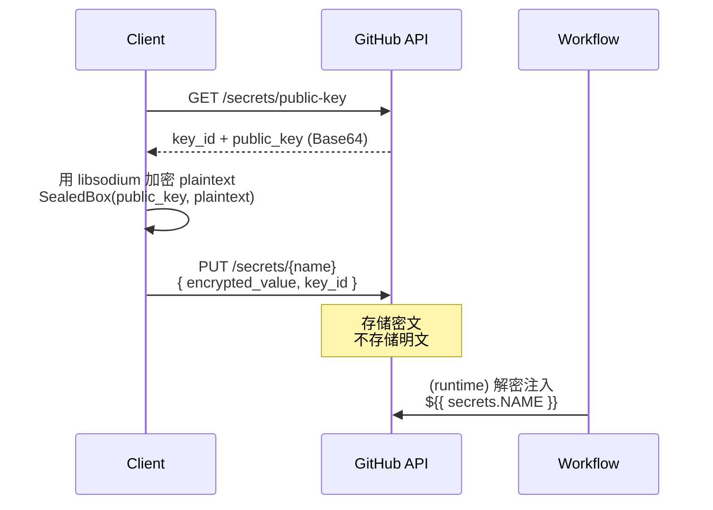
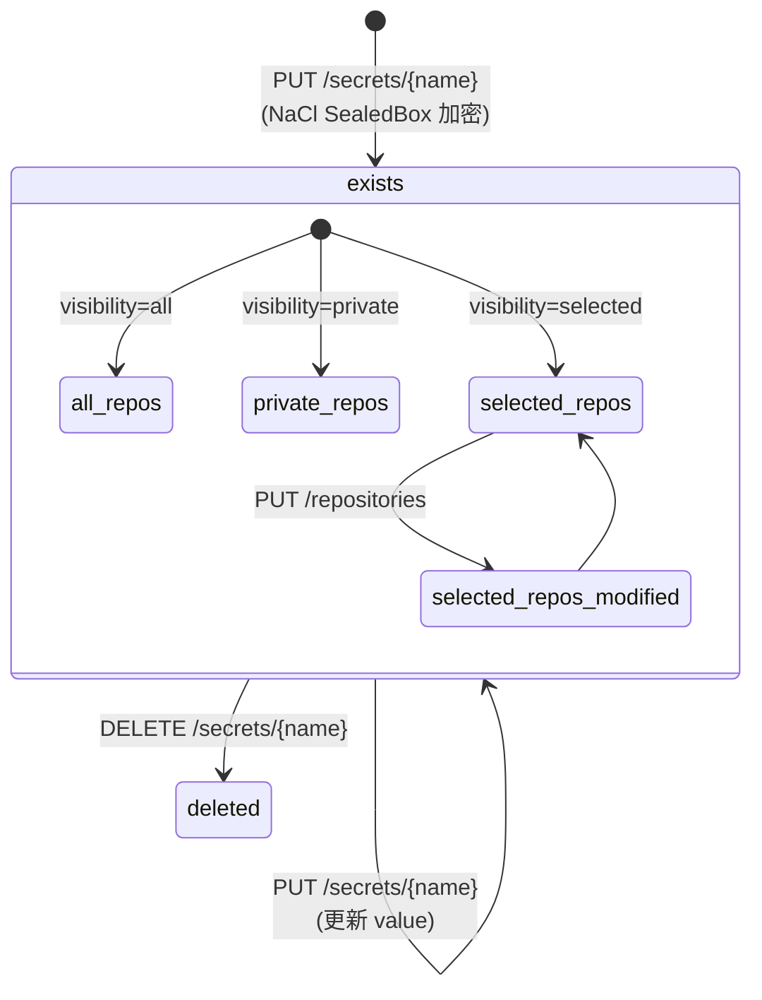

# GitHub Actions Secret —— 生命周期模型

> **数据源**: `https://unpkg.com/@github/openapi@5.7.2/dist/api.github.com.json`
> **适用层级**: Organization / Repository

---

## 1. 状态集合

Secret 无传统"状态机"——它是加密存储的键值对。生命周期由 CRUD + 可见性作用域定义。

$$\text{Secret} = (\text{name}, \text{encrypted\_value}, \text{visibility}, \text{scope}, \text{created\_at}, \text{updated\_at})$$

### 存在性状态

$$\mathbb{S}_{\text{secret}} = \{ \text{exists}, \text{deleted} \}$$

| 状态 | 含义 |
|---|---|
| `exists` | 已加密存储，可被 workflow 引用 |
| `deleted` | 已从系统移除，workflow 引用失败 |

### 可见性 (Org 级独有)

$$\mathbb{V}_{\text{org}} = \{ \text{all}, \text{private}, \text{selected} \}$$

| visibility | 含义 |
|---|---|
| `all` | 所有 repo 可用 |
| `private` | 仅私有 repo 可用 |
| `selected` | 仅指定的 repo 列表可用 |

---

## 2. 加密模型 (Public-Key Sealing)

### 加密公式

$$\text{encrypted} = \text{SealedBox}(\text{pubkey}, \text{plaintext})$$

$$\text{ciphertext} = \text{Base64}(\text{encrypted})$$

---

## 3. 状态机图

---

## 4. API 清单

### Repo 级

| 操作 | HTTP | 说明 |
|---|---|---|
| `ListSecrets` | GET /repos/{o}/{r}/actions/secrets | 列出 secret 名（不含 value） |
| `GetPublicKey` | GET /repos/{o}/{r}/actions/secrets/public-key | 获取公钥 (key_id + key) |
| `GetSecret` | GET /repos/{o}/{r}/actions/secrets/{name} | 获取 secret 元数据 |
| `CreateOrUpdate` | PUT /repos/{o}/{r}/actions/secrets/{name} | 创建/更新（需加密） |
| `DeleteSecret` | DELETE /repos/{o}/{r}/actions/secrets/{name} | 删除 |

### Org 级 (额外功能)

| 操作 | HTTP | 说明 |
|---|---|---|
| `ListSecrets` | GET /orgs/{org}/actions/secrets | 列出（含 visibility） |
| `GetPublicKey` | GET /orgs/{org}/actions/secrets/public-key | 获取公钥 |
| `CreateOrUpdate` | PUT /orgs/{org}/actions/secrets/{name} | 创建/更新（含 visibility） |
| `DeleteSecret` | DELETE /orgs/{org}/actions/secrets/{name} | 删除 |
| `ListSelectedRepos` | GET /orgs/{org}/actions/secrets/{name}/repositories | 列出所选 repo |
| `SetSelectedRepos` | PUT /orgs/{org}/actions/secrets/{name}/repositories | 批量设置所选 repo |
| `AddSelectedRepo` | PUT /orgs/{org}/actions/secrets/{name}/repositories/{repo_id} | 添加单个 repo |
| `RemoveSelectedRepo` | DELETE /orgs/{org}/actions/secrets/{name}/repositories/{repo_id} | 移除单个 repo |

---

## 5. 真值表

### 5.1 CRUD 合法性

| 操作 | exists | deleted |
|---|---|---|
| `GetPublicKey` | V (200) | V (200) — key 不属于单个 secret |
| `GetSecret` | V (200) | I (404) |
| `CreateOrUpdate` | V (201/204) | V (201) — 新建 |
| `DeleteSecret` | V (204) | I (404) |

### 5.2 可见性 × 操作 (Org 级)

| visibility | ListSelectedRepos | SetSelectedRepos |
|---|---|---|
| `all` | N/A | N/A |
| `private` | N/A | N/A |
| `selected` | V | V |

### 5.3 更新幂等性

| 操作 | 幂等？ |
|---|---|
| `CreateOrUpdate` (same name, same value) | 是 — 204 |
| `CreateOrUpdate` (same name, new value) | 是 — 204（覆盖） |
| `DeleteSecret` | 是 — 404（已删） |
| `GetPublicKey` | 是 |

---

## 6. 不变量 (LaTeX)

**加密不可逆**（GitHub 不存储明文）：

$$\forall s: \text{plaintext}(s) \notin \text{storage}$$

**Name 唯一性 (per scope)**：

$$\forall s_1, s_2 \in \text{scope}(R): \text{name}(s_1) = \text{name}(s_2) \implies s_1 = s_2$$

**Org secret 可见性约束**：

$$\text{visibility}(s) = \text{all} \implies \text{accessible}(s, r), \forall r \in \text{Org}$$

$$\text{visibility}(s) = \text{selected} \implies \text{accessible}(s, r) \iff r \in \text{selectedRepos}(s)$$

**公钥不变性 (per scope)**：

$$\text{pubkey}(\text{repo}) = \text{const} \quad \text{(直到手动 rotate)}$$

---

## 7. 项目参考价值

| GitHub 概念 | 可映射 |
|---|---|
| Public-Key Sealing (NaCl SealedBox) | AES-GCM 信封加密 (`core/auth/`) |
| Org/Repo 二级作用域 | 权限继承 DAG (`core/permission/`) |
| visibility=selected + repo list | 资源可见性白名单 |
| PUT 即 Upsert | REST 幂等设计 |
| key_id 防重放 | 加密版本号 / OCC |
| 公钥独立于 secret 生命周期 | 密钥管理与数据分离 |
