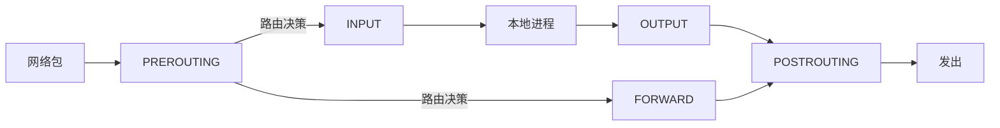
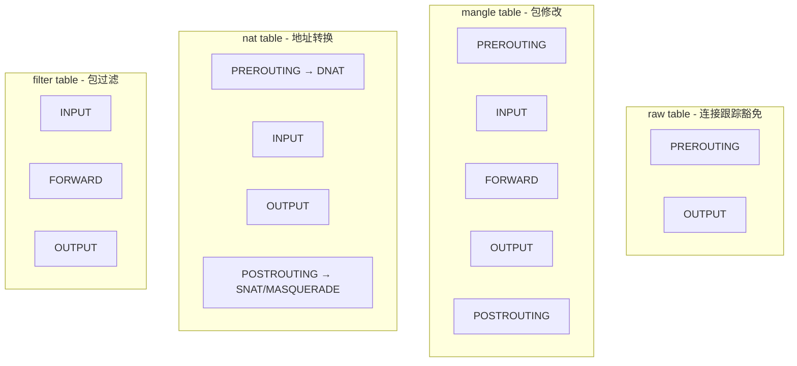
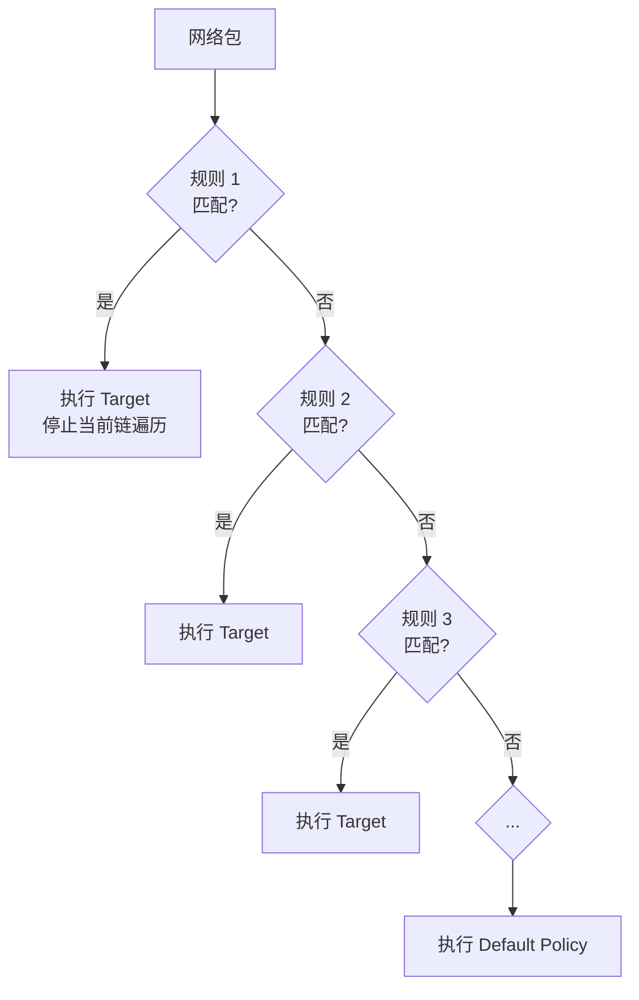
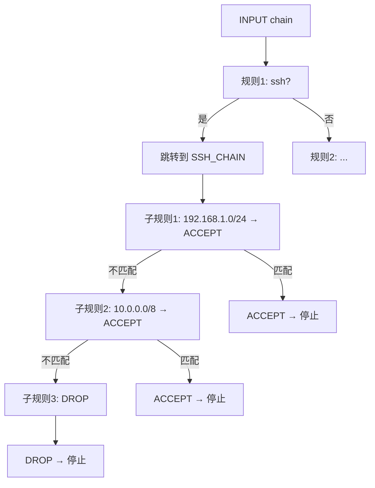

# iptables / nftables 规则链模型 —— 形式化模型

> **环境**: RHEL 9.8 (nftables 为主，iptables 向后兼容)
> **核心思想**: 包在网络栈的五个钩子点依次经过四张表中的规则链，逐条匹配，首次命中即停止。

---

## 1. 五链 × 四表 架构

### 1.1 五个钩子点 (Chains / Hooks)



| Chain | 触发时机 | 经过的包 |
|---|---|---|
| `PREROUTING` | 包进入网络栈后、路由决策前 | 所有进入的包 |
| `INPUT` | 路由决策确定目标是本机后 | 目标是本机的包 |
| `FORWARD` | 路由决策确定目标是其他主机后 | 经过本机转发的包 |
| `OUTPUT` | 本机进程发出包后 | 本机发出的包 |
| `POSTROUTING` | 路由决策后、发出前（最后一步） | 所有发出的包 |

### 1.2 四张表 (Tables) × 链 路由矩阵



$$\text{Table} \times \text{Chain} = \begin{array}{c|ccccc}
& \text{PRE} & \text{IN} & \text{FWD} & \text{OUT} & \text{POST} \\
\hline
\text{raw} & \checkmark & & & \checkmark & \\
\text{mangle} & \checkmark & \checkmark & \checkmark & \checkmark & \checkmark \\
\text{nat} & \checkmark & \checkmark & & \checkmark & \checkmark \\
\text{filter} & & \checkmark & \checkmark & \checkmark &
\end{array}$$

### 1.3 遍历顺序

一个包经过的完整路径（按表×链优先级）：

```
raw.PREROUTING → mangle.PREROUTING → nat.PREROUTING
→ 路由决策 (是本地还是转发?)
→ [INPUT 路径]: mangle.INPUT → filter.INPUT → 本地进程
→ [FORWARD 路径]: mangle.FORWARD → filter.FORWARD
→ [OUTPUT 路径]: raw.OUTPUT → mangle.OUTPUT → nat.OUTPUT → filter.OUTPUT
→ mangle.POSTROUTING → nat.POSTROUTING → 发出
```

---

## 2. 规则匹配语义

### 2.1 规则结构

$$\text{Rule} = (\text{Match}_1 \land \text{Match}_2 \land \dots \land \text{Match}_n, \text{Target})$$

| 组件 | 说明 |
|---|---|
| Match | 匹配条件: `-p tcp`, `--dport 80`, `-s 192.168.0.0/24`, `-m conntrack --ctstate NEW` |
| Target | 命中后执行的动作 |

### 2.2 First-Match Wins



形式化:

$$\text{ChainEval}(pkt, \text{chain}) \triangleq \begin{cases}
\text{target}_i(pkt) & \text{if } \exists i = \min\{j \mid \text{matches}(\text{rule}_j, pkt)\} \\
\text{DefaultPolicy}(\text{chain}) & \text{if no rule matches}
\end{cases}$$

### 2.3 Target 类型

| Target | 含义 | 行为 |
|---|---|---|
| `ACCEPT` | 接受包 | 停止当前链，包继续到下一张表 |
| `DROP` | 丢弃包 | 静默丢弃，不通知发送方 |
| `REJECT` | 拒绝包 | 丢弃 + 发送 ICMP rejection (port unreachable 等) |
| `RETURN` | 返回 | 从自定义链返回调用链，继续下一条规则 |
| `LOG` | 记录日志 | 记录后继续下一条规则匹配（不停止） |
| `chain_name` | 跳转 | 跳转到用户自定义链 |
| `DNAT` | 目标地址转换 | 修改目标 IP:Port (仅 nat.PREROUTING) |
| `SNAT` | 源地址转换 | 修改源 IP (仅 nat.POSTROUTING) |
| `MASQUERADE` | 动态 SNAT | 源 IP = 出接口 IP (仅 nat.POSTROUTING) |

---

## 3. 连接跟踪 (conntrack)

连接跟踪是 iptables 实现"有状态"过滤的关键。

$$\text{ctstate} \in \{ \text{NEW}, \text{ESTABLISHED}, \text{RELATED}, \text{INVALID}, \text{UNTRACKED} \}$$

| ctstate | 含义 |
|---|---|
| `NEW` | 新连接的初始包 |
| `ESTABLISHED` | 已建立连接的后续包 |
| `RELATED` | 与已有连接关联的新连接（如 FTP data） |
| `INVALID` | 不符合任何已知连接的包 |
| `UNTRACKED` | 被 raw 表标记为不跟踪的包 |

**经典安全规则**:

```bash
# 允许已建立的连接 + 回环
iptables -A INPUT -m conntrack --ctstate ESTABLISHED,RELATED -j ACCEPT
iptables -A INPUT -i lo -j ACCEPT
# 允许 SSH
iptables -A INPUT -p tcp --dport 22 -m conntrack --ctstate NEW -j ACCEPT
# 默认丢弃
iptables -P INPUT DROP
```

等价于 "白名单" 模型: 默认拒绝，只放行已知安全流量。

---

## 4. 自定义链 (User-defined Chain)

iptables 支持创建自定义链作为"子程序":

```bash
iptables -N SSH_CHAIN
iptables -A SSH_CHAIN -s 192.168.1.0/24 -j ACCEPT
iptables -A SSH_CHAIN -s 10.0.0.0/8 -j ACCEPT
iptables -A SSH_CHAIN -j DROP

# 从 INPUT 跳转到 SSH_CHAIN
iptables -A INPUT -p tcp --dport 22 -j SSH_CHAIN
```



这实现了**规则复用**和**分层组织**——相同逻辑不用在每条规则里重复写。

---

## 5. Default Policy

每条内置链有一个默认策略（当没有规则匹配时执行）：

$$\text{DefaultPolicy}(\text{chain}) \in \{ \text{ACCEPT}, \text{DROP} \}$$

| 策略 | 含义 | 安全模型 |
|---|---|---|
| `ACCEPT` | 未匹配 = 允许 | 黑名单（默认允许，拒绝特定） |
| `DROP` | 未匹配 = 丢弃 | 白名单（默认拒绝，允许特定） |

---

## 6. nftables: 现代替代

RHEL 9.8 默认使用 nftables (`iptables` 命令透明转换为 nftables 规则)。

### 6.1 核心改进

| 特性 | iptables | nftables |
|---|---|---|
| 框架数量 | 4 个 (iptables/ip6tables/arptables/ebtables) | **1 个** |
| 规则更新 | 逐条加载（非原子） | **原子事务** |
| 数据结构 | 无 | **sets, maps, verdict maps** |
| 内核评估 | 每张表独立评估 | 合并评估（更少遍历） |

### 6.2 nftables 语法

```bash
# 创建表
nft add table ip filter

# 创建链
nft add chain ip filter input { type filter hook input priority 0 \; policy drop \; }

# 添加规则
nft add rule ip filter input tcp dport 22 accept
nft add rule ip filter input ct state established,related accept
```

### 6.3 Verdict Map (nftables 独有)

```bash
nft add map ip filter port_to_action { type inet_service : verdict \; }
nft add element ip filter port_to_action { 22 : accept }
nft add element ip filter port_to_action { 80 : accept }
nft add element ip filter port_to_action { 443 : accept }

nft add rule ip filter input tcp dport vmap @port_to_action
```

一个规则 + 一个 map = 替代多条 `-p tcp --dport X -j ACCEPT` 规则。

---

## 7. 形式化规约

### 7.1 规则匹配函数

$$\text{Match}(\text{rule}, pkt) \triangleq \bigwedge_{m \in \text{matches}(\text{rule})} \text{eval}(m, pkt)$$

### 7.2 链评估函数

$$\text{Eval}(\text{chain}, pkt) \triangleq \begin{cases}
\text{Apply}(\text{target}_i, pkt) & \text{if } i = \min\{j \mid \text{Match}(\text{rule}_j, pkt)\} \\
\text{DefaultPolicy}(\text{chain}) & \text{if no match}
\end{cases}$$

### 7.3 包遍历函数

$$\text{Traverse}(pkt) \triangleq \text{foreach } (t, c) \in \text{TableChainOrder}: pkt = \text{Eval}(t.c, pkt)$$

### 7.4 First-Match 不变量

$$\forall pkt, \text{chain}: \text{matched}(pkt) \leq 1 \quad \text{(每条链最多命中一条规则)}$$

### 7.5 DROP 可检测性

$$\text{Eval}(\text{chain}, pkt) = \text{DROP} \implies pkt \notin \text{subsequent\_tables}$$

DROP 的包**立即消失**，不进入后续的表和链。

### 7.6 ACCEPT 语义

$$\text{Eval}(\text{chain}, pkt) = \text{ACCEPT} \implies pkt \text{继续遍历下一个 (table, chain) 对}$$

ACCEPT 不是"最终接受"——它只结束**当前链**的遍历。包可能被后续的表和链再次拒绝。

---

## 8. 项目参考价值

iptables 的"表×链"模型是最适合抄到中间件架构的:

| iptables 概念 | 你的项目映射 |
|---|---|
| **4 张表 (raw/mangle/nat/filter)** | 中间件功能分组: 安全表 / 限流表 / 审计表 / 路由表 |
| **5 条链 (PRE/IN/FWD/OUT/POST)** | 请求生命周期钩子: 预处理 → 鉴权 → 业务 → 审计 → 后处理 |
| **First-Match Wins** | 中间件短路: authz 拒绝 → 不再执行后续中间件 |
| **Default Policy (ACCEPT/DROP)** | 默认策略: dev 环境 ACCEPT，prod 环境 DROP (白名单) |
| **自定义链 (子链)** | 中间件链内嵌套子链: `ssh_chain` → `PermissionCheck` sub-chain |
| **`-j LOG` 仅记录不停止** | 审计中间件——记录后继续执行（不像 authz 拒绝会停止） |
| **`-j RETURN` 返回调用链** | 子中间件完成，返回主链继续 |
| **conntrack 状态 (NEW/ESTABLISHED/RELATED)** | 连接状态: 新请求 vs 已有会话 vs 关联请求 (SSE/WebSocket) |
| **nftables 原子事务更新** | 规则热加载——不中断当前请求的流量 |
| **nftables verdict map** | 路由表——path → handler 映射，不用写一组 `if/else` |
