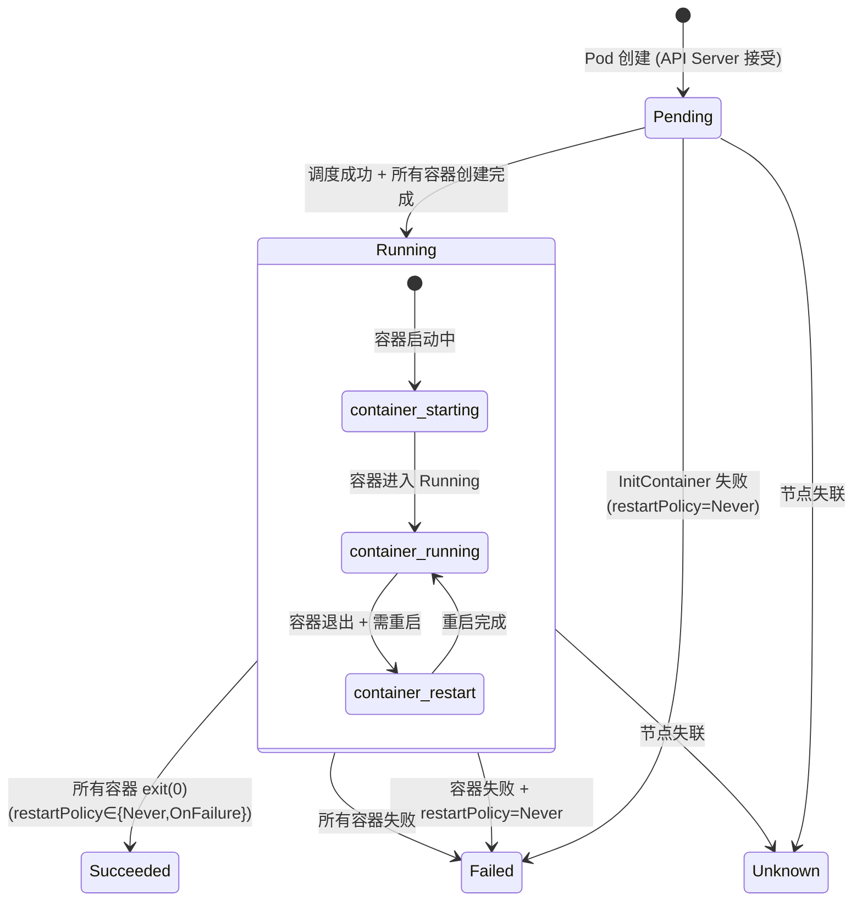
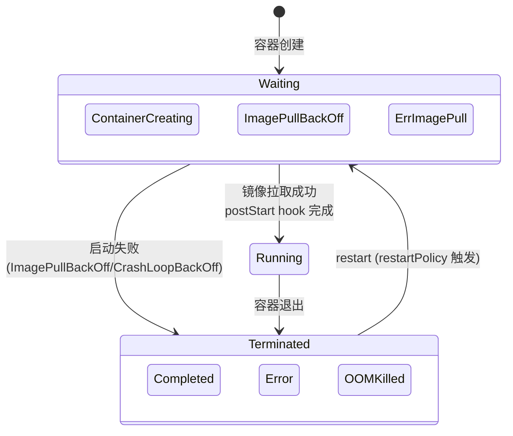
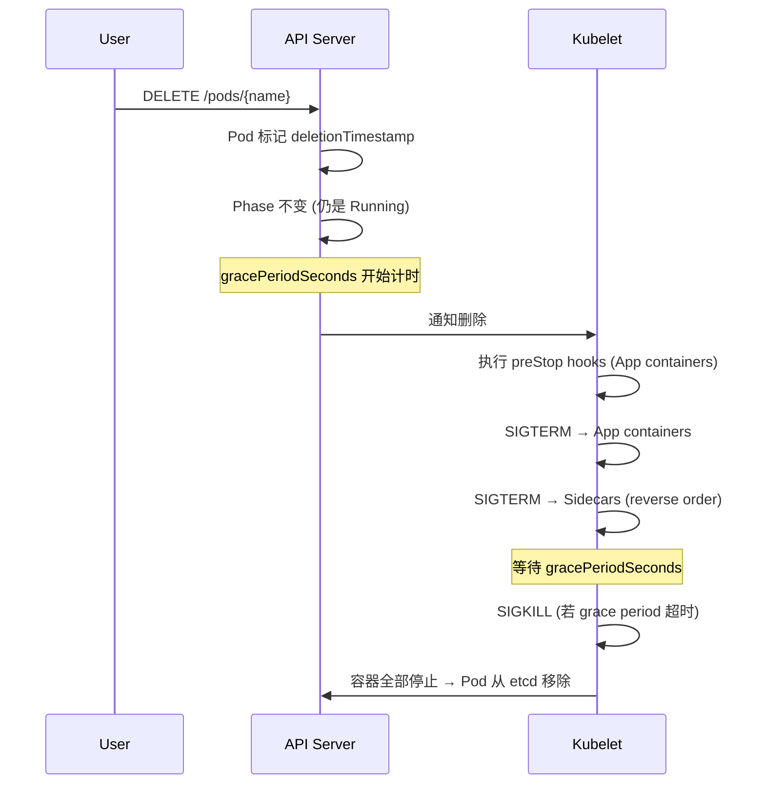

# Kubernetes Pod 生命周期 —— 形式化模型

> **数据源**: `https://raw.githubusercontent.com/kubernetes/kubernetes/master/api/openapi-spec/swagger.json`
> **版本**: v1.30+ (含 Sidecar Container stable / per-container restartPolicy Alpha)

---

## 1. 三层状态体系

K8s Pod 的状态建模是三层嵌套的：**Pod Phase → Pod Conditions → Container States**。

```
Pod.phase            (5 values)     ─ 宏观生命周期阶段
  Pod.conditions[]   (4+ types)     ─ 细粒度就绪条件
    Container.state  (3 values)     ─ 每个容器的状态
```

### 1.1 Pod Phase

$$\mathbb{P}_{\text{pod}} = \{ \text{Pending}, \text{Running}, \text{Succeeded}, \text{Failed}, \text{Unknown} \}$$

| Phase | 含义 | 类 |
|---|---|---|
| `Pending` | 已被 API Server 接受，容器尚未全部创建（调度中/拉镜像/InitContainers） | 瞬态 |
| `Running` | 已绑定到节点，所有容器已创建，至少一个在运行 | 稳态 |
| `Succeeded` | 所有容器 exit(0) 且不会重启 | 终态 |
| `Failed` | 所有容器终止且至少一个失败 | 终态 |
| `Unknown` | 节点失联，无法确定 Pod 状态 | 终态 |

### 1.2 Pod Conditions

每个 condition $c$ = $(\text{type}, \text{status} \in \{\text{True}, \text{False}, \text{Unknown}\}, \text{reason}, \text{message}, \text{lastTransitionTime})$

| Type | True 含义 | False 含义 |
|---|---|---|
| `PodScheduled` | 已调度到节点 | 未调度 / 调度失败 |
| `Initialized` | 所有 InitContainer 已完成 | InitContainer 执行中 |
| `ContainersReady` | 所有容器就绪 | 部分容器未就绪 |
| `Ready` | Pod 可接收流量（可加入 Service endpoint） | 未就绪 |
| `DisruptionTarget` | Pod 将被驱逐 | N/A |

### 1.3 Container States

$$\mathbb{S}_{\text{container}} = \{ \text{Waiting}, \text{Running}, \text{Terminated} \}$$

| State | 含义 | 字段 |
|---|---|---|
| `Waiting` | 未运行（拉镜像/等待依赖） | Reason (ImagePullBackOff, ContainerCreating...) |
| `Running` | 正常执行 | startedAt, postStart hook 已完成 |
| `Terminated` | 已退出 | exitCode, reason (Completed/Error/OOMKilled), finishedAt |

---

## 2. 容器类型

Pod 中可以包含三种语义不同的容器：

| 类型 | 启动顺序 | 生命周期 | restartPolicy |
|---|---|---|---|
| **Init Containers** | 最先，串行执行 | 运行到 completion 即退出 | 服从 Pod restartPolicy |
| **Sidecar Containers** (initContainer + `restartPolicy: Always`) | 在 init containers 之后，app containers 之前 | Pod 整个生命周期 | **独立 `Always`**，忽略 Pod restartPolicy |
| **App Containers** | init/sidecar 之后 | Pod 整个生命周期 | 服从 Pod restartPolicy |

### 2.1 终止顺序

$$\text{Stop order}: \text{App Containers} \to \text{Sidecar Containers (reverse start order)}$$

Sidecar 在所有 App Container 停止**之后**才收到 SIGTERM。这保证了 sidecar（如日志代理、服务网格 proxy）在主业务容器退出前仍然可用。

---

## 3. 状态转移

### 3.1 Pod Phase 转移



### 3.2 Container 状态转移



### 3.3 形式化转移函数

$$\delta_{\text{pod}}: \mathbb{P} \times \Omega \to \mathbb{P}$$

| # | 源 | 触发 | 目标 |
|---|---|---|---|
| P1 | (none) | `POST /api/v1/namespaces/{ns}/pods` | `Pending` |
| P2 | `Pending` | 调度成功 + Init 完成 + 容器创建完成 | `Running` |
| P3 | `Pending` | 调度失败 / 资源不足 | `Failed` |
| P4 | `Pending` | InitContainer 失败 (restartPolicy=Never) | `Failed` |
| P5 | `Running` | 所有容器 exit(0) (restartPolicy=Never/OnFailure) | `Succeeded` |
| P6 | `Running` | 所有容器终止 + 至少一个失败 (restartPolicy=Never) | `Failed` |
| P7 | `Running` | 节点失联 (kubelet 心跳超时) | `Unknown` |
| P8 | `Running` | Pod 删除 (`DELETE /pods/{name}`) | → `Terminating` → 资源回收 |
| P9 | `Running` | 容器退出 + restartPolicy 允许 → 容器层面重启 | `Running` (phase 不变) |

---

## 4. RestartPolicy 三层控制

### 4.1 Pod 级 restartPolicy

| Policy | exit(0) | exit(!0) | OOM |
|---|---|---|---|
| `Always` | 重启 | 重启 | 重启 |
| `OnFailure` | 不重启 | 重启 | 重启 |
| `Never` | 不重启 | 不重启 | 不重启 |

### 4.2 重启退避 (Exponential Backoff)

$$\text{delay}(n) = \min(10s \times 2^{n-1}, 300s)$$

退避计数器在 10 分钟健康运行后重置。

### 4.3 K8s 1.34+: Per-Container restartPolicyRules (Alpha)

```yaml
restartPolicyRules:
- action: Restart
  exitCodes: { operator: In, values: [1, 2] }
- action: DoNotRestart
  exitCodes: { operator: In, values: [125] }
```

| Action | 效果 |
|---|---|
| `Restart` | 容器级重启 |
| `DoNotRestart` | 不重启，Pod 继续运行 |
| `RestartAllContainers` | 重启整个 Pod (KEP-5532, Alpha) |

---

## 5. Probes (健康检查)

三种探针，都是 kubelet 周期性执行的诊断动作：

$$\text{Probe} = (\text{type}, \text{handler}, \text{periodSeconds}, \text{timeoutSeconds}, \text{failureThreshold}, \text{successThreshold})$$

| Probe | 作用 | 失败后果 |
|---|---|---|
| `livenessProbe` | 容器是否存活 | 失败 → 重启容器 |
| `readinessProbe` | 容器是否可接收流量 | 失败 → 从 Service endpoint 移除 |
| `startupProbe` | 容器是否已完成启动 | 失败 → 重启容器（启动期间 liveness/readiness 被禁用） |

### Handler 类型

| Type | 示例 |
|---|---|
| `exec` | 在容器内执行命令，exit(0)=成功 |
| `httpGet` | HTTP GET，2xx/3xx=成功 |
| `tcpSocket` | TCP connect 成功=成功 |
| `gRPC` | gRPC health check (v1.24+) |

---

## 6. 形式化规约 (关键不变量)

### 6.1 Phase 不变量

$$\text{phase} = \text{Succeeded} \implies \forall c \in \text{containers}: \text{state}(c) = \text{Terminated} \land \text{exitCode}(c) = 0$$

$$\text{phase} = \text{Failed} \implies \forall c \in \text{containers}: \text{state}(c) = \text{Terminated} \land \exists c: \text{exitCode}(c) \neq 0$$

$$\text{phase} = \text{Running} \implies \text{PodScheduled} = \text{True}$$

### 6.2 Container 蕴含关系

$$\text{phase} = \text{Running} \iff \exists c: \text{state}(c) = \text{Running}$$

$$\forall c \in \text{sidecars}: \text{phase} = \text{Running} \implies \text{state}(c) \in \{\text{Running}, \text{Waiting}\}$$

### 6.3 Ready 条件

$$\text{Ready} = \text{True} \iff \text{PodScheduled} = \text{True} \land \text{Initialized} = \text{True} \land \text{ContainersReady} = \text{True}$$

### 6.4 终止顺序

$$\text{stop}(c_i) < \text{stop}(c_j) \iff c_i \in \text{AppContainers} \land c_j \in \text{Sidecars}$$

---

## 7. Pod 删除流程 (Terminating)



---

## 8. K8s Pod × ECI × GitHub Actions 对比

| 维度 | K8s Pod | ECI ContainerGroup | GitHub Actions WorkflowRun |
|---|---|---|---|
| Phase/Status 数 | 5 | 11 | 6 |
| 子资源 | Container (3 states) | Container (3 states) | Job (3 states) → Step |
| 容器类型 | Init / Sidecar / App | Init / Container | N/A (steps only) |
| 健康检查 | liveness/readiness/startup | (ECI 无内置探针) | N/A |
| 重启策略 | Always/OnFailure/Never + per-container rules | Always/OnFailure/Never | N/A (rerun 手动) |
| 终止 | gracePeriodSeconds → SIGTERM → SIGKILL | Force=true/false + TerminationGracePeriodSeconds | Cancel 立即，Delete 立即 |
| 终态可逆 | 否 | 否 | 是 (Rerun) |

---

## 9. 项目参考价值

| K8s 概念 | 你的项目映射 |
|---|---|
| **Pod Phase × Conditions 双层状态** | SandboxStatus + PodStatus conditions → 把 status 拆成宏观 phase + 细粒度 condition 列表 |
| **Sidecar Container 生命周期** | 日志/代理 sidecar 在 app 退出后继续运行——你的 health-check GC 路径需要区分 |
| **InitContainer 串行依赖** | `features/template/` DAG 解析——apply 时按拓扑序创建 init containers |
| **preStop hook + gracePeriod** | DeleteContainerGroup 的 Force=false 优雅删除 |
| **ReadinessProbe (失败不移除容器，只摘流量)** | 不同于 liveness——你的 health check 可以区分"不健康→重启"和"不健康→摘流量" |
| **Exponential Backoff (10s→300s)** | 重启退避——你的 RestartContainerGroup 可以抄这个限速 |
| **per-container restartPolicyRules** | 每个容器的重启策略独立——不用全局一个 RestartPolicy |
