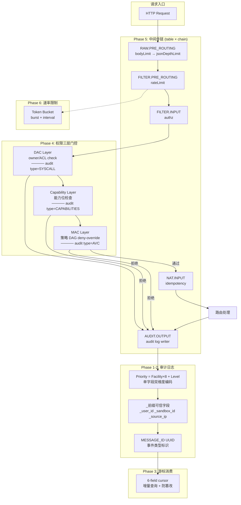

# 权限 × 日志 × 审计 —— 抽象模型与重构计划

> **抄袭来源**: RHEL 9.8 权限体系 + dmesg/journald 日志系统
> **目标**: Cloudflare Workers 日志 (现阶段开发模式: local/hybrid)
> **原则**: 每个变更都独立可测试，不引入破坏性 API 变更

---

## 0. 抽象模型

### 0.1 三层门控 + 分层审计 (抄 Linux)

```
请求 → Layer 1: DAC    (UID/GID + rwx/ACL)  ──拒绝──→ audit type=SYSCALL
     → Layer 2: Cap     (能力位检查)         ──拒绝──→ audit type=CAPABILITIES
     → Layer 3: MAC     (强制访问策略 DAG)    ──拒绝──→ audit type=AVC
     → 通过 → 执行
```

**当前项目**: 只有一层 `permissionChecker` 的二元 `allowed/denied`，不区分拒绝来源。
**改后**: 三层各自独立判定，各有自己的 audit `type` 字段。

### 0.2 Facility × Severity 编码 (抄 dmesg)

```
Priority = Facility × 8 + Severity

facility:  sandbox=1, image=2, auth=3, perm=4, network=5, volume=6, ...
severity:  EMERG=0, ALERT=1, CRIT=2, ERR=3, WARNING=4, NOTICE=5, INFO=6, DEBUG=7
```

**当前项目**: `facility` 是字符串 (`'http'`、`'perm'`)，`level` 是独立字段。
**改后**: 新增 `priority` 数字字段 = facility × 8 + level。单字段即可完成双维度过滤。

### 0.3 可信/不可信字段分离 (抄 journald)

```
_开头 = 可信字段 (系统注入，不可被业务代码伪造)
  _sandbox_id, _user_id, _source_ip, _request_id, _boot_id

大写开头 = 不可信字段 (业务代码可写入)
  MESSAGE, SYSLOG_IDENTIFIER, PRIORITY

自定义 = 应用层字段
  CODE_FILE, ERRNO, RESULT, DURATION_MS
```

**当前项目**: `LogEntry` 所有字段平铺，无信任级别区分。
**改后**: `AuditEntry` 和 `LogEntry` 增加字段命名约定。系统注入的字段用 `_` 前缀。

### 0.4 游标索引 (抄 journald)

```
Cursor = (machine_hash, seqnum, boot_id, mono_us, real_us, xor_hash)
```

**当前项目**: `LogQuery` 有 `cursor?` 占位符但未实现。
**改后**: `HybridAuditLogger.query()` 返回真实游标，`queryAsync()` 支持 `afterCursor` 增量消费。

### 0.5 中间件链拓扑排序 (抄 iptables)

```
表 (功能分组) × 链 (请求钩子) = 规则路由矩阵

raw.PREROUTING → mangle.INPUT → filter.INPUT → nat.POSTROUTING
```

**当前项目**: Hono `app.use()` 隐式顺序，无显式链定义。
**改后**: 5 个中间件按优先级编号，支持可插拔的中间件注册表。

---

## 1. 重构分 6 个阶段

```
阶段 1: Audit 编码重构 (facility 数字化, priority 编码)
阶段 2: 日志字段可信分离 (_前缀约定)
阶段 3: 游标实现 (cursor 增量消费)
阶段 4: 权限三层门控 (DAC → Cap → MAC)
阶段 5: 中间件链显式化 (table × chain 注册)
阶段 6: MESSAGE_ID + 速率限制双参数
```

---

## 2. 阶段 1: Audit Facility 数字化 + Priority 编码

### 2.1 改动文件

| 文件 | 改什么 |
|---|---|
| `core/audit/kern-level.ts` | 新增 `AuditFacility` const enum (数字 0-23) |
| `core/audit/types.ts` | `AuditEntry` 新增 `priority: number` 字段 |
| `core/audit/local-audit-logger.ts` | `write()` 计算 priority = facility × 8 + level |
| `core/audit/hybrid-logger.ts` | 同上 + `query()` 支持 `priorityMin/Max` 过滤 |
| `core/audit/kv-audit-logger.ts` | 同上 |
| `core/logger/types.ts` | `LogQuery` 新增 `priorityMin?` / `priorityMax?` |

### 2.2 新定义

```typescript
// core/audit/kern-level.ts
export const enum AuditFacility {
  KERN = 0,    // 内核/系统
  SANDBOX = 1, // 沙箱操作
  IMAGE = 2,   // 镜像管理
  AUTH = 3,    // 认证
  PERM = 4,    // 权限检查
  NETWORK = 5, // 网络操作
  VOLUME = 6,  // 存储卷
  HTTP = 7,    // HTTP 请求
  PROVIDER = 8,// Provider 调用
  // 16-23 留给自定义
}

// Priority = Facility × 8 + Level
export function encodePriority(facility: AuditFacility, level: KernLevel): number {
  return (facility << 3) | level;
}
export function decodePriority(p: number): { facility: AuditFacility; level: KernLevel } {
  return { facility: p >> 3, level: p & 0x7 };
}
```

### 2.3 兼容性

`KernLevel` 枚举值不变 (0-7)。现有 `facility: string` 字段保留，新增 `priority?: number`。旧代码可以不填 priority，日志后端自动从 `facility` 字符串映射。

### 2.4 测试

- `encodePriority(AuditFacility.AUTH, KernLevel.ERR)` → `3×8+3 = 27`
- `decodePriority(27)` → `{ facility: 3, level: 3 }`
- 查询 `priorityMin=16, priorityMax=31` → 仅返回 AUTH facility 的所有级别

---

## 3. 阶段 2: 日志字段可信分离

### 3.1 改动文件

| 文件 | 改什么 |
|---|---|
| `core/audit/types.ts` | `StoredAuditEntry` 新增 `_fields: Record<string, unknown>` (可信字段) |
| `core/audit/hybrid-logger.ts` | `write()` 自动填充 `_sandbox_id`, `_user_id`, `_source_ip`, `_request_id` |
| `core/logger/console-logger.ts` | 序列化时区分 `_` 前缀字段 |
| `core/middleware/auth.ts` | 在 `c.var` 中设置 `_user_id`, `_source_ip` |

### 3.2 新约定

```typescript
// 可信字段 (系统注入)
interface TrustedFields {
  _sandbox_id?: SandboxId;
  _user_id?: string;
  _source_ip?: string;
  _request_id?: string;
  _boot_id?: string;       // Worker 实例 ID
}

// 不可信字段 (业务代码传入)
// MESSAGE, PRIORITY, SYSLOG_IDENTIFIER - 大写开头，业务代码可写入

// AuditEntry 扩展
interface AuditEntry {
  // 原有字段
  facility: string;
  level: KernLevel;
  message: string;
  actorId?: string;
  metadata?: Record<string, unknown>;
  
  // 新增
  priority?: number;              // facility × 8 + level
  trusted: TrustedFields;         // _前缀，自动注入
}
```

### 3.3 注入时机

在 `app.ts` 中，每个请求创建 `AuditEntry` 时：

```typescript
const entry: AuditEntry = {
  facility: 'http',
  level: KernLevel.INFO,
  message: 'GET /api/sandbox',
  trusted: {
    _user_id: c.var.currentUser?.id,
    _source_ip: c.req.header('cf-connecting-ip') || 'unknown',
    _request_id: c.var.requestId,
    _boot_id: WORKER_INSTANCE_ID,
  }
};
```

---

## 4. 阶段 3: 游标实现

### 4.1 改动文件

| 文件 | 改什么 |
|---|---|
| `core/logger/types.ts` | `LogCursor` 类型: `{ s, i, b, m, t, x }` |
| `core/audit/hybrid-logger.ts` | `queryAsync()` 生成真实游标；`afterCursor` 增量查询 |
| `core/audit/local-audit-logger.ts` | `query()` 返回游标 |

### 4.2 游标结构

```typescript
interface LogCursor {
  s: string;  // machine hash (Worker instance ID 的前 16 字符)
  i: number;  // sequence number (单调递增)
  b: string;  // boot ID (Worker 启动 UUID)
  m: number;  // monotonic timestamp (performance.now() 微秒)
  t: number;  // real timestamp (Date.now() 毫秒)
  x: string;  // xor hash of above 5 fields (防篡改)
}
```

### 4.3 增量消费

```typescript
// 首次查询
const r1 = await audit.query({ limit: 100 });
// → { entries: [...], nextCursor: "s=abc;i=99;b=...;m=...;t=...;x=..." }

// 后续查询: 从上次游标之后继续
const r2 = await audit.query({ afterCursor: r1.nextCursor, limit: 100 });
// → 只返回 cursor 之后的条目
```

---

## 5. 阶段 4: 权限三层门控

### 5.1 抽象

当前 `PermissionChecker.check()` 返回 `{ allowed, reason }`。改为三层：

```typescript
enum DenialLayer {
  DAC = 'dac',           // 资源所有权/ACL 拒绝
  CAPABILITY = 'cap',    // 能力位不足
  MAC = 'mac',           // 强制策略 DAG 拒绝
}

interface PermissionResult {
  allowed: boolean;
  reason: string;
  layer?: DenialLayer;   // 新增: 哪一层拒绝的
  auditType?: string;    // 新增: 对应 audit type
}
```

### 5.2 三层判定逻辑

```typescript
// Layer 1: DAC — 资源所有权
function checkDac(actor: User, resource: Resource): PermissionResult {
  if (actor.id === resource.ownerId) return { allowed: true, reason: 'owner' };
  if (resource.acl?.includes(actor.id)) return { allowed: true, reason: 'acl_entry' };
  return { allowed: false, reason: 'not owner, not in ACL', layer: DenialLayer.DAC, auditType: 'SYSCALL' };
}

// Layer 2: Capability — 能力位
function checkCap(actor: User, action: string): PermissionResult {
  const required = actionToCap(action);  // 'sandbox:delete' → CAP_SANDBOX_DELETE
  if (actor.capabilities.has(required)) return { allowed: true, reason: 'cap_present' };
  return { allowed: false, reason: `missing cap: ${required}`, layer: DenialLayer.CAPABILITY, auditType: 'CAPABILITIES' };
}

// Layer 3: MAC — 强制策略 DAG (deny-override, 当前已有)
function checkMac(actor: User, action: string, resource: Resource): PermissionResult {
  return permissionDag.evaluate({ actor, action, resource });
}

// 组合
function checkAll(actor, action, resource): PermissionResult {
  const dac = checkDac(actor, resource);
  if (!dac.allowed) { audit.write({ type: dac.auditType, ... }); return dac; }
  
  const cap = checkCap(actor, action);
  if (!cap.allowed) { audit.write({ type: cap.auditType, ... }); return cap; }
  
  const mac = checkMac(actor, action, resource);
  if (!mac.allowed) { audit.write({ type: 'AVC', ... }); return mac; }
  
  return { allowed: true, reason: 'all_layers_passed' };
}
```

### 5.3 改动文件

| 文件 | 改什么 |
|---|---|
| `core/permission/types.ts` | `PermissionResult` 新增 `layer?` 和 `auditType?` |
| `features/permission/perm-checker.ts` | 拆分为 `checkDac` + `checkCap` + `checkMac` |
| `features/permission/audit.ts` | 按 `auditType` 写入不同 audit 条目 |

---

## 6. 阶段 5: 中间件链显式化

### 6.1 抽象

抄 iptables 的 `table × chain` 模型：

```typescript
// 表 (功能分组)
enum MiddlewareTable {
  RAW = 'raw',       // 预处理 (body-limit, json-depth)
  FILTER = 'filter', // 安全过滤 (rate-limit, authz)
  AUDIT = 'audit',   // 审计记录
  NAT = 'nat',       // 请求改写 (idempotency cache)
}

// 链 (请求阶段)
enum MiddlewareChain {
  PRE_ROUTING = 'pre_routing',     // body 解析前
  INPUT = 'input',                 // 权限检查
  HANDLER = 'handler',             // 路由处理
  OUTPUT = 'output',               // 响应后
}

// 中间件注册
interface MiddlewareRegistration {
  name: string;
  table: MiddlewareTable;
  chain: MiddlewareChain;
  priority: number;  // 同表同链内的顺序
  handler: MiddlewareHandler;
}
```

### 6.2 当前映射

| 当前中间件 | Table | Chain | Priority |
|---|---|---|---|
| `bodyLimit` | RAW | PRE_ROUTING | 10 |
| `jsonDepthLimit` | RAW | PRE_ROUTING | 20 |
| `rateLimit` | FILTER | PRE_ROUTING | 10 |
| `authz` | FILTER | INPUT | 10 |
| `idempotency` | NAT | INPUT | 20 |
| (新增 audit log) | AUDIT | OUTPUT | 10 |

### 6.3 改动文件

| 文件 | 改什么 |
|---|---|
| `core/middleware/registry.ts` (新) | `MiddlewareRegistry` 类 + `table × chain` 拓扑排序 |
| `app.ts` | 用 registry 替换手动 `app.use()` 链 |

---

## 7. 阶段 6: MESSAGE_ID + 速率限制双参数

### 7.1 MESSAGE_ID

每个审计事件类型分配一个 UUID:

```typescript
const MESSAGE_IDS = {
  SANDBOX_CREATED: 'a1b2c3d4-...',
  SANDBOX_DELETED: 'e5f6a7b8-...',
  PERM_DAC_DENIED: 'c001d001-...',
  PERM_CAP_DENIED: 'c002d002-...',
  PERM_MAC_DENIED: 'c003d003-...',
  HEALTH_CHECK_FAILED: 'f001e001-...',
} as const;
```

### 7.2 速率限制双参数

当前 `rate-limit.ts`: `windowMs + maxRequests`。改为 `burst + interval`:

```typescript
interface RateLimitConfig {
  burst: number;        // 突发允许的请求数 (ex: 10)
  intervalMs: number;    // 限速窗口 (ex: 5000)
  // 等价于: 每 intervalMs 最多 burst 个请求
  // 算法: token bucket，初始 token = burst，每 intervalMs/burst 补充 1 个 token
}
```

### 7.3 改动文件

| 文件 | 改什么 |
|---|---|
| `core/audit/types.ts` | `AuditEntry` 新增 `messageId?: string` |
| `core/middleware/rate-limit.ts` | 新增 `burst + interval` token bucket 实现 |
| `features/sandbox/sandbox.service.ts` | provision/terminate 时写入 MESSAGE_ID |

---

## 8. 激进改动 (Phase 0, 0a, 0b)

### Phase 0: 合并 audit + logger (删 core/logger/ 业务层)

`core/audit/` (8 文件) 和 `core/logger/` (8+ 文件) 功能重叠。合并为一套:

- 删 `core/logger/types.ts`, `core/logger/interfaces.ts`, `core/logger/formatter.ts`
- 删 `core/logger/console-logger.ts`, `core/logger/log-policy.ts`
- 删 `core/logger/tail-coordinator/`, `core/logger/storage-adapters/`
- `core/audit/` 吸收 logger 的所有功能
- 保留存储适配器，移到 `core/audit/storage/`

### Phase 0a: 删 LogLevel 字符串枚举

全系统统一用 `KernLevel` (const enum, 0-7)。删 `core/types.ts` 中的 `LogLevel`。

### Phase 0b: Capability 位域

`PermissionAction` 从 5 个字符串 → 数字位域。权限检查 = 位运算。
合入 Phase 4 一起做。

## 9. 执行顺序

```
Phase 0a (0.5h): 删 LogLevel, 统一 KernLevel           → 3 个文件
Phase 0  (2-3h): 合并 audit + logger                    → 12 个文件 (删 8, 改 4)
Phase 1  (1-2h): facility 数字化 + priority 编码         → 4 个文件
Phase 2  (1-2h): 可信字段 _前缀约定                      → 3 个文件
Phase 3  (2-3h): 游标实现                               → 2 个文件
Phase 4  (3-4h): 权限三层门控 + Capability 位域            → 4 个文件
Phase 5  (1-2h): 中间件注册表                            → 1 个新文件 + app.ts
Phase 6  (1-2h): MESSAGE_ID + rate-limit 双参数          → 3 个文件
```

总计约 12-18 小时，~30 个文件变更。每个阶段产出独立可测。

---

## 9. 最终架构图



---

## 10. 开始动手

以上 6 个阶段已拆好，不破坏现有 API。要开始从哪个阶段动手？
