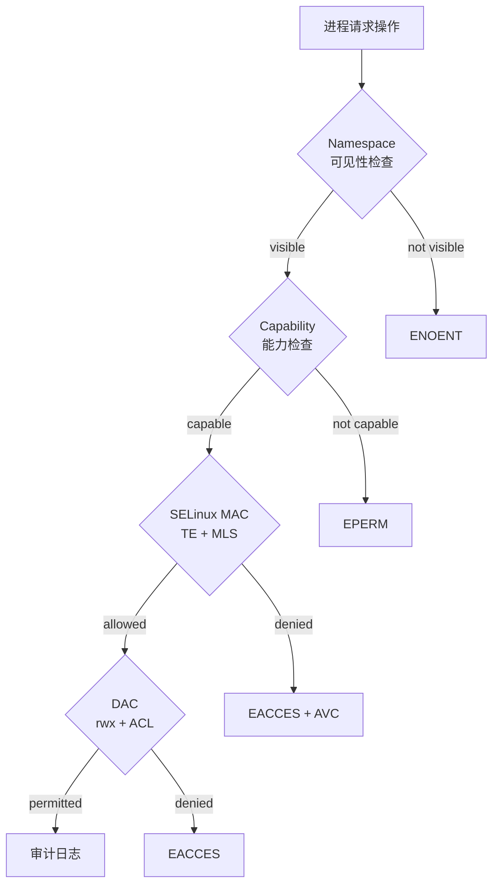
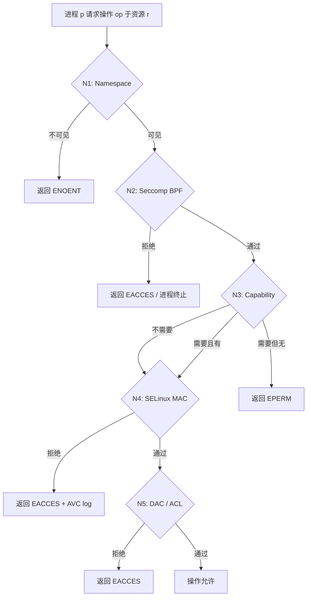

# RHEL 9.8 形式化权限模型

> **环境**: RHEL 9.8 (Plow), kernel 5.14+, WSL
> **范围**: DAC → Capabilities → ACL → SELinux → sudo → Namespaces 六层模型

---

## 0. 整体架构: 六层安全检查栈



每层独立拒绝，仅当四层全部通过，操作才被允许。

---

## 1. DAC 层: 用户/组/文件权限

### 1.1 实体定义

$$\mathbb{U} = \{ u \mid u = (\text{uid}, \text{username}, \text{password\_hash}, \text{home}, \text{shell}) \}$$

$$\mathbb{G} = \{ g \mid g = (\text{gid}, \text{groupname}, \text{members} \subseteq \mathbb{U}) \}$$

$$\mathbb{F} = \{ f \mid f = (\text{owner} \in \mathbb{U}, \text{group} \in \mathbb{G}, \text{mode} \in \{0\ldots 7777\}, \text{acl}) \}$$

### 1.2 文件权限 (12 bits)

$$\text{mode} = \underbrace{\text{suid}\ \text{sgid}\ \text{sticky}}_{3\text{ special bits}}\ \underbrace{\text{rwx}}_{3\text{ owner}}\ \underbrace{\text{rwx}}_{3\text{ group}}\ \underbrace{\text{rwx}}_{3\text{ other}}$$

| 位 | 八进制 | 语义 |
|---|---|---|
| setuid | `4000` | execve 时 $\text{euid} \gets \text{file.owner}$ |
| setgid | `2000` | execve 时 $\text{egid} \gets \text{file.group}$ |
| sticky | `1000` | 目录: 仅 owner 或 root 可删除/重命名其中文件 |
| r | 4 | read |
| w | 2 | write |
| x | 1 | execute (文件) / traverse (目录) |

### 1.3 DAC 权限检查算法

给定进程 $p$ 和文件 $f$，要执行操作 $\text{op} \in \{ \text{read}, \text{write}, \text{execute} \}$：

$$
\text{DAC}(p, f, \text{op}) = \begin{cases}
\text{allowed} & \text{if } \text{euid}(p) = 0 \text{ (root bypass for read/write)} \\[4pt]
               & \quad \land \text{op} = \text{execute} \implies \text{has\_x\_anywhere}(f) \\[8pt]
\text{allowed} & \text{if } \text{euid}(p) = \text{owner}(f) \land \text{check\_bits}(\text{owner\_bits}(f), \text{op}) \\[4pt]
\text{allowed} & \text{if } \text{egid}(p) = \text{group}(f) \lor \text{egid}(p) \in \text{supp\_groups}(p) \\[4pt]
               & \quad \land \text{check\_bits}(\text{group\_bits}(f), \text{op}) \\[4pt]
\text{allowed} & \text{if } \text{check\_bits}(\text{other\_bits}(f), \text{op}) \\[4pt]
\text{denied}  & \text{otherwise}
\end{cases}
$$

### 1.4 进程凭证 (7 元组)

每个进程 $p$ 具有:

$$\text{creds}(p) = (\text{uid}, \text{gid}, \text{euid}, \text{egid}, \text{suid}, \text{sgid}, \text{fsuid})$$

| 字段 | 含义 | 用途 |
|---|---|---|
| `uid` | 实际 UID | 标识"谁启动的" |
| `gid` | 实际 GID | |
| `euid` | 有效 UID | **用于 DAC 权限检查** |
| `egid` | 有效 GID | |
| `suid` | 保存的 set-user-ID | setuid 时保存旧 euid，可恢复 |
| `sgid` | 保存的 set-group-ID | |
| `fsuid` | 文件系统 UID | Linux 特有，NFS 使用 |

辅助组列表:

$$\text{supp\_groups}(p) \subseteq \mathbb{G}, \quad \text{上限 65536 (NGROUPS\_MAX)}$$

---

## 2. POSIX ACL 扩展

ACL 在传统 `rwx` 9 bits 之外增加细粒度的 named user/named group 条目。

### 2.1 ACL 条目类型

$$\text{ACL} = \langle \text{owner}, \text{named\_users}^*, \text{group}, \text{named\_groups}^*, \text{mask}, \text{other} \rangle$$

| 条目 | 格式 | 语义 |
|---|---|---|
| `user::` | `user::rwx` | 文件 owner |
| `user:name:` | `user:alice:r--` | 命名用户 (额外授权) |
| `group::` | `group::r-x` | 文件 owning group |
| `group:name:` | `group:dev:rw-` | 命名组 (额外授权) |
| `mask::` | `mask::rwx` | 所有 named/group 条目的权限上限 |
| `other::` | `other::---` | 其他用户 |

### 2.2 ACL 权限检查 (扩展 DAC)

$$
\text{ACL\_DAC}(p, f, \text{op}) = \begin{cases}
\text{allowed} & \text{if } \text{euid}(p) = \text{owner}(f) \land \text{check}(\text{user::entry}, \text{op}) \\
\text{allowed} & \text{if } \exists e \in \text{named\_users}: \text{user}(e) = \text{euid}(p) \land \text{check}(e \cap \text{mask}, \text{op}) \\
\text{allowed} & \text{if } \text{any\_group\_match}(p, f) \land \text{check}(\text{effective\_group\_perm}, \text{op}) \\
\text{allowed} & \text{if } \text{check}(\text{other::entry}, \text{op}) \\
\text{denied}  & \text{otherwise}
\end{cases}
$$

其中 $\text{effective\_group\_perm}$ = $\max(\text{group::entry}, \text{named\_group\_entries}) \cap \text{mask}$。

### 2.3 Default ACL (目录继承)

目录 $d$ 可设置 Default ACL，所有在 $d$ 下创建的子文件/子目录自动继承:

$$\forall f \in \text{children}(d): \text{ACL}(f) \gets \text{DefaultACL}(d)$$

---

## 3. Capabilities (能力分解)

将传统 root 的全部权限拆分为独立的 capability bits。Thread 级别。

### 3.1 五个能力集合

$$\mathbb{C} = \{ \text{CAP\_KILL}, \text{CAP\_DAC\_OVERRIDE}, \dots, \text{CAP\_SYS\_ADMIN}, \dots \} \quad (40+ \text{ 个})$$

| 集合 | 符号 | 含义 |
|---|---|---|
| Permitted | $P$ | 允许使用的能力（上限） |
| Inheritable | $I$ | execve 时可带入新进程 |
| Effective | $E$ | 当前生效的能力 |
| Bounding | $B$ | 绝对上限（无法突破，只能缩减） |
| Ambient | $A$ | 跨 execve 保持（非 setuid 程序） |

### 3.2 execve 时能力转移规则

当进程 $p$ 执行程序 $f$ 时:

**若 $f$ 为 setuid/setgid (privileged exec)：**

$$P' = B \cap P$$
$$E' = \varnothing \quad (\text{需要新程序显式启用})$$
$$I' = \varnothing$$
$$B' = B$$

**若 $f$ 为非特权 (ordinary exec)：**

$$P' = (I \cap P) \cup (A \cap P)$$
$$E' = P' \quad (\text{若设置了 SECBIT\_NO\_SETUID\_FIXUP})$$
$$I' = I$$
$$A' = A$$
$$B' = B$$

### 3.3 关键 Capabilities

| Capability | 语义 |
|---|---|
| `CAP_DAC_OVERRIDE` (1) | 绕过 DAC rwx 检查 |
| `CAP_DAC_READ_SEARCH` (2) | 绕过读/搜索检查 |
| `CAP_FOWNER` (3) | 绕过 owner 匹配 |
| `CAP_KILL` (5) | kill 任意进程 |
| `CAP_SETUID` (7) | 设置任意 UID |
| `CAP_SETGID` (6) | 设置任意 GID |
| `CAP_SYS_ADMIN` (21) | 近似传统 root 的大部分权限 |
| `CAP_SYS_CHROOT` (18) | chroot |
| `CAP_NET_RAW` (13) | raw sockets |
| `CAP_SYS_PTRACE` (19) | ptrace 任意进程 |

### 3.4 权限检查

$$\text{capable}(p, \text{cap}) \triangleq \text{cap} \in E(p) \lor (\text{cap} \in P(p) \land \text{特权进程可自动激活})$$

root 用户 ($\text{euid} = 0$)：$E \supseteq P$ 自动全部生效；非 root 用户需显式 `cap_set_proc()`。

---

## 4. SELinux: 强制访问控制 (MAC)

> WSL 中 SELinux disabled。本节基于 RHEL 9.8 标准配置建模。

### 4.1 安全上下文 (4 元组)

每个进程/文件/端口等资源具有上下文:

$$\text{context} = (\text{user}, \text{role}, \text{type}, \text{level})$$

| 字段 | 示例 | 含义 |
|---|---|---|
| `user` | `system_u`, `unconfined_u` | SELinux 用户 |
| `role` | `object_r`, `system_r` | 角色 |
| `type` | `admin_home_t`, `httpd_t` | **类型 (Type Enforcement 的核心)** |
| `level` | `s0`, `s0:c0.c1023` | 敏感度:类别 (MLS/MCS) |

### 4.2 Type Enforcement (TE)

核心模型: 所有的访问控制都基于 `type`。

$$\text{allow } \langle \text{source\_type} \rangle \ \langle \text{target\_type} \rangle : \langle \text{class} \rangle \ \{ \langle \text{permissions} \rangle \};$$

**示例规则**:

```
allow httpd_t httpd_config_t:file { read getattr open };
allow httpd_t httpd_cache_t:dir { read write add_name remove_name search };
allow httpd_t httpd_port_t:tcp_socket name_bind;
```

### 4.3 访问检查流程

给定进程 $p$ (type $s$) 对资源 $r$ (type $t$, class $c$) 请求操作 $\text{perm}$:

$$\text{SELinux}(s, t, c, \text{perm}) = \begin{cases}
\text{allowed} & \text{if } \exists \text{ rule: allow } s \ t : c \ \{ \text{perm} \} \\
               & \quad \land \text{MLS}(p, r) = \text{allowed} \\
\text{denied}   & \text{otherwise} \quad (\text{generates AVC denial log})
\end{cases}$$

### 4.4 MLS/MCS (多级安全)

每个上下文有敏感度级别。进程 $p$ 只能读取同级或更低级别的资源 ($\text{level}(p) \geq \text{level}(r)$)，只能写入同级或更高级别的资源 ($\text{level}(p) \leq \text{level}(r)$)。

$$\text{MLS\_read}(p, r) \triangleq \text{level}(p) \geq \text{level}(r)$$
$$\text{MLS\_write}(p, r) \triangleq \text{level}(p) \leq \text{level}(r)$$

### 4.5 SELinux 用户 → Linux 用户映射

$$\text{SELinuxUser} \to \text{Roles} \to \text{Types}$$

每个 SELinux user 有可进入的 role 集合；每个 role 有可进入的 type 集合：

```
semanage user -l    # 查看 SELinux user → role 映射
semanage login -l   # 查看 Linux user → SELinux user 映射
```

---

## 5. sudo/sudoers: 受控提权

### 5.1 规则语法

$$\text{rule} = \langle \text{who}, \text{where}, \text{as\_whom}, \text{what} \rangle$$

| 字段 | 值域 | 说明 |
|---|---|---|
| `who` | `user` / `%group` / `#uid` / `User_Alias` | 谁可以 sudo |
| `where` | `ALL` / `hostname` / `ip` / `Host_Alias` | 从哪里 |
| `as_whom` | `ALL` / `root` / `username` / `#uid` / `Runas_Alias` | 以谁的身份 |
| `what` | `ALL` / `CMD_LIST` / `Cmnd_Alias` | 可执行什么命令 |

### 5.2 RHEL 9.8 默认规则

```
root    ALL=(ALL) ALL        # root 可在任何地方以任何身份执行任何命令
%wheel  ALL=(ALL) ALL        # wheel 组成员同上
```

### 5.3 sudoers 权限检查

$$\text{sudo}(p, \text{cmd}, \text{as\_user}) = \begin{cases}
\text{allowed} & \text{if } \exists \text{rule: match}(\text{who}(p), \text{where}(p)) \\
               & \quad \land \text{match}(\text{as\_whom}, \text{as\_user}) \\
               & \quad \land \text{match}(\text{what}, \text{cmd}) \\
\text{denied}   & \text{otherwise}
\end{cases}$$

### 5.4 Defaults 安全设置

| Default | 含义 |
|---|---|
| `!visiblepw` | 不通过环境变量传递密码 |
| `always_set_home` | sudo 后 HOME 指向目标用户 home |
| `env_reset` | 重置所有环境变量 |
| `env_keep` | 白名单保留的环境变量 |
| `secure_path` | 覆盖 PATH 为安全路径 |

---

## 6. Namespaces: 权限隔离容器

### 6.1 七种 Namespace

$$\mathbb{N} = \{ \text{mnt}, \text{uts}, \text{ipc}, \text{pid}, \text{net}, \text{user}, \text{cgroup} \}$$

### 6.2 User Namespace 的 UID 映射

$$\text{uid\_map} = [( \text{uid\_inside}, \text{uid\_outside}, \text{length} ), \dots]$$

**关键性质:**
- namespace 内部的 `root` (uid=0) 在外部可以是普通用户
- 进程在外部 namespace 的 capability 受 bounding set 限制
- 子 namespace 的进程在父 namespace 中没有任何特权

### 6.3 跨 Namespace 权限检查

给定进程 $p$ 在 namespace $N_p$ 中访问资源 $r$ 在 namespace $N_r$ 中：

$$\text{NS\_visible}(p, r) \triangleq N_p = N_r \lor r \text{ is shared} \lor p \text{ has CAP\_SYS\_ADMIN in } N_r$$

---

## 7. 综合权限检查流程

完整的 $\text{check\_permission}(p, r, \text{op})$:



---

## 8. 形式化规约 (TLA⁺ 风格)

```tla
---- MODULE RHEL_Permission ----

CONSTANTS
  Users, Groups, Files, Processes
  CapabilitySet, SecurityClass

VARIABLES
  \* 进程凭证
  uid, gid, euid, egid, suid, sgid, fsuid    \* [Processes -> UID/GID]
  supp_groups                                  \* [Processes -> SUBSET Groups]
  cap_permitted, cap_effective, cap_inheritable \* [Processes -> SUBSET CapabilitySet]
  cap_bounding, cap_ambient                    \* [Processes -> SUBSET CapabilitySet]

  \* 文件属性
  file_owner, file_group                       \* [Files -> UID/GID]
  file_mode                                    \* [Files -> 0..7777]
  file_acl                                     \* [Files -> ACL]
  selinux_context                              \* [Processes ∪ Files -> Context]

----
\* DAC check
DAC_allowed(p, f, op) ≜
  ∨ euid[p] = 0  \* root bypass
  ∨ ∧ euid[p] = file_owner[f]
     ∧ mode_bits_match(owner_bits(file_mode[f]), op)
  ∨ ∧ (egid[p] = file_group[f] ∨ egid[p] ∈ supp_groups[p])
     ∧ mode_bits_match(group_bits(file_mode[f]), op)
  ∨ mode_bits_match(other_bits(file_mode[f]), op)

\* Capability check
CAP_allowed(p, op) ≜
  ∨ op ∉ CAP_PROTECTED_OPS
  ∨ required_cap(op) ∈ cap_effective[p]

\* Full check
Permission_allowed(p, f, op) ≜
  ∧ NS_visible(p, f)
  ∧ CAP_allowed(p, op)
  ∧ SELinux_allowed(p, f, op)
  ∧ DAC_allowed(p, f, op)

----
\* Invariants
\* busy 进程必 online
BusyImpliesOnline ≜
  ∀ r ∈ Runners: busy[r] ⇒ status[r] = "online"

\* 文件 owner 必存在
FileOwnerExists ≜
  ∀ f ∈ Files: file_owner[f] ∈ DOMAIN Users

\* 权限检查是确定性的
Deterministic ≜
  ∀ p, f, op: Permission_allowed(p, f, op) ∈ {TRUE, FALSE}

=============================================================================
```

---

## 9. 项目参考价值

| RHEL 概念 | 项目映射 |
|---|---|
| DAC rwx + ACL | 资源访问控制矩阵 |
| Process credentials (7 UID/GID fields) | 执行上下文（euid 切换 = ak/sk 凭证切换） |
| Capabilities 5 集合 | 细粒度权限分解（拆 root 为多个独立权限） |
| SELinux Type Enforcement | RBAC 类型标记 + DAG 继承 |
| MLS/MCS 级别 | 审计日志 kern-level (0-7) 分级 |
| sudoers rule matching | 路由 ACL (middleware/authz) |
| User Namespace UID 映射 | 沙箱内部/外部身份映射 |
| ACL mask 机制 | 权限上限（MAC 规则覆盖 DAC） |
| Default ACL 继承 | 子资源自动继承权限 |
