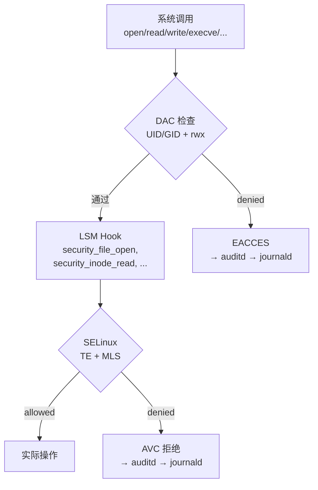
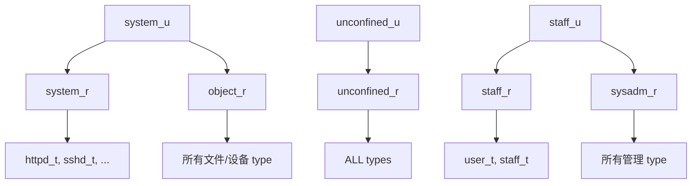
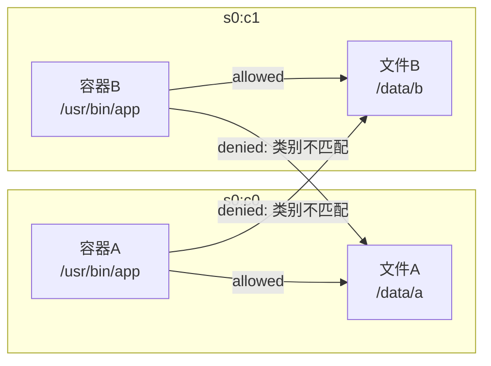
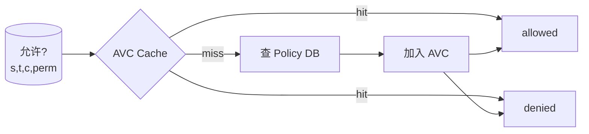
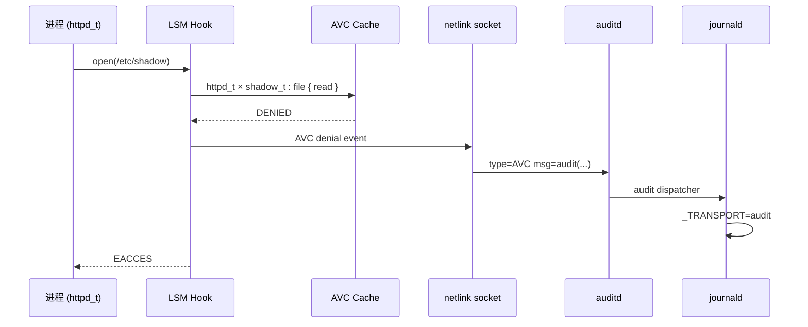

# SELinux 强制访问控制 —— 形式化模型

> **RHEL 9.8 标准配置** (WSL 中 disabled，但策略/policy 结构完整)
> **LSM Hook 位置**: 所有系统调用在 DAC 检查通过后、实际操作执行前

---

## 0. SELinux 在 LSM 栈中的位置



SELinux **不替代 DAC**——它在 DAC 之后、实际操作之前。两层都通过才允许访问。

---

## 1. 安全上下文 (Security Context)

### 1.1 四元组结构

$$\text{Context} = (\text{user}, \text{role}, \text{type}, \text{level})$$

| 字段 | 示例值 | 语义 | 谁控制 |
|---|---|---|---|
| `user` | `system_u`, `unconfined_u`, `staff_u` | SELinux 用户身份 | `semanage login` |
| `role` | `object_r`, `system_r`, `staff_r` | 角色 | `semanage user` |
| `type` | `httpd_t`, `admin_home_t`, `var_log_t` | **类型 —— TE 的核心** | `semanage fcontext` |
| `level` | `s0`, `s0:c0.c1023`, `s0-s15:c0.c1023` | 敏感度:类别 (MLS/MCS) | `semanage fcontext` |

### 1.2 上下文分配规则

| 资源类型 | 上下文存储位置 | 设置方式 |
|---|---|---|
| 进程 | `/proc/PID/attr/current` | 继承父进程 / `runcon` / policy transition |
| 文件 | inode extended attribute (`security.selinux`) | `semanage fcontext` + `restorecon` |
| 网络端口 | policy 编译时固定 | `semanage port` |
| 目录 | inode xattr + Default Context | 同文件 |

---

## 2. Type Enforcement (TE) —— 核心访问控制

### 2.1 TE 规则格式

所有访问控制基于**类型**。规则在 policy 中声明：

```
allow <source_type> <target_type> : <object_class> { <permissions> };
```

### 2.2 形式化

$$\text{TE} \subseteq \mathbb{T}_{\text{source}} \times \mathbb{T}_{\text{target}} \times \mathbb{C} \times \mathbb{P}$$

其中 $\mathbb{T}$ 是所有 type 的集合，$\mathbb{C}$ 是所有 object class，$\mathbb{P}$ 是 per-class 的权限集合。

$$\text{TE\_allowed}(s, t, c, \text{perm}) \triangleq \exists r \in \text{Policy}: \text{source}(r) = s \land \text{target}(r) = t \land \text{class}(r) = c \land \text{perm} \in \text{permissions}(r)$$

### 2.3 核心 Object Classes

| Class | 语义 | 权限示例 |
|---|---|---|
| `file` | 普通文件 | `read`, `write`, `open`, `getattr`, `execute`, `link`, `unlink` |
| `dir` | 目录 | `read`, `write`, `search`, `add_name`, `remove_name` |
| `process` | 进程 | `fork`, `transition`, `sigkill`, `ptrace`, `getsched` |
| `tcp_socket` | TCP socket | `connect`, `name_bind`, `accept`, `listen` |
| `unix_stream_socket` | Unix socket | `connectto`, `acceptfrom` |
| `chr_file` | 字符设备 | `read`, `write`, `open`, `ioctl` |
| `fifo_file` | 命名管道 | `read`, `write`, `open` |
| `capability` | Linux capability | `sys_admin`, `net_raw`, `setuid`, ... |
| `packet_socket` | Packet socket | `create`, `send`, `recv` |

### 2.4 实例

```
allow httpd_t httpd_config_t:file { read getattr open };
allow httpd_t httpd_cache_t:dir { read write add_name remove_name search };
allow httpd_t httpd_port_t:tcp_socket name_bind;
allow syslogd_t kmsg_device_t:chr_file { read write open };
allow syslogd_t var_log_t:dir { read write add_name remove_name search };
allow syslogd_t var_log_t:file { read write open create };
```

**解释**: syslogd (类型 `syslogd_t`) 可以:
- 读取内核日志设备 (`/dev/kmsg`, type `kmsg_device_t`)
- 读写日志目录 (`/var/log/`, type `var_log_t`)
- 创建和写入日志文件 (type `var_log_t`)

---

## 3. Role-Based Access Control (RBAC)

### 3.1 Role 层次

SELinux user 可以承担多个 role；每个 role 可以访问多个 type。



### 3.2 形式化

$$\text{RoleAllowed}(\text{user}, \text{role}) \in \{ \text{T}, \text{F} \}$$
$$\text{TypeAllowed}(\text{role}, \text{type}) \in \{ \text{T}, \text{F} \}$$

进程 $p$ 可以拥有 type $t$ 当且仅当:

$$\exists r \in \text{Roles}: \text{RoleAllowed}(\text{seuser}(p), r) \land \text{TypeAllowed}(r, t)$$

---

## 4. MLS/MCS (多级安全)

### 4.1 Level 格式

$$\text{Level} = (\text{sensitivity}, \text{categories})$$

| 表示法 | 含义 |
|---|---|
| `s0` | 敏感度 0，无类别 |
| `s0:c0.c1023` | 敏感度 0，类别 0-1023 |
| `s0-s15:c0.c1023` | 敏感度 0-15 范围，类别 0-1023 |
| `SystemLow` | `s0` (最低) |
| `SystemHigh` | `s15:c0.c1023` (最高) |

### 4.2 支配关系 (Dominance)

$$\ell_1 \succeq \ell_2 \triangleq \text{sens}(\ell_1) \geq \text{sens}(\ell_2) \land \text{cats}(\ell_1) \supseteq \text{cats}(\ell_2)$$

### 4.3 MLS 约束

$$\text{MLS\_read}(p, r) \triangleq \text{level}(p) \succeq \text{level}(r) \quad \text{(进程级别 ≥ 资源级别)}$$

$$\text{MLS\_write}(p, r) \triangleq \text{level}(r) \succeq \text{level}(p) \quad \text{(资源级别 ≥ 进程级别)}$$

这是 Bell-LaPadula 模型的标准实现:
- **不能向上读** (no read up)
- **不能向下写** (no write down)

### 4.4 MCS (多类别安全) —— RHEL 默认

RHEL 9.8 默认使用 MCS 而不是完整的 MLS。MCS 只使用 `s0` 单一敏感度，通过类别 (categories) 隔离:



---

## 5. AVC (Access Vector Cache)

### 5.1 缓存机制

每次 TE 查询都会先查 AVC——一个内核内存缓存：



### 5.2 AVC 条目结构

$$\text{AVCEntry} = (\text{source\_type}, \text{target\_type}, \text{object\_class}, \text{permission}, \text{result} \in \{\text{granted}, \text{denied}\})$$

### 5.3 缓存刷新

当 policy 重新加载时 (`setenforce 0; setenforce 1` 或 `load_policy`)，整个 AVC 被刷新。

---

## 6. SELinux × 日志系统协作

### 6.1 AVC Denial → audit → journal



### 6.2 AVC 消息格式

```
type=AVC msg=audit(1118706400.123:456): avc:  denied  { read } for
  pid=1234 comm="httpd"
  name="shadow" dev="dm-0" ino=123456
  scontext=system_u:system_r:httpd_t:s0
  tcontext=system_u:object_r:shadow_t:s0
  tclass=file permissive=0
```

### 6.3 关键字段

| 字段 | 含义 |
|---|---|
| `denied { read }` | 被拒绝的操作 |
| `scontext` | 源上下文 (进程) |
| `tcontext` | 目标上下文 (文件) |
| `tclass` | 目标类型 |
| `permissive=0` | `0`=enforcing (真正拒绝), `1`=permissive (仅记录) |

---

## 7. SELinux 三种模式

$$\text{Mode} \in \{ \text{Enforcing}, \text{Permissive}, \text{Disabled} \}$$

| Mode | 行为 | 审计 |
|---|---|---|
| `Enforcing` | 拒绝 + 记录 AVC | 是 |
| `Permissive` | **允许** + 记录 AVC (调试模式) | 是 |
| `Disabled` | 完全关闭 | 否 |

### 7.1 域级别 Permissive

可以对特定 type 设置 permissive，而不影响全局:

```
semanage permissive -a httpd_t
# httpd 进程的访问即使被 deny 也会被允许，但记录 AVC
# 其他进程仍然在 enforcing 模式
```

---

## 8. Policy 管理

### 8.1 Policy 类型

| Policy | 含义 | RHEL 9 默认 |
|---|---|---|
| `targeted` | 仅对关键服务启用 SELinux，其他进程在 `unconfined_t` | ✓ (默认) |
| `mls` | 完整的 MLS + TE | 需手动启用 |
| `minimum` | 最小策略，仅保护少数进程 | |

### 8.2 Policy 源与二进制

```
源 (.te):     /usr/share/selinux/targeted/*.te
编译 (.pp):   make -f /usr/share/selinux/devel/Makefile
加载 (.pp):   semodule -i myapp.pp
二进制 (.policy): /etc/selinux/targeted/policy/policy.33
```

### 8.3 上下文管理命令

```bash
# 文件上下文
semanage fcontext -a -t httpd_content_t "/var/www(/.*)?"
restorecon -Rv /var/www

# 端口上下文
semanage port -a -t http_port_t -p tcp 8080

# 布尔开关 (运行时切换)
setsebool -P httpd_can_network_connect on
getsebool -a | grep httpd

# 用户映射
semanage login -a -s staff_u zhangsan
semanage user -l   # 查看 SELinux user → role 映射
```

### 8.4 布尔开关 (Booleans)

SELinux 支持运行时开关，允许在不修改 policy 的情况下调整行为:

$$\text{Boolean} \in \{ \text{on}, \text{off} \}$$

```tla
\* 条件规则
allow httpd_t httpd_sys_content_t:dir read;
allow httpd_t httpd_sys_content_t:file read;
if (httpd_enable_homedirs) {
    allow httpd_t user_home_t:dir read;
    allow httpd_t user_home_t:file read;
}
```

---

## 9. 形式化规约 (TLA⁺)

```tla
---- MODULE SELinux_Formal ----

CONSTANTS
  Types, Users, Roles, Classes, Permissions
  SensitivityLevels, Categories

VARIABLES
  \* 上下文分配
  proc_type, proc_role, proc_user, proc_level    \* [Processes -> ...]
  file_type, file_level                            \* [Files -> ...]

  \* Policy
  te_rules    \* Permitted TE triples
  mls_enabled \* Boolean
  mode        \* "enforcing" / "permissive" / "disabled"

  \* AVC 缓存
  avc_cache   \* [Proc × File × Perm] -> {granted, denied}

  \* 审计日志
  avc_log     \* Sequence of AVC events

----
\* TE 检查
TE_allowed(p, f, perm) ≜
  ∨ mode = "disabled"
  ∨ ∃ r ∈ te_rules:
      r.source = proc_type[p]
      ∧ r.target = file_type[f]
      ∧ r.class = class_of(f)
      ∧ perm ∈ r.permissions
  ∨ mode = "permissive"  \* permissive 模式记录但不拒绝

\* MLS 检查
MLS_allowed(p, f, op) ≜
  ∨ ¬mls_enabled
  ∨ (op = "read"  ∧ proc_level[p] ⪰ file_level[f])
  ∨ (op = "write" ∧ file_level[f] ⪰ proc_level[p])

\* 完整 SELinux 检查
SELinux_allowed(p, f, perm, op) ≜
  ∧ TE_allowed(p, f, perm)
  ∧ MLS_allowed(p, f, op)

\* AVC 缓存语义
AVC_lookup(p, f, perm) ≜
  IF (proc_type[p], file_type[f], perm) ∈ avc_cache
  THEN avc_cache[(p, f, perm)]
  ELSE LET result = TE_allowed(p, f, perm) IN
       avc_cache' = avc_cache ∪ {((p, f, perm), result)}
       ∧ result

\* 审计不变量
AVC_Logging ≜
  ∀ p, f, perm:
    ¬SELinux_allowed(p, f, perm, "read") ∧ mode ≠ "disabled"
    ⇒ ∃ e ∈ avc_log': e.type = "AVC" ∧ e.result = "denied"
       ∧ e.scontext = (proc_user[p], proc_role[p], proc_type[p], proc_level[p])
       ∧ e.tcontext = (file_type[f], file_level[f])

\* No-Read-Up, No-Write-Down (Bell-LaPadula)
BLP ≜
  mls_enabled ⇒
  (∀ p, f: ¬(MLS_read(p, f)) ∨ ¬(MLS_write(p, f)))

=============================================================================
```

---

## 10. 三层权限协作完整图

```mermaid
flowchart TD
    subgraph "Layer 3: SELinux (MAC)"
        TE[Type Enforcement<br/>allow source_t target_t:class { perm }]
        MLS[MLS/MCS<br/>No Read Up / No Write Down]
        RBAC_R[SELinux RBAC<br/>user → role → type]
    end

    subgraph "Layer 2: Capabilities"
        CAPS[Capability Sets<br/>P/E/I/B/A]
    end

    subgraph "Layer 1: DAC"
        UID[UID/GID<br/>owner/group/other]
        RWX[rwx bits<br/>read/write/execute]
        ACL[POSIX ACL<br/>named user/group]
        SUPP[Supplementary Groups<br/>最多 65536 个]
    end

    subgraph "审计"
        AUDIT_SYSCALL[type=SYSCALL<br/>DAC 拒绝]
        AUDIT_CAP[type=CAPABILITIES<br/>Cap 拒绝]
        AUDIT_AVC[type=AVC<br/>SELinux 拒绝]
    end

    UID --> AUDIT_SYSCALL
    CAPS --> AUDIT_CAP
    TE --> AUDIT_AVC

    AUDIT_SYSCALL --> JD[journald]
    AUDIT_CAP --> JD
    AUDIT_AVC --> JD

    DAC -->|通过| CAPS
    CAPS -->|通过| TE
```

---

## 11. 项目参考价值

| SELinux 概念 | 你的项目映射 |
|---|---|
| **Type Enforcement (allow s t:c {p})** | 权限规则引擎 —— 替代简单的 `if isAdmin()` |
| **四元组上下文** | 资源标记: SandboxId + VersionId + OwnerId + AuditLevel |
| **AVC 缓存** | `core/store/cached-atomic-store.ts` —— 热路径避免重复查 policy |
| **permissive 模式 (记录不拒绝)** | 审计模式: kern-level 7 (debug) 时只记录不拦截 |
| **domain transition (execve 时 type 切换)** | 沙箱启动时 euid/egid 切换 → 对应 provider 身份切换 |
| **Boolean 开关 (运行时调整)** | Feature flag / 运行时配置: 不修改 policy 即改变行为 |
| **MLS/MCS 类别隔离** | 沙箱隔离: 不同 SandboxId 不能互相访问对方的 volume |
| **semanage fcontext + restorecon** | `IBlobStore` 写入后自动设置 metadata |
| **audit2allow (从 AVC 生成 policy)** | 从审计日志自动学习权限规则 |
