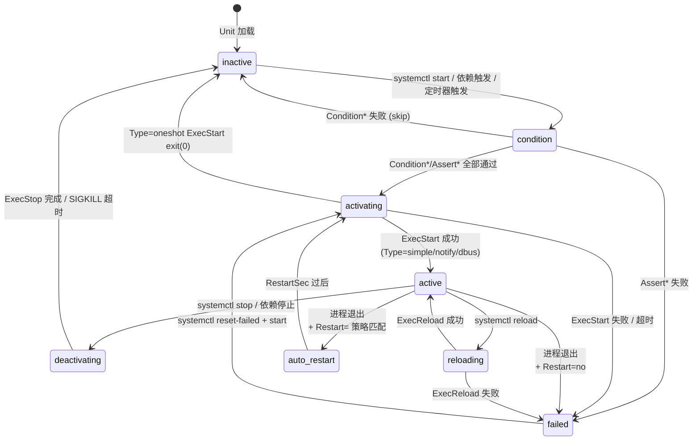

# systemd Unit 生命周期 —— 形式化模型

> **环境**: RHEL 9.8, systemd 252+
> **Unit 类型**: service, socket, mount, timer, device, swap, path, target, slice, scope

---

## 1. 状态集合

systemd 有两层状态：`ActiveState`（5 值，用户可见）和 `SubState`（数十值，内部细化）。

### 1.1 ActiveState

$$\mathbb{A} = \{ \text{active}, \text{inactive}, \text{activating}, \text{deactivating}, \text{failed} \}$$

| ActiveState | 含义 | 类 |
|---|---|---|
| `inactive` | 未运行（初始状态） | 稳态 |
| `activating` | 正在启动（condition check → ExecStart） | 瞬态 |
| `active` | 正在运行 | 稳态 |
| `deactivating` | 正在停止（ExecStop） | 瞬态 |
| `failed` | 启动失败或运行中崩溃 | 稳态 |

### 1.2 SubState (关键值，service 类型)

| SubState | 含义 |
|---|---|
| `dead` | 未运行或已停止 |
| `condition` | 正在执行 Condition*/Assert* 检查 |
| `running` | 主进程正常运行 |
| `exited` | Type=oneshot 的进程已退出 |
| `auto-restart` | 进程退出后等待 RestartSec 后重启 |
| `reloading` | 正在执行 ExecReload |
| `stop-sigterm` | 发送 SIGTERM |
| `stop-sigkill` | 发送 SIGKILL |
| `failed` | 启动失败 |
| `dead` + Result= | `success`, `timeout`, `exit-code`, `signal`, `core-dump`, `watchdog` |

---

## 2. 状态转移



### 2.1 Restart= 策略转移矩阵

| Restart= | exit(0) | exit(!0) | 信号终止 | 超时 | watchdog |
|---|---|---|---|---|---|
| `no` | inactive | failed | failed | failed | failed |
| `on-success` | **auto-restart** | failed | failed | failed | failed |
| `on-failure` | inactive | **auto-restart** | **auto-restart** | **auto-restart** | failed |
| `on-abnormal` | inactive | failed | **auto-restart** | **auto-restart** | failed |
| `on-abort` | inactive | failed | **auto-restart** | failed | failed |
| `on-watchdog` | inactive | failed | failed | failed | **auto-restart** |
| `always` | **auto-restart** | **auto-restart** | **auto-restart** | **auto-restart** | **auto-restart** |

### 2.2 重启限速

$$\text{auto-restart allowed} \iff \text{count}(\text{restarts in last } T_{\text{interval}}) < B_{\text{burst}}$$

当前值在 sshd.service:
```
RestartSec=42s
StartLimitBurst=5  (默认)
StartLimitIntervalSec=10s  (默认)
```

---

## 3. Service Type 六种模式

| Type | ExecStart 行为 | active 何时达成 |
|---|---|---|
| `simple` (默认) | 主进程就是 ExecStart 的进程 | ExecStart fork 后立即 |
| `forking` | ExecStart fork 子进程后退出 | 父进程退出（子进程被 systemd 接管） |
| `oneshot` | ExecStart 执行完即退出 | 进程 exit(0) 后（后续 unit 才启动） |
| `dbus` | 等待 D-Bus 名称出现 | D-Bus 名称获取成功 |
| `notify` | `sd_notify("READY=1")` | 收到 READY 通知 |
| `idle` | 等所有 job 派发完毕才启动 | 同 simple |

影响转移逻辑的关键差异：

**Type=oneshot**: ExecStart exit(0) → 直接进入 `inactive`（不是 `active`），`RemainAfterExit=yes` 时保持在 `active`。

**Type=notify**: ExecStart 后停留在 `activating`，进程通过 Unix socket 发送 `READY=1` 后才进入 `active`。如果 `NotifyAccess=all`，任何子进程都可以通知就绪。

---

## 4. 依赖关系

systemd 的依赖系统是六种关系的组合，比 Docker Compose 的 `depends_on` 丰富得多。

### 4.1 依赖语义

| 关系 | 效果 | 类型 |
|---|---|---|
| `Wants=` | 目标与本 unit 一起启动。目标失败不影响本 unit | 弱依赖 |
| `Requires=` | 目标失败 → 本 unit 也失败 | 强依赖 |
| `Requisite=` | 如果目标不在运行，本 unit 立即失败（不尝试启动目标） | 强前置 |
| `BindsTo=` | 目标停止 → 本 unit 也停止 | 强绑定 |
| `PartOf=` | 目标 restart/stop → 本 unit 也 restart/stop | 部分关系 |
| `Conflicts=` | 与目标互斥，不能同时运行。启动本 unit → 停止目标 | 互斥 |

### 4.2 顺序关系

| 关系 | 效果 |
|---|---|
| `After=` | 本 unit 在目标**之后**启动 |
| `Before=` | 本 unit 在目标**之前**启动 |

`After=` 和 `Before=` 只影响启动**顺序**，不影响依赖强度。典型的组合：

```
Requires=postgresql.service
After=postgresql.service
# my-app 强依赖 postgresql，且在 postgresql 之后启动
```

### 4.3 依赖形式化

$$\text{Start}(u) \implies \begin{cases}
\text{Start}(t) & \text{if } \text{Wants}(t) \text{ or } \text{Requires}(t) \\
\text{Fail}(u) & \text{if } \text{Requisite}(t) \land \neg \text{Active}(t) \\
\text{Stop}(t) & \text{if } \text{Conflicts}(t) \land \text{Active}(t)
\end{cases}$$

$$\text{Stop}(t) \implies \begin{cases}
\text{Stop}(u) & \text{if } \text{BindsTo}(t) \\
\text{Restart}(u) & \text{if } \text{PartOf}(t) \\
\text{Skip} & \text{if } \text{PartOf}(t) \land \text{op} = \text{restart}
\end{cases}$$

---

## 5. Condition* vs Assert* 前置检查

Unit 在进入 `activating` 之前必须通过所有 Condition 和 Assert 检查。

| 指令 | 检查失败后... |
|---|---|
| `ConditionPathExists=/path` | **skip** — unit 不启动，但不报错 |
| `AssertPathExists=/path` | **fail** — unit 进入 `failed` 状态 |
| `ConditionKernelCommandLine=quiet` | skip |
| `ConditionVirtualization=!container` | skip |
| `ConditionSecurity=selinux` | skip |
| `ConditionACPower=true` | skip |

$$\text{ConditionCheck}(u) \triangleq \bigwedge_{c \in \text{Conditions}(u)} \text{eval}(c) \land \bigwedge_{a \in \text{Asserts}(u)} \text{eval}(a)$$

$$\text{Result}(u) = \begin{cases}
\text{inactive (skip)} & \text{if } \exists c \in \text{Conditions}: \neg \text{eval}(c) \\
\text{failed} & \text{if } \exists a \in \text{Asserts}: \neg \text{eval}(a) \\
\text{activating} & \text{if all pass}
\end{cases}$$

---

## 6. 与日志系统的协作

systemd 通过 journald 记录每次状态变更：

```json
{
  "_TRANSPORT": "journal",
  "SYSLOG_IDENTIFIER": "systemd",
  "PRIORITY": "6",
  "MESSAGE": "Started OpenSSH server daemon.",
  "MESSAGE_ID": "39f53479d3a045ac8e11786248231fbf",
  "JOB_TYPE": "start",
  "JOB_RESULT": "done",
  "UNIT": "sshd.service",
  "INVOCATION_ID": "...",
  "CODE_FILE": "src/core/job.c",
  "CODE_LINE": "768",
  "CODE_FUNC": "job_emit_done_message"
}
```

| JOB_TYPE | JOB_RESULT | 含义 |
|---|---|---|
| `start` | `done` | 启动成功 |
| `start` | `timeout` | 启动超时 |
| `start` | `failed` | 启动失败 |
| `stop` | `done` | 停止成功 |
| `reload` | `done` | 重载成功 |
| `restart` | `done` | 重启成功 |

每次状态转换都有唯一的 `INVOCATION_ID`，形成完整的审计链。

---

## 7. 形式化不变量

**active 唯一性**: 对于 `Conflicts=` 互斥的 unit，它们不能同时处于 active。

$$\forall u_1, u_2: \text{Conflicts}(u_1, u_2) \implies \neg (\text{active}(u_1) \land \text{active}(u_2))$$

**依赖传递性**: `Requires=` 是传递的强依赖。

$$\text{Requires}(A, B) \land \text{Requires}(B, C) \implies \text{active}(A) \implies \text{active}(C)$$

**oneshot RemainAfterExit**: 只有 Type=oneshot 可以保持 active 而其主进程已退出。

$$\text{Type}(u) = \text{oneshot} \land \text{RemainAfterExit} \implies \text{active}(u) \land \text{pid}(u) = \text{null}$$

---

## 8. 项目参考价值

| systemd 概念 | 你的项目映射 |
|---|---|
| **Condition* vs Assert* (skip vs fail)** | 沙箱创建前的前置检查：volume 不存在 → skip (不创建)，subnet 不存在 → fail (报错) |
| **六种依赖关系** | `features/template/` DAG 解析——Wants(弱)/Requires(强)/After(顺序)/BindsTo(绑定)/Conflicts(互斥) |
| **Type=notify (sd_notify READY=1)** | 容器就绪回调——不是启动=就绪，而是容器主动通知"我准备好了" |
| **RestartSec + StartLimitBurst 双参数限速** | 重启退避 + 限速窗口——抄袭 dmesg 的 printk_ratelimit 同款设计 |
| **INVOCATION_ID 每次调用唯一** | 审计链: 每次操作一个 UUID，关联所有后续日志 |
| **JOB_TYPE + JOB_RESULT** | 审计日志的 `action` + `result` 字段 |
| **PartOf= 级联 restart** | 模板更新 → 所有关联沙箱级联重启 |
| **OnFailure= / OnSuccess= 触发其他 unit** | 事件驱动: 沙箱失败 → 自动触发清理 handler |
